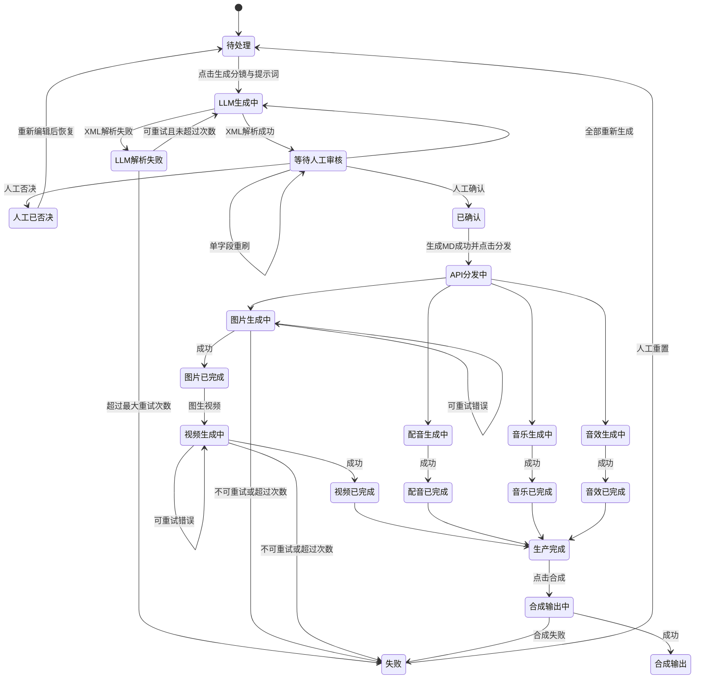
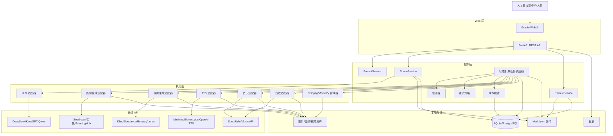
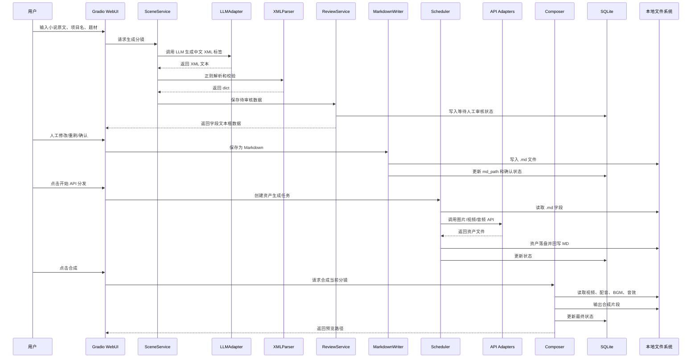

# 漫剧/短剧自动化生产系统——完整架构设计方案

## 一、系统概述

本系统定位为一套**纯云端 API 驱动、全中文文本流、本地 Markdown 组装、WebUI 人工审核**的漫剧/短剧自动化生产流水线。它不是“一键盲盒成片”系统，而是一个面向批量生产的**半自动工业化内容生产系统**：大模型负责中文内容生成，本地 Python 负责解析、校验、组装、调度和文件治理，人工在关键节点进行审核、修正和重刷。

核心原则如下：

1. **LLM 只生产中文 XML 标签文本**  
    LLM 不输出 JSON、不输出 Markdown、不输出 Python、不输出 HTML、不输出任何代码性结构。XML 标签只是字段边界，标签内容必须是简体中文自然语言。
    
2. **Markdown 是唯一中间验收标准**  
    LLM 原始输出不是验收标准，解析后的 dict 也不是验收标准。只有人工审核确认后生成的 `.md` 文件，才是后续图像、视频、配音、音乐、合成模块的唯一输入来源。
    
3. **控制面与执行面解耦**  
    控制面负责状态机、任务调度、重试、审核 Hook、断点续传；执行面负责调用具体 LLM、图像、视频、TTS、BGM、音效、FFmpeg/MoviePy 适配器。
    
4. **三层 Agent 逻辑，但不部署本地 Agent 模型**  
    借鉴 Toonflow、ArcReel、Huobao Drama、BigBanana AI Director 的分层/分阶段思想，但所有“Agent”在本系统中只是 Python 服务层职责划分，不代表本地模型部署。
    

推荐技术栈：

|层级|技术选型|作用|
|---|---|---|
|后端 API|FastAPI|REST API、任务状态接口、WebUI 挂载入口、适配器服务入口|
|WebUI|Gradio Blocks|审核、编辑、重刷、预览、人工确认|
|配置|pydantic-settings + `.env`|API Key、模型名、目录、并发、超时、重试配置|
|HTTP 调用|httpx.AsyncClient|异步调用 LLM/图片/视频/音频 API|
|状态存储|SQLite 起步，PostgreSQL 可升级|任务状态、断点续传、成本记录、资产记录|
|文件中间层|Markdown + 本地目录|唯一真理文件、分镜级资产路径|
|调度|asyncio + 自定义状态机；生产可换 Celery/RQ/Arq|并发、重试、限流、断点恢复|
|合成|FFmpeg / MoviePy|字幕、音画同步、片段合成、最终视频导出|

FastAPI 与 Gradio 可以部署在同一个 Python 服务中：Gradio 官方支持将 `gradio.Blocks` 挂载到既有 FastAPI 应用上，例如通过 `gr.mount_gradio_app(app, blocks, path="/gradio")`。([Gradio](https://www.gradio.app/docs/gradio/mount_gradio_app "gradio.app")) 配置层建议使用 `.env` + `pydantic-settings`，因为 FastAPI 文档明确指出可变配置和敏感信息通常应来自环境变量，并用 Pydantic Settings 做类型转换与校验。([FastAPI](https://fastapi.tiangolo.com/advanced/settings/ "Settings and Environment Variables - FastAPI")) FastAPI 自带 `BackgroundTasks` 能在响应返回后执行轻量后台任务，但本系统的视频生成、音乐生成和批量任务持续时间较长，因此它只适合作为触发器，核心状态仍应落 SQLite/PostgreSQL，由自定义调度器持久化管理。([FastAPI](https://fastapi.tiangolo.com/tutorial/background-tasks/ "Background Tasks - FastAPI"))

---

## 二、项目目录结构

### 2.1 完整目录树

```text
aishortdrama/
├── README.md
├── requirements.txt
├── pyproject.toml
├── .env
├── .env.example
├── .gitignore
├── run_server.py
├── run_worker.py
├── scripts/
│   ├── init_db.py
│   ├── check_env.py
│   ├── repair_md_index.py
│   └── batch_generate_from_txt.py
│
├── app/
│   ├── __init__.py
│   ├── main.py
│   ├── config.py
│   ├── logging_config.py
│   │
│   ├── api/
│   │   ├── __init__.py
│   │   ├── routes_health.py
│   │   ├── routes_project.py
│   │   ├── routes_scene.py
│   │   ├── routes_md.py
│   │   ├── routes_assets.py
│   │   └── routes_config.py
│   │
│   ├── ui/
│   │   ├── __init__.py
│   │   ├── gradio_app.py
│   │   ├── components.py
│   │   ├── callbacks.py
│   │   └── ui_state.py
│   │
│   ├── core/
│   │   ├── __init__.py
│   │   ├── constants.py
│   │   ├── schemas.py
│   │   ├── enums.py
│   │   ├── exceptions.py
│   │   ├── cost_meter.py
│   │   └── utils.py
│   │
│   ├── prompts/
│   │   ├── __init__.py
│   │   ├── system_prompts.py
│   │   ├── genre_style_lexicon.py
│   │   ├── meta_prompt_builder.py
│   │   └── reroll_prompt_builder.py
│   │
│   ├── parser/
│   │   ├── __init__.py
│   │   ├── xml_tag_parser.py
│   │   ├── validators.py
│   │   └── md_reader.py
│   │
│   ├── md/
│   │   ├── __init__.py
│   │   ├── assembler.py
│   │   ├── file_manager.py
│   │   ├── md_index.py
│   │   └── templates.py
│   │
│   ├── services/
│   │   ├── __init__.py
│   │   ├── project_service.py
│   │   ├── scene_service.py
│   │   ├── review_service.py
│   │   ├── asset_service.py
│   │   ├── compose_service.py
│   │   └── resume_service.py
│   │
│   ├── adapters/
│   │   ├── __init__.py
│   │   ├── base.py
│   │   │
│   │   ├── llm/
│   │   │   ├── __init__.py
│   │   │   ├── base_llm.py
│   │   │   ├── deepseek_adapter.py
│   │   │   ├── kimi_adapter.py
│   │   │   ├── openai_adapter.py
│   │   │   └── qwen_adapter.py
│   │   │
│   │   ├── image/
│   │   │   ├── __init__.py
│   │   │   ├── base_image.py
│   │   │   ├── seedream_adapter.py
│   │   │   ├── dashscope_wanx_adapter.py
│   │   │   ├── openai_image_adapter.py
│   │   │   ├── replicate_adapter.py
│   │   │   └── runninghub_adapter.py
│   │   │
│   │   ├── video/
│   │   │   ├── __init__.py
│   │   │   ├── base_video.py
│   │   │   ├── kling_adapter.py
│   │   │   ├── seedance_adapter.py
│   │   │   ├── runway_adapter.py
│   │   │   ├── luma_adapter.py
│   │   │   ├── pika_adapter.py
│   │   │   └── wan_video_adapter.py
│   │   │
│   │   ├── audio/
│   │   │   ├── __init__.py
│   │   │   ├── base_tts.py
│   │   │   ├── elevenlabs_adapter.py
│   │   │   ├── minimax_tts_adapter.py
│   │   │   ├── openai_tts_adapter.py
│   │   │   ├── aliyun_tts_adapter.py
│   │   │   └── edge_tts_adapter.py
│   │   │
│   │   ├── music/
│   │   │   ├── __init__.py
│   │   │   ├── base_music.py
│   │   │   ├── suno_adapter.py
│   │   │   ├── udio_adapter.py
│   │   │   └── musicgen_api_adapter.py
│   │   │
│   │   └── sfx/
│   │       ├── __init__.py
│   │       ├── base_sfx.py
│   │       └── generic_sfx_adapter.py
│   │
│   ├── scheduler/
│   │   ├── __init__.py
│   │   ├── state_machine.py
│   │   ├── task_queue.py
│   │   ├── retry_policy.py
│   │   ├── rate_limiter.py
│   │   ├── worker.py
│   │   └── locks.py
│   │
│   ├── storage/
│   │   ├── __init__.py
│   │   ├── db.py
│   │   ├── models.py
│   │   ├── repositories.py
│   │   └── migrations/
│   │       └── 001_init.sql
│   │
│   └── composer/
│       ├── __init__.py
│       ├── ffmpeg_runner.py
│       ├── subtitle_builder.py
│       ├── audio_mixer.py
│       ├── timeline_builder.py
│       └── final_renderer.py
│
├── config/
│   ├── default.yaml
│   ├── development.yaml
│   ├── production.yaml
│   ├── provider_limits.yaml
│   └── cost_rules.yaml
│
├── templates/
│   ├── scene_md_template.md
│   ├── episode_md_template.md
│   ├── subtitle_srt_template.srt
│   └── prompt_debug_template.txt
│
├── data/
│   ├── input/
│   │   └── novels/
│   ├── lexicons/
│   │   ├── genre_style_lexicon.yaml
│   │   ├── camera_terms.yaml
│   │   ├── lighting_terms.yaml
│   │   ├── emotion_terms.yaml
│   │   └── forbidden_motion_terms.yaml
│   └── seeds/
│       └── character_anchor_examples.yaml
│
├── outputs/
│   ├── projects/
│   │   └── .gitkeep
│   ├── backups/
│   │   └── .gitkeep
│   ├── exports/
│   │   └── .gitkeep
│   └── tmp/
│       └── .gitkeep
│
├── logs/
│   ├── app.log
│   ├── llm_parse_error.log
│   ├── api_error.log
│   ├── cost.log
│   └── worker.log
│
└── tests/
    ├── test_xml_tag_parser.py
    ├── test_md_assembler.py
    ├── test_md_reader.py
    ├── test_state_machine.py
    ├── test_retry_policy.py
    └── fixtures/
        ├── llm_good_response.txt
        ├── llm_missing_tag_response.txt
        └── sample_scene.md
```

### 2.2 目录说明

|路径|说明|
|---|---|
|`run_server.py`|启动 FastAPI + Gradio WebUI 的入口|
|`run_worker.py`|启动后台任务调度器与执行 Worker|
|`app/main.py`|FastAPI 应用创建、路由注册、Gradio 挂载|
|`app/config.py`|读取 `.env`、YAML 配置，生成全局 Settings|
|`app/api/`|后端 REST API 路由|
|`app/ui/`|Gradio 界面、组件、回调函数|
|`app/core/`|全局枚举、Pydantic schema、异常类、成本统计|
|`app/prompts/`|System Prompt、题材词库、动态元提示词构造器|
|`app/parser/`|XML 标签解析、格式校验、Markdown 字段读取|
|`app/md/`|Markdown 模板渲染、文件写入、版本管理、索引管理|
|`app/services/`|业务服务层，连接 API、parser、md、scheduler|
|`app/adapters/`|外部 API 适配器。新增服务时只新增 adapter，不改核心调度|
|`app/scheduler/`|状态机、任务队列、重试、限流、Worker|
|`app/storage/`|SQLite/PostgreSQL 存储层|
|`app/composer/`|FFmpeg/MoviePy 合成相关模块|
|`config/provider_limits.yaml`|各 API 的 RPM、TPM、并发、超时配置|
|`data/lexicons/`|题材、镜头、光影、情绪、禁用运动词库|
|`outputs/projects/`|项目级输出目录，包含 MD 和资产文件|
|`logs/`|中文日志文件，按用途拆分|
|`tests/`|单元测试与解析器回归样本|

### 2.3 requirements.txt 建议

版本号应在开发时用 `pip-compile` 或 `uv lock` 锁定。这里给出依赖类别，不强行绑定不可验证的未来版本。

```txt
fastapi
uvicorn[standard]
gradio
pydantic
pydantic-settings
python-dotenv
httpx
aiofiles
jinja2
pyyaml
sqlalchemy
aiosqlite
tenacity
python-multipart
loguru
orjson
moviepy
ffmpeg-python
pytest
pytest-asyncio
```

---

## 三、核心数据字典

## 3.1 LLM 输出 XML 标签体系

### 3.1.1 设计原则

LLM 输出必须满足以下约束：

```text
1. 只输出 XML 标签包裹的简体中文自然语言。
2. 禁止输出 Markdown。
3. 禁止输出 JSON。
4. 禁止输出代码。
5. 禁止输出解释说明。
6. 标签必须完整闭合。
7. 标签顺序固定。
8. 每个标签只出现一次。
9. 标签内容不得为空。
10. 标签内容可以换行，但不得嵌套其他标签。
```

建议 LLM 最终输出结构如下：

```xml
<ProjectName>剧名</ProjectName>
<EpisodeNo>第一集</EpisodeNo>
<SceneId>001</SceneId>
<Genre>题材类型</Genre>
<SceneSummary>本分镜剧情摘要</SceneSummary>
<NarrativePurpose>本分镜叙事目的</NarrativePurpose>

<CharacterName>主要出镜角色名称</CharacterName>
<CharacterAppearance>角色外貌描述</CharacterAppearance>
<CharacterAnchor>角色一致性锚定词</CharacterAnchor>
<CharacterEmotion>角色情绪</CharacterEmotion>
<CharacterAction>角色当前动作</CharacterAction>
<WardrobeProps>服装道具</WardrobeProps>

<SceneEnvironment>场景环境</SceneEnvironment>
<LightingComposition>光影构图</LightingComposition>
<CameraLanguage>镜头语言</CameraLanguage>
<ArtStyle>画面风格</ArtStyle>
<ImagePrompt>文生图提示词</ImagePrompt>
<NegativePrompt>反向提示词</NegativePrompt>

<VideoMotionPrompt>视频动态提示词</VideoMotionPrompt>
<MotionLimit>运动限制说明</MotionLimit>
<ShotDuration>镜头时长</ShotDuration>
<TransitionHint>转场建议</TransitionHint>

<DialogueBlock>台词块</DialogueBlock>
<VoiceEmotion>配音情绪</VoiceEmotion>
<VoiceProfile>角色音色</VoiceProfile>
<BgmPrompt>背景音乐提示词</BgmPrompt>
<SfxPrompt>音效提示词</SfxPrompt>

<ConsistencyNotes>一致性备注</ConsistencyNotes>
<ReviewWarnings>人工审核提示</ReviewWarnings>
```

### 3.1.2 标签定义表

|标签名|必填|内容约束|用途|是否进入 MD|
|---|--:|---|---|--:|
|`ProjectName`|是|剧名，纯中文，可含书名号|文件命名、元数据|是|
|`EpisodeNo`|是|如“第一集”|文件命名、元数据|是|
|`SceneId`|是|三位编号，如 `001`|文件命名、排序、断点续传|是|
|`Genre`|是|题材类型，如“玄幻修仙”“现代都市”|动态风格词库选择|是|
|`SceneSummary`|是|50-120 字剧情摘要|审核人员理解上下文|是|
|`NarrativePurpose`|是|本镜头在剧情中的作用|判断镜头必要性|是|
|`CharacterName`|是|主要出镜角色，多个角色用中文顿号分隔|TTS、角色一致性、提示词审核|是|
|`CharacterAppearance`|是|五官、体型、发型、年龄感、气质|生图基础描述|是|
|`CharacterAnchor`|是|稳定复用的角色锚定词链|角色一致性|是|
|`CharacterEmotion`|是|当前分镜情绪，如“冷峻、压抑、隐忍怒意”|生图、配音、表演|是|
|`CharacterAction`|是|静态画面中的核心动作|生图主体动作|是|
|`WardrobeProps`|是|服装、武器、饰品、标志物|角色一致性与视觉识别|是|
|`SceneEnvironment`|是|时间、地点、天气、环境元素、氛围|生图环境|是|
|`LightingComposition`|是|光源、明暗、色彩、构图|生图质量控制|是|
|`CameraLanguage`|是|景别、机位、焦段、镜头角度|生图构图和视频运动|是|
|`ArtStyle`|是|漫剧风格、国风、写实、赛博等|题材自适应|是|
|`ImagePrompt`|是|完整文生图提示词，80-180 字|图像生成 API 输入|是|
|`NegativePrompt`|否|不希望出现的画面问题，中文|支持反向提示词的 API 使用|是|
|`VideoMotionPrompt`|是|镜头微动态、环境微动态、推拉摇移|图生视频 API 输入|是|
|`MotionLimit`|是|禁止大尺度位移、禁止换脸、禁止换衣等|控制视频漂移|是|
|`ShotDuration`|是|如“三秒”“五秒”|视频生成时长参数|是|
|`TransitionHint`|否|淡入、切黑、风沙转场等|合成阶段使用|是|
|`DialogueBlock`|是|每行“角色名：台词”；无台词写“无台词”|TTS 输入|是|
|`VoiceEmotion`|是|中文情绪，如“压抑愤怒”“低声呢喃”|TTS 情绪映射|是|
|`VoiceProfile`|是|音色描述，如“低沉冷冽的青年男声”|TTS 声线选择|是|
|`BgmPrompt`|是|音乐风格、速度、情绪、乐器|BGM 生成或曲库检索|是|
|`SfxPrompt`|是|环境音、动作音、转场音|音效生成或曲库检索|是|
|`ConsistencyNotes`|是|角色、服装、场景连续性注意事项|审核与后续 API 参数预留|是|
|`ReviewWarnings`|否|可能需要人工确认的风险点|人工审核|是|

### 3.1.3 推荐的 LLM System Prompt 约束模板

这个模板由本地 Python 构造后传给 LLM。注意：模板可以包含 XML 标签要求；但 LLM 返回时只能返回 XML 标签文本。

```text
你是专业的中文漫剧分镜提示词生成器。

你的任务：
根据用户提供的小说片段，生成一个分镜的结构化中文内容。

绝对规则：
一、你只能输出指定 XML 标签。
二、你不能输出 Markdown。
三、你不能输出 JSON。
四、你不能输出 Python、HTML、JavaScript 或任何代码。
五、你不能解释你的输出。
六、所有标签内容必须使用简体中文自然语言。
七、每个标签必须完整闭合。
八、每个标签只能出现一次。
九、不得遗漏必填标签。
十、文生图提示词必须精炼、精准、高信息密度。
十一、视频动态提示词只允许描述镜头微运动和画面微动态，禁止角色大幅奔跑、跳跃、转身、换脸、换装、场景突变。

输出标签顺序必须如下：
<ProjectName></ProjectName>
<EpisodeNo></EpisodeNo>
<SceneId></SceneId>
<Genre></Genre>
<SceneSummary></SceneSummary>
<NarrativePurpose></NarrativePurpose>
<CharacterName></CharacterName>
<CharacterAppearance></CharacterAppearance>
<CharacterAnchor></CharacterAnchor>
<CharacterEmotion></CharacterEmotion>
<CharacterAction></CharacterAction>
<WardrobeProps></WardrobeProps>
<SceneEnvironment></SceneEnvironment>
<LightingComposition></LightingComposition>
<CameraLanguage></CameraLanguage>
<ArtStyle></ArtStyle>
<ImagePrompt></ImagePrompt>
<NegativePrompt></NegativePrompt>
<VideoMotionPrompt></VideoMotionPrompt>
<MotionLimit></MotionLimit>
<ShotDuration></ShotDuration>
<TransitionHint></TransitionHint>
<DialogueBlock></DialogueBlock>
<VoiceEmotion></VoiceEmotion>
<VoiceProfile></VoiceProfile>
<BgmPrompt></BgmPrompt>
<SfxPrompt></SfxPrompt>
<ConsistencyNotes></ConsistencyNotes>
<ReviewWarnings></ReviewWarnings>
```

---

## 3.2 本地 Markdown 模板结构

### 3.2.1 文件命名规范

```text
{剧名}_{集数}_{场景编号}.md
```

示例：

```text
剑骨归墟_第一集_001.md
```

实际落盘建议使用安全文件名：

```text
outputs/projects/{project_id}/episodes/episode_001/scenes/剑骨归墟_第一集_001.md
```

### 3.2.2 Markdown 模板

```markdown
---
项目ID: "{project_id}"
剧名: "{project_name}"
集数: "{episode_no}"
场景编号: "{scene_id}"
题材类型: "{genre}"
生成时间: "{generated_at}"
审核状态: "{review_status}"
版本: "{version}"
来源模型: "{llm_provider}:{llm_model}"
MD结构版本: "scene-md-v1"
---

# 《{project_name}》{episode_no} 第 {scene_id} 场

## 一、剧情信息

- 剧情摘要：{scene_summary}
- 叙事目的：{narrative_purpose}

## 二、角色信息

- 出镜角色：{character_name}
- 角色外貌：{character_appearance}
- 角色锚定词：{character_anchor}
- 当前情绪：{character_emotion}
- 当前动作：{character_action}
- 服装道具：{wardrobe_props}

## 三、场景与画面

- 场景环境：{scene_environment}
- 光影构图：{lighting_composition}
- 镜头语言：{camera_language}
- 画面风格：{art_style}

## 四、文生图提示词

> {image_prompt}

## 五、反向提示词

> {negative_prompt}

## 六、图生视频提示词

> {video_motion_prompt}

- 运动限制：{motion_limit}
- 镜头时长：{shot_duration}
- 转场建议：{transition_hint}

## 七、台词与配音

- 台词内容：
{dialogue_block_md}

- 配音情绪：{voice_emotion}
- 角色音色：{voice_profile}

## 八、音乐与音效

- BGM 提示词：{bgm_prompt}
- 音效提示词：{sfx_prompt}

## 九、一致性与审核

- 一致性备注：{consistency_notes}
- 人工审核提示：{review_warnings}

## 十、生成产物

- 图片文件：{image_file}
- 图片URL：{image_url}
- 配音文件：{voice_file}
- BGM文件：{bgm_file}
- 音效文件：{sfx_file}
- 视频文件：{video_file}
- 合成片段：{composed_clip_file}

## 十一、处理日志

- LLM生成状态：{llm_status}
- 图片生成状态：{image_status}
- 配音生成状态：{voice_status}
- 视频生成状态：{video_status}
- 合成状态：{compose_status}
- 最近错误：{last_error}
```

### 3.2.3 玄幻修仙场景填充示例

```markdown
---
项目ID: "proj_20260615_jianguiguixu"
剧名: "剑骨归墟"
集数: "第一集"
场景编号: "001"
题材类型: "玄幻修仙"
生成时间: "2026-06-15T21:30:00+09:00"
审核状态: "未审核"
版本: "v001"
来源模型: "deepseek:deepseek-chat"
MD结构版本: "scene-md-v1"
---

# 《剑骨归墟》第一集 第 001 场

## 一、剧情信息

- 剧情摘要：萧玄在破败山门前醒来，发现自己丹田尽碎，昔日宗门已化为废墟，远处残钟仍在风雪中低鸣。
- 叙事目的：建立主角重伤归来的开局氛围，强化宗门覆灭与复仇动机。

## 二、角色信息

- 出镜角色：萧玄
- 角色外貌：二十岁左右的清瘦青年，眉骨锋利，眼神沉冷，长发半束，脸侧有一道浅淡血痕，气质孤绝而压抑。
- 角色锚定词：清瘦青年，锋利眉眼，半束黑发，脸侧浅血痕，玄色破损长袍，孤冷剑修气质。
- 当前情绪：震惊后强行压下的冷怒，眼底带着痛意和杀意。
- 当前动作：单膝跪在雪地中，一手撑着断剑，一手按住胸口。
- 服装道具：玄色破损长袍，银灰腰封，断裂长剑，染血护腕。

## 三、场景与画面

- 场景环境：黄昏雪夜，破败山门，坍塌石阶，残破匾额半埋在积雪中，远处废墟升起微弱寒雾。
- 光影构图：冷蓝雪光为主，远处残火提供微弱橙色逆光，低角度构图，人物位于画面下三分之一，山门废墟压迫在背景中。
- 镜头语言：低机位中近景，轻微仰拍，浅景深，人物面部与断剑清晰，背景废墟略虚化。
- 画面风格：国风玄幻漫剧，电影级厚涂质感，冷峻写实，细节丰富，高对比光影。

## 四、文生图提示词

> 国风玄幻漫剧画面，黄昏雪夜的破败山门前，清瘦青年萧玄单膝跪在积雪石阶上，玄色破损长袍沾满血迹，一手撑着断裂长剑，一手按住胸口，锋利眉眼中压着冷怒与痛意，脸侧浅血痕清晰可见，背景是坍塌石阶、残破匾额与寒雾废墟，冷蓝雪光与远处残火橙色逆光交织，低机位中近景，电影级厚涂质感，高细节，高对比光影。

## 五、反向提示词

> 角色变脸，五官漂移，多余手指，肢体扭曲，服装突变，现代建筑，卡通低龄风，过度模糊，文字水印，画面脏乱。

## 六、图生视频提示词

> 镜头缓慢向前推进，雪花在前景轻轻飘落，萧玄的发丝和破损衣袂被寒风微微吹动，远处残火轻微摇曳，寒雾缓慢流过坍塌山门，人物保持单膝跪地姿势不变，眼神微微抬起。

- 运动限制：禁止角色起身、奔跑、转身、换脸、换装，禁止场景突变，禁止断剑形态变化，只允许镜头轻推和环境微动态。
- 镜头时长：五秒
- 转场建议：从黑场淡入，结尾以风雪遮挡轻微转白。

## 七、台词与配音

- 台词内容：
  - 萧玄：是谁……灭了我青玄宗。

- 配音情绪：低沉压抑，带有克制的愤怒和虚弱感。
- 角色音色：低沉冷冽的青年男声，气息略弱，尾音带沙哑。

## 八、音乐与音效

- BGM 提示词：低速国风史诗配乐，冷峻悲壮，古琴低音与弦乐铺底，节奏克制，带复仇开端的压迫感。
- 音效提示词：寒风声，细雪落地声，远处残钟低鸣，微弱火焰噼啪声，断剑轻触石阶声。

## 九、一致性与审核

- 一致性备注：后续萧玄必须保持清瘦青年、锋利眉眼、半束黑发、脸侧浅血痕、玄色破损长袍和断剑设定。
- 人工审核提示：确认断剑和脸侧血痕是否需要作为全剧固定视觉符号。

## 十、生成产物

- 图片文件：未生成
- 图片URL：未生成
- 配音文件：未生成
- BGM文件：未生成
- 音效文件：未生成
- 视频文件：未生成
- 合成片段：未生成

## 十一、处理日志

- LLM生成状态：已完成
- 图片生成状态：未开始
- 配音生成状态：未开始
- 视频生成状态：未开始
- 合成状态：未开始
- 最近错误：无
```

---

## 3.3 API 分发数据映射

### 3.3.1 MD 字段到 API 的映射表

|MD 字段|目标 API 类型|适配器方法|关键参数|输出写回|
|---|---|---|---|---|
|`文生图提示词`|图像生成|`ImageAdapter.generate_image()`|`prompt`|`图片文件`、`图片URL`|
|`反向提示词`|图像生成|`ImageAdapter.generate_image()`|`negative_prompt`|同上|
|`角色锚定词`|图像生成|`ImageAdapter.generate_image()`|`character_anchor`、`seed`、`reference_id`|同上|
|`图生视频提示词`|视频生成|`VideoAdapter.generate_video()`|`prompt`|`视频文件`|
|`图片URL`|视频生成|`VideoAdapter.generate_video()`|`image_url`|`视频文件`|
|`运动限制`|视频生成|`VideoAdapter.generate_video()`|`negative_motion_prompt`|`视频文件`|
|`镜头时长`|视频生成|`VideoAdapter.generate_video()`|`duration_seconds`|`视频文件`|
|`台词内容`|TTS|`TTSAdapter.synthesize()`|`text`|`配音文件`|
|`配音情绪`|TTS|`TTSAdapter.synthesize()`|`emotion`|`配音文件`|
|`角色音色`|TTS|`TTSAdapter.synthesize()`|`voice_profile`|`配音文件`|
|`BGM 提示词`|音乐生成/曲库检索|`MusicAdapter.generate_music()`|`prompt`|`BGM文件`|
|`音效提示词`|音效生成/曲库检索|`SfxAdapter.generate_sfx()`|`prompt`|`音效文件`|
|`转场建议`|合成|`Composer.build_timeline()`|`transition`|`合成片段`|
|所有资产路径|合成|`Composer.render_clip()`|`image/video/audio/bgm/sfx`|`合成片段`|

### 3.3.2 从 MD 中读取字段的策略

MD 读取器不依赖 LLM 原始 XML，而是解析 Markdown 的固定标题结构。

建议核心读取函数：

```python
# app/parser/md_reader.py

from __future__ import annotations

import re
from pathlib import Path
from typing import Dict


class MarkdownReadError(Exception):
    """Markdown 字段读取失败。"""


SECTION_RE_TEMPLATE = r"^##\s+{title}\s*\n(?P<body>.*?)(?=^##\s+|\Z)"


def read_text(path: Path) -> str:
    if not path.exists():
        raise MarkdownReadError(f"Markdown 文件不存在：{path}")
    return path.read_text(encoding="utf-8")


def extract_section(md_text: str, title: str) -> str:
    pattern = SECTION_RE_TEMPLATE.format(title=re.escape(title))
    match = re.search(pattern, md_text, flags=re.S | re.M)
    if not match:
        raise MarkdownReadError(f"缺少 Markdown 章节：{title}")
    return match.group("body").strip()


def extract_quote_block(md_text: str, title: str) -> str:
    body = extract_section(md_text, title)
    lines = []
    for line in body.splitlines():
        stripped = line.strip()
        if stripped.startswith(">"):
            lines.append(stripped[1:].strip())
    result = "\n".join(lines).strip()
    if not result:
        raise MarkdownReadError(f"章节 {title} 中没有引用块内容")
    return result


def extract_bullet_value(md_text: str, key: str) -> str:
    pattern = rf"^\s*-\s*{re.escape(key)}：(?P<value>.*?)\s*$"
    match = re.search(pattern, md_text, flags=re.M)
    if not match:
        raise MarkdownReadError(f"缺少字段：{key}")
    return match.group("value").strip()


def load_scene_for_dispatch(md_path: Path) -> Dict[str, str]:
    md_text = read_text(md_path)

    return {
        "image_prompt": extract_quote_block(md_text, "四、文生图提示词"),
        "negative_prompt": extract_quote_block(md_text, "五、反向提示词"),
        "video_motion_prompt": extract_quote_block(md_text, "六、图生视频提示词"),
        "motion_limit": extract_bullet_value(md_text, "运动限制"),
        "shot_duration": extract_bullet_value(md_text, "镜头时长"),
        "dialogue_section": extract_section(md_text, "七、台词与配音"),
        "voice_emotion": extract_bullet_value(md_text, "配音情绪"),
        "voice_profile": extract_bullet_value(md_text, "角色音色"),
        "bgm_prompt": extract_bullet_value(md_text, "BGM 提示词"),
        "sfx_prompt": extract_bullet_value(md_text, "音效提示词"),
        "image_url": extract_bullet_value(md_text, "图片URL"),
        "image_file": extract_bullet_value(md_text, "图片文件"),
    }
```

---

## 四、正则解析器模块

## 4.1 解析器核心逻辑

解析器职责：

1. 输入：LLM 原始字符串。
    
2. 预处理：清理 BOM、零宽字符、全角尖括号、标签前后空格。
    
3. 提取：按白名单标签提取内容。
    
4. 校验：检查必填标签、空字段、重复标签、代码/Markdown/JSON 痕迹、非法嵌套标签。
    
5. 输出：标准 `dict[str, str]`。
    
6. 异常：抛出结构化错误，供 LLM 重试机制使用。
    
7. 日志：把原始输出、错误类型、缺失标签写入 `llm_parse_error.log`。
    

核心正则：

```python
TAG_RE_TEMPLATE = r"<\s*{tag}\s*>\s*(?P<content>.*?)\s*<\s*/\s*{tag}\s*>"
```

该正则允许以下轻微偏差：

```xml
< ImagePrompt > 内容 </ ImagePrompt >
<ImagePrompt>
内容
</ImagePrompt>
<ImagePrompt> 内容 </ImagePrompt>
```

同时在预处理阶段把全角符号转为半角：

```text
＜ImagePrompt＞ → <ImagePrompt>
＜／ImagePrompt＞ → </ImagePrompt>
```

## 4.2 格式校验与异常处理

### 4.2.1 错误分类

|错误类型|示例|是否触发 LLM 重试|处理方式|
|---|---|--:|---|
|`MISSING_TAG`|缺少 `ImagePrompt`|是|拼接修复提示重新调用 LLM|
|`EMPTY_TAG`|`<ImagePrompt></ImagePrompt>`|是|要求补全|
|`DUPLICATE_TAG`|`ImagePrompt` 出现两次|是|要求只输出一次|
|`UNKNOWN_TAG`|输出未定义标签|是|要求只输出白名单|
|`CODE_LIKE_OUTPUT`|出现 ```、`def`、`{}` JSON|是|强化“禁止代码/JSON/Markdown”|
|`LOW_CHINESE_RATIO`|大量英文提示词|是|要求改成简体中文|
|`INVALID_SCENE_ID`|场景编号非三位|是|要求修正编号|
|`CONTENT_TOO_SHORT`|提示词过短|是|要求补充细节|
|`UNSAFE_OUTPUT`|明显违规内容|否或转人工|标记人工审核|

### 4.2.2 关键字段最低长度建议

|字段|最低长度|
|---|--:|
|`SceneSummary`|20 字|
|`CharacterAppearance`|30 字|
|`CharacterAnchor`|20 字|
|`SceneEnvironment`|30 字|
|`LightingComposition`|20 字|
|`ImagePrompt`|60 字|
|`VideoMotionPrompt`|40 字|
|`BgmPrompt`|20 字|
|`SfxPrompt`|10 字|

### 4.2.3 禁用内容检测

解析器不是安全审核器，但应执行最低限度格式约束：

```python
FORBIDDEN_MARKERS = [
    "```",
    "```python",
    "```json",
    "{",
    "}",
    "import ",
    "def ",
    "class ",
    "<script",
    "</script",
    "# ",
    "## ",
]
```

注意：`{` 和 `}` 在中文自然语言中极少必要。为了强制杜绝 JSON，建议默认禁止。若后续某些剧本文本确需花括号，可在配置中放宽。

---

## 4.3 代码示例

```python
# app/parser/xml_tag_parser.py

from __future__ import annotations

import logging
import re
from dataclasses import dataclass
from enum import Enum
from typing import Dict, Iterable, List, Optional

logger = logging.getLogger("llm_parser")


class ParseErrorCode(str, Enum):
    MISSING_TAG = "MISSING_TAG"
    EMPTY_TAG = "EMPTY_TAG"
    DUPLICATE_TAG = "DUPLICATE_TAG"
    UNKNOWN_TAG = "UNKNOWN_TAG"
    CODE_LIKE_OUTPUT = "CODE_LIKE_OUTPUT"
    LOW_CHINESE_RATIO = "LOW_CHINESE_RATIO"
    INVALID_SCENE_ID = "INVALID_SCENE_ID"
    CONTENT_TOO_SHORT = "CONTENT_TOO_SHORT"


@dataclass
class ParseIssue:
    code: ParseErrorCode
    message: str
    tag: Optional[str] = None


class XMLParseError(Exception):
    def __init__(self, issues: List[ParseIssue], raw_text: str):
        self.issues = issues
        self.raw_text = raw_text
        message = "；".join([f"{i.code}:{i.tag or ''}:{i.message}" for i in issues])
        super().__init__(message)


EXPECTED_TAGS: List[str] = [
    "ProjectName",
    "EpisodeNo",
    "SceneId",
    "Genre",
    "SceneSummary",
    "NarrativePurpose",
    "CharacterName",
    "CharacterAppearance",
    "CharacterAnchor",
    "CharacterEmotion",
    "CharacterAction",
    "WardrobeProps",
    "SceneEnvironment",
    "LightingComposition",
    "CameraLanguage",
    "ArtStyle",
    "ImagePrompt",
    "NegativePrompt",
    "VideoMotionPrompt",
    "MotionLimit",
    "ShotDuration",
    "TransitionHint",
    "DialogueBlock",
    "VoiceEmotion",
    "VoiceProfile",
    "BgmPrompt",
    "SfxPrompt",
    "ConsistencyNotes",
    "ReviewWarnings",
]

REQUIRED_TAGS = [
    tag for tag in EXPECTED_TAGS
    if tag not in {"NegativePrompt", "TransitionHint", "ReviewWarnings"}
]

MIN_LENGTH_BY_TAG = {
    "SceneSummary": 20,
    "CharacterAppearance": 30,
    "CharacterAnchor": 20,
    "SceneEnvironment": 30,
    "LightingComposition": 20,
    "ImagePrompt": 60,
    "VideoMotionPrompt": 40,
    "BgmPrompt": 20,
    "SfxPrompt": 10,
}

FORBIDDEN_MARKERS = [
    "```",
    "```python",
    "```json",
    "import ",
    "def ",
    "class ",
    "<script",
    "</script",
    "# ",
    "## ",
    "{",
    "}",
]

TAG_RE_TEMPLATE = r"<\s*{tag}\s*>\s*(?P<content>.*?)\s*<\s*/\s*{tag}\s*>"
ANY_TAG_RE = re.compile(r"</?\s*([A-Za-z][A-Za-z0-9_]*|[\u4e00-\u9fa5A-Za-z0-9_]+)\s*>")
SCENE_ID_RE = re.compile(r"^\d{3}$")


def normalize_llm_text(raw_text: str) -> str:
    text = raw_text or ""
    replacements = {
        "\ufeff": "",
        "\u200b": "",
        "\u200c": "",
        "\u200d": "",
        "＜": "<",
        "＞": ">",
        "／": "/",
        "\r\n": "\n",
        "\r": "\n",
    }
    for old, new in replacements.items():
        text = text.replace(old, new)
    return text.strip()


def chinese_ratio(text: str) -> float:
    if not text:
        return 0.0
    meaningful = [c for c in text if not c.isspace()]
    if not meaningful:
        return 0.0
    chinese = [c for c in meaningful if "\u4e00" <= c <= "\u9fff"]
    return len(chinese) / len(meaningful)


def extract_all_occurrences(text: str, tag: str) -> List[str]:
    pattern = re.compile(
        TAG_RE_TEMPLATE.format(tag=re.escape(tag)),
        flags=re.S | re.M,
    )
    return [m.group("content").strip() for m in pattern.finditer(text)]


def detect_unknown_tags(text: str, expected_tags: Iterable[str]) -> List[str]:
    expected = set(expected_tags)
    found = set(ANY_TAG_RE.findall(text))
    return sorted(tag for tag in found if tag not in expected)


def validate_plain_text(tag: str, value: str) -> List[ParseIssue]:
    issues: List[ParseIssue] = []

    for marker in FORBIDDEN_MARKERS:
        if marker in value:
            issues.append(
                ParseIssue(
                    code=ParseErrorCode.CODE_LIKE_OUTPUT,
                    tag=tag,
                    message=f"字段中出现禁止内容标记：{marker}",
                )
            )

    min_len = MIN_LENGTH_BY_TAG.get(tag)
    if min_len and len(value) < min_len:
        issues.append(
            ParseIssue(
                code=ParseErrorCode.CONTENT_TOO_SHORT,
                tag=tag,
                message=f"字段内容过短，当前长度 {len(value)}，最低要求 {min_len}",
            )
        )

    # 场景编号、镜头时长等短字段不做中文比例校验。
    skip_ratio_tags = {"SceneId", "EpisodeNo", "ShotDuration"}
    if tag not in skip_ratio_tags and len(value) >= 20:
        ratio = chinese_ratio(value)
        if ratio < 0.55:
            issues.append(
                ParseIssue(
                    code=ParseErrorCode.LOW_CHINESE_RATIO,
                    tag=tag,
                    message=f"中文占比过低：{ratio:.2f}",
                )
            )

    return issues


def parse_llm_xml(raw_text: str) -> Dict[str, str]:
    text = normalize_llm_text(raw_text)
    issues: List[ParseIssue] = []
    result: Dict[str, str] = {}

    unknown_tags = detect_unknown_tags(text, EXPECTED_TAGS)
    for tag in unknown_tags:
        issues.append(
            ParseIssue(
                code=ParseErrorCode.UNKNOWN_TAG,
                tag=tag,
                message="输出中包含未定义标签",
            )
        )

    for tag in EXPECTED_TAGS:
        values = extract_all_occurrences(text, tag)

        if not values:
            if tag in REQUIRED_TAGS:
                issues.append(
                    ParseIssue(
                        code=ParseErrorCode.MISSING_TAG,
                        tag=tag,
                        message="缺少必填标签",
                    )
                )
            else:
                result[tag] = "无"
            continue

        if len(values) > 1:
            issues.append(
                ParseIssue(
                    code=ParseErrorCode.DUPLICATE_TAG,
                    tag=tag,
                    message="标签重复出现",
                )
            )

        value = values[0].strip()
        if not value:
            if tag in REQUIRED_TAGS:
                issues.append(
                    ParseIssue(
                        code=ParseErrorCode.EMPTY_TAG,
                        tag=tag,
                        message="必填标签内容为空",
                    )
                )
            value = "无"

        result[tag] = value
        issues.extend(validate_plain_text(tag, value))

    scene_id = result.get("SceneId", "")
    if scene_id and not SCENE_ID_RE.match(scene_id):
        issues.append(
            ParseIssue(
                code=ParseErrorCode.INVALID_SCENE_ID,
                tag="SceneId",
                message="场景编号必须是三位数字，例如 001",
            )
        )

    if issues:
        logger.error(
            "LLM XML 解析失败：%s\n原始输出：\n%s",
            "；".join([f"{i.code}:{i.tag}:{i.message}" for i in issues]),
            text,
        )
        raise XMLParseError(issues=issues, raw_text=text)

    return result


def build_retry_instruction(error: XMLParseError) -> str:
    issue_lines = []
    for issue in error.issues:
        issue_lines.append(f"字段：{issue.tag or '未知'}，问题：{issue.message}")

    return (
        "你上一次输出不符合格式要求。请只重新输出完整 XML 标签文本，不要解释。\n"
        "需要修复的问题如下：\n"
        + "\n".join(issue_lines)
        + "\n请严格按照指定标签顺序输出，所有标签必须完整闭合。"
    )
```

### 4.4 LLM 调用中的重试示例

```python
# app/services/scene_service.py

from __future__ import annotations

import asyncio
import logging
from typing import Dict

from app.parser.xml_tag_parser import XMLParseError, build_retry_instruction, parse_llm_xml

logger = logging.getLogger("scene_service")


class SceneGenerationFailed(Exception):
    pass


async def generate_scene_with_retry(
    llm_client,
    base_system_prompt: str,
    user_prompt: str,
    max_parse_retries: int = 3,
) -> Dict[str, str]:
    system_prompt = base_system_prompt
    last_error: XMLParseError | None = None

    for attempt in range(1, max_parse_retries + 1):
        raw = await llm_client.generate_text(
            system_prompt=system_prompt,
            user_prompt=user_prompt,
        )

        try:
            return parse_llm_xml(raw)
        except XMLParseError as exc:
            last_error = exc
            logger.warning("第 %s 次 XML 解析失败：%s", attempt, exc)
            system_prompt = base_system_prompt + "\n\n" + build_retry_instruction(exc)
            await asyncio.sleep(min(2 ** attempt, 8))

    raise SceneGenerationFailed(f"LLM 多次输出格式异常：{last_error}")
```

---

## 五、MD 组装器与文件管理模块

## 5.1 组装逻辑

MD 组装器输入为：

```python
parsed_scene: dict[str, str]
metadata: dict[str, str]
```

输出为：

```python
Markdown 文件路径
```

组装器不调用 LLM，不调用图像/视频 API，只负责：

1. 字段映射。
    
2. Markdown 模板渲染。
    
3. 文件名清洗。
    
4. 版本号生成。
    
5. 已存在文件备份。
    
6. 原子写入。
    
7. 更新 SQLite 索引。
    
8. 返回路径给 WebUI。
    

## 5.2 文件管理策略

### 5.2.1 写入策略

|场景|策略|
|---|---|
|首次保存|写入 `v001`|
|同一场景再次保存|旧文件备份到 `outputs/backups/`，新文件版本递增|
|人工修改后保存|审核状态设为 `已修改` 或 `已确认`|
|批量保存|单个分镜失败不影响其他分镜，失败项写日志|
|系统中断|已写入 MD 不重复写，除非人工点击覆盖|
|资产生成后|回写同一个 MD 的“生成产物”和“处理日志”区域|

### 5.2.2 审核状态

```python
class ReviewStatus(str, Enum):
    UNREVIEWED = "未审核"
    REVIEWING = "审核中"
    MODIFIED = "已修改"
    CONFIRMED = "已确认"
    REJECTED = "已否决"
```

### 5.2.3 版本命名

```text
剑骨归墟_第一集_001.md
剑骨归墟_第一集_001.v001.bak.md
剑骨归墟_第一集_001.v002.bak.md
```

备份路径：

```text
outputs/backups/{project_id}/episode_001/剑骨归墟_第一集_001_20260615_213000_v001.bak.md
```

---

## 5.3 代码框架

```python
# app/md/assembler.py

from __future__ import annotations

import re
import shutil
from dataclasses import dataclass
from datetime import datetime, timezone
from pathlib import Path
from typing import Dict, Iterable, List

import aiofiles


@dataclass
class SceneMarkdownMeta:
    project_id: str
    llm_provider: str
    llm_model: str
    review_status: str = "未审核"
    version: str = "v001"
    generated_at: str = ""


class MarkdownAssembleError(Exception):
    pass


def safe_filename(value: str, max_length: int = 80) -> str:
    value = value.strip()
    value = re.sub(r'[\\/:*?"<>|]', "_", value)
    value = re.sub(r"\s+", "_", value)
    value = value.strip("._")
    if not value:
        value = "未命名"
    return value[:max_length]


def dialogue_to_md(dialogue_block: str) -> str:
    lines = [line.strip() for line in dialogue_block.splitlines() if line.strip()]
    if not lines:
        return "  - 无台词"

    md_lines = []
    for line in lines:
        normalized = line.replace("：", ":", 1)
        if ":" in normalized:
            speaker, text = normalized.split(":", 1)
            md_lines.append(f"  - {speaker.strip()}：{text.strip()}")
        else:
            md_lines.append(f"  - {line}")
    return "\n".join(md_lines)


def render_scene_md(scene: Dict[str, str], meta: SceneMarkdownMeta) -> str:
    generated_at = meta.generated_at or datetime.now(timezone.utc).isoformat()

    project_name = scene["ProjectName"]
    episode_no = scene["EpisodeNo"]
    scene_id = scene["SceneId"]
    genre = scene["Genre"]

    return f'''---
项目ID: "{meta.project_id}"
剧名: "{project_name}"
集数: "{episode_no}"
场景编号: "{scene_id}"
题材类型: "{genre}"
生成时间: "{generated_at}"
审核状态: "{meta.review_status}"
版本: "{meta.version}"
来源模型: "{meta.llm_provider}:{meta.llm_model}"
MD结构版本: "scene-md-v1"
---

# 《{project_name}》{episode_no} 第 {scene_id} 场

## 一、剧情信息

- 剧情摘要：{scene["SceneSummary"]}
- 叙事目的：{scene["NarrativePurpose"]}

## 二、角色信息

- 出镜角色：{scene["CharacterName"]}
- 角色外貌：{scene["CharacterAppearance"]}
- 角色锚定词：{scene["CharacterAnchor"]}
- 当前情绪：{scene["CharacterEmotion"]}
- 当前动作：{scene["CharacterAction"]}
- 服装道具：{scene["WardrobeProps"]}

## 三、场景与画面

- 场景环境：{scene["SceneEnvironment"]}
- 光影构图：{scene["LightingComposition"]}
- 镜头语言：{scene["CameraLanguage"]}
- 画面风格：{scene["ArtStyle"]}

## 四、文生图提示词

> {scene["ImagePrompt"]}

## 五、反向提示词

> {scene.get("NegativePrompt", "无")}

## 六、图生视频提示词

> {scene["VideoMotionPrompt"]}

- 运动限制：{scene["MotionLimit"]}
- 镜头时长：{scene["ShotDuration"]}
- 转场建议：{scene.get("TransitionHint", "无")}

## 七、台词与配音

- 台词内容：
{dialogue_to_md(scene["DialogueBlock"])}

- 配音情绪：{scene["VoiceEmotion"]}
- 角色音色：{scene["VoiceProfile"]}

## 八、音乐与音效

- BGM 提示词：{scene["BgmPrompt"]}
- 音效提示词：{scene["SfxPrompt"]}

## 九、一致性与审核

- 一致性备注：{scene["ConsistencyNotes"]}
- 人工审核提示：{scene.get("ReviewWarnings", "无")}

## 十、生成产物

- 图片文件：未生成
- 图片URL：未生成
- 配音文件：未生成
- BGM文件：未生成
- 音效文件：未生成
- 视频文件：未生成
- 合成片段：未生成

## 十一、处理日志

- LLM生成状态：已完成
- 图片生成状态：未开始
- 配音生成状态：未开始
- 视频生成状态：未开始
- 合成状态：未开始
- 最近错误：无
'''


class SceneMarkdownWriter:
    def __init__(self, output_root: Path, backup_root: Path):
        self.output_root = output_root
        self.backup_root = backup_root

    def build_scene_path(self, scene: Dict[str, str], project_id: str) -> Path:
        project_name = safe_filename(scene["ProjectName"])
        episode_no = safe_filename(scene["EpisodeNo"])
        scene_id = safe_filename(scene["SceneId"])

        filename = f"{project_name}_{episode_no}_{scene_id}.md"

        return (
            self.output_root
            / "projects"
            / project_id
            / "episodes"
            / episode_no
            / "scenes"
            / filename
        )

    def backup_existing(self, path: Path, project_id: str) -> None:
        if not path.exists():
            return

        timestamp = datetime.now().strftime("%Y%m%d_%H%M%S")
        backup_dir = self.backup_root / project_id / path.parent.name
        backup_dir.mkdir(parents=True, exist_ok=True)

        backup_name = f"{path.stem}_{timestamp}.bak{path.suffix}"
        backup_path = backup_dir / backup_name
        shutil.copy2(path, backup_path)

    async def atomic_write(self, path: Path, content: str) -> None:
        path.parent.mkdir(parents=True, exist_ok=True)
        tmp_path = path.with_suffix(path.suffix + ".tmp")

        async with aiofiles.open(tmp_path, "w", encoding="utf-8") as f:
            await f.write(content)

        tmp_path.replace(path)

    async def write_scene(
        self,
        scene: Dict[str, str],
        meta: SceneMarkdownMeta,
        overwrite: bool = True,
    ) -> Path:
        path = self.build_scene_path(scene, meta.project_id)

        if path.exists() and not overwrite:
            raise MarkdownAssembleError(f"文件已存在，禁止覆盖：{path}")

        self.backup_existing(path, meta.project_id)

        content = render_scene_md(scene, meta)
        await self.atomic_write(path, content)
        return path

    async def write_batch(
        self,
        scenes: Iterable[Dict[str, str]],
        meta: SceneMarkdownMeta,
        overwrite: bool = True,
    ) -> List[Path]:
        written_paths: List[Path] = []
        errors: List[str] = []

        for scene in scenes:
            try:
                path = await self.write_scene(scene, meta, overwrite=overwrite)
                written_paths.append(path)
            except Exception as exc:
                errors.append(f"{scene.get('SceneId', '未知场景')} 写入失败：{exc}")

        if errors:
            raise MarkdownAssembleError("；".join(errors))

        return written_paths
```

### 5.4 回写生成产物的代码框架

```python
# app/md/file_manager.py

from __future__ import annotations

import re
from pathlib import Path
from typing import Dict


class MarkdownUpdateError(Exception):
    pass


def replace_bullet_value(md_text: str, key: str, new_value: str) -> str:
    pattern = rf"(^\s*-\s*{re.escape(key)}：)(.*?)$"
    replacement = rf"\g<1>{new_value}"

    new_text, count = re.subn(
        pattern,
        replacement,
        md_text,
        count=1,
        flags=re.M,
    )

    if count == 0:
        raise MarkdownUpdateError(f"无法回写字段：{key}")

    return new_text


def update_scene_assets(md_path: Path, updates: Dict[str, str]) -> None:
    text = md_path.read_text(encoding="utf-8")

    for key, value in updates.items():
        text = replace_bullet_value(text, key, value)

    md_path.write_text(text, encoding="utf-8")
```

示例：

```python
update_scene_assets(
    md_path=Path("outputs/projects/proj_x/episodes/第一集/scenes/剑骨归墟_第一集_001.md"),
    updates={
        "图片文件": "outputs/projects/proj_x/assets/images/001.png",
        "图片URL": "https://example-cdn/001.png",
        "图片生成状态": "已完成",
    },
)
```

---

## 六、任务调度与状态机

## 6.1 状态定义与流转图

### 6.1.1 主状态

```python
class TaskStatus(str, Enum):
    PENDING = "待处理"
    LLM_GENERATING = "LLM生成中"
    LLM_PARSE_FAILED = "LLM解析失败"
    WAITING_REVIEW = "等待人工审核"
    REVIEW_REJECTED = "人工已否决"
    CONFIRMED = "已确认"
    API_DISPATCHING = "API分发中"
    IMAGE_GENERATING = "图片生成中"
    IMAGE_DONE = "图片已完成"
    VOICE_GENERATING = "配音生成中"
    VOICE_DONE = "配音已完成"
    BGM_GENERATING = "音乐生成中"
    BGM_DONE = "音乐已完成"
    SFX_GENERATING = "音效生成中"
    SFX_DONE = "音效已完成"
    VIDEO_GENERATING = "视频生成中"
    VIDEO_DONE = "视频已完成"
    PRODUCTION_DONE = "生产完成"
    COMPOSITING = "合成输出中"
    FINAL_DONE = "合成输出"
    FAILED = "失败"
    PAUSED = "已暂停"
```

### 6.1.2 Mermaid 状态图



## 6.2 失败重试与超时机制

### 6.2.1 重试策略

|任务类型|最大重试|初始等待|最大等待|超时|
|---|--:|--:|--:|--:|
|LLM 文本生成|3|2 秒|15 秒|120 秒|
|XML 解析修复|3|2 秒|8 秒|120 秒|
|图像生成|3|5 秒|60 秒|300 秒|
|视频生成|3|10 秒|120 秒|900 秒|
|TTS|3|2 秒|30 秒|120 秒|
|BGM 生成|2|10 秒|120 秒|600 秒|
|SFX 生成|2|5 秒|60 秒|300 秒|
|FFmpeg 合成|2|3 秒|20 秒|300 秒|

指数退避公式：

```python
sleep_seconds = min(max_backoff, base_delay * (2 ** retry_count)) + jitter
```

其中：

```python
jitter = random.uniform(0, 1.5)
```

### 6.2.2 可重试错误

```text
HTTP 408
HTTP 409 临时任务冲突
HTTP 425
HTTP 429 限流
HTTP 500
HTTP 502
HTTP 503
HTTP 504
网络连接超时
连接被重置
API 返回任务仍在排队
LLM 输出格式异常
图像/视频任务轮询未完成
```

### 6.2.3 不可重试错误

```text
HTTP 400 参数错误
HTTP 401 API Key 无效
HTTP 403 无权限
余额不足
模型不存在
请求内容被服务商拒绝
上传文件格式不支持
MD 文件缺少必要字段
人工已否决
```

---

## 6.3 并发控制策略

### 6.3.1 分层并发

|层级|控制方式|
|---|---|
|项目级|同一项目最多 N 个分镜并行|
|API 服务级|每个 provider 单独 semaphore|
|RPM|Token bucket|
|TPM|本地 token 估算 + 实际返回统计|
|文件写入|scene_id 级别文件锁|
|合成|单机建议串行或低并发|

### 6.3.2 provider_limits.yaml

```yaml
llm:
  deepseek:
    max_concurrency: 3
    rpm: 60
    tpm: 60000
    timeout_seconds: 120
  kimi:
    max_concurrency: 2
    rpm: 30
    tpm: 30000
    timeout_seconds: 120

image:
  seedream:
    max_concurrency: 4
    rpm: 60
    timeout_seconds: 300
  dashscope_wanx:
    max_concurrency: 3
    rpm: 30
    timeout_seconds: 300

video:
  kling:
    max_concurrency: 2
    rpm: 20
    timeout_seconds: 900
  seedance:
    max_concurrency: 2
    rpm: 20
    timeout_seconds: 900

audio:
  elevenlabs:
    max_concurrency: 4
    rpm: 60
    timeout_seconds: 120
  minimax:
    max_concurrency: 4
    rpm: 60
    timeout_seconds: 120
```

### 6.3.3 RateLimiter 框架

```python
# app/scheduler/rate_limiter.py

from __future__ import annotations

import asyncio
import time
from dataclasses import dataclass


@dataclass
class RateLimitConfig:
    rpm: int
    max_concurrency: int


class TokenBucketRateLimiter:
    def __init__(self, config: RateLimitConfig):
        self.capacity = config.rpm
        self.tokens = config.rpm
        self.refill_rate = config.rpm / 60.0
        self.updated_at = time.monotonic()
        self.semaphore = asyncio.Semaphore(config.max_concurrency)
        self.lock = asyncio.Lock()

    async def acquire(self) -> None:
        await self.semaphore.acquire()
        try:
            while True:
                async with self.lock:
                    now = time.monotonic()
                    elapsed = now - self.updated_at
                    self.updated_at = now
                    self.tokens = min(self.capacity, self.tokens + elapsed * self.refill_rate)

                    if self.tokens >= 1:
                        self.tokens -= 1
                        return

                await asyncio.sleep(0.2)
        except Exception:
            self.semaphore.release()
            raise

    def release(self) -> None:
        self.semaphore.release()
```

使用方式：

```python
await limiter.acquire()
try:
    result = await provider.call_api(payload)
finally:
    limiter.release()
```

---

## 6.4 人工审核 Hook 点

|Hook 点|是否必须|说明|
|---|--:|---|
|LLM 输出解析后、MD 写入前|必须|每个标签渲染为可编辑文本框|
|单字段重刷后|必须|重刷字段覆盖前需展示|
|生成 MD 前|必须|点击“确认并生成 MD 剧本”|
|生图后|建议必须|展示图片，允许重刷|
|配音后|建议必须|播放音频，允许重刷|
|生视频后|建议必须|播放片段，允许重刷|
|合成前|建议必须|检查所有资产状态|
|最终导出前|可选|批量生产时可自动导出|

最关键铁律是：**LLM 解析结果必须先进入 WebUI 审核状态，不得直接写入 MD。**

---

## 6.5 断点续传设计

### 6.5.1 SQLite 表建议

```sql
CREATE TABLE IF NOT EXISTS projects (
    id TEXT PRIMARY KEY,
    name TEXT NOT NULL,
    genre TEXT,
    created_at TEXT NOT NULL,
    updated_at TEXT NOT NULL
);

CREATE TABLE IF NOT EXISTS scenes (
    id TEXT PRIMARY KEY,
    project_id TEXT NOT NULL,
    episode_no TEXT NOT NULL,
    scene_id TEXT NOT NULL,
    status TEXT NOT NULL,
    review_status TEXT NOT NULL,
    md_path TEXT,
    image_file TEXT,
    image_url TEXT,
    voice_file TEXT,
    bgm_file TEXT,
    sfx_file TEXT,
    video_file TEXT,
    composed_clip_file TEXT,
    retry_count INTEGER NOT NULL DEFAULT 0,
    last_error TEXT,
    cost_total REAL NOT NULL DEFAULT 0,
    created_at TEXT NOT NULL,
    updated_at TEXT NOT NULL,
    UNIQUE(project_id, episode_no, scene_id)
);

CREATE TABLE IF NOT EXISTS task_events (
    id INTEGER PRIMARY KEY AUTOINCREMENT,
    scene_db_id TEXT NOT NULL,
    from_status TEXT,
    to_status TEXT NOT NULL,
    message TEXT,
    created_at TEXT NOT NULL
);

CREATE TABLE IF NOT EXISTS api_costs (
    id INTEGER PRIMARY KEY AUTOINCREMENT,
    project_id TEXT NOT NULL,
    scene_db_id TEXT,
    provider TEXT NOT NULL,
    model TEXT NOT NULL,
    usage_type TEXT NOT NULL,
    input_tokens INTEGER DEFAULT 0,
    output_tokens INTEGER DEFAULT 0,
    duration_seconds REAL DEFAULT 0,
    estimated_cost REAL DEFAULT 0,
    created_at TEXT NOT NULL
);
```

### 6.5.2 恢复规则

系统启动后执行：

1. 查询 `status` 不在 `FINAL_DONE`、`FAILED`、`WAITING_REVIEW` 的场景。
    
2. 对 `LLM_GENERATING` 状态回退到 `PENDING`。
    
3. 对 `API_DISPATCHING` 状态检查 MD 与资产文件：
    
    - 图片已存在则跳过图片生成。
        
    - 配音已存在则跳过 TTS。
        
    - 视频已存在则跳过视频生成。
        
4. 对 `COMPOSITING` 状态检查是否已有合成文件：
    
    - 有则标记 `FINAL_DONE`。
        
    - 无则回到 `PRODUCTION_DONE`。
        
5. 对 `WAITING_REVIEW` 状态不自动继续，必须人工确认。
    

---

## 6.6 核心调度伪代码

```python
# app/scheduler/worker.py

async def process_scene(scene_db_id: str) -> None:
    scene = repo.get_scene(scene_db_id)

    if scene.status == "待处理":
        await transition(scene, "LLM生成中")
        parsed = await scene_service.generate_scene_with_retry(scene)
        await review_service.save_pending_review(scene, parsed)
        await transition(scene, "等待人工审核")
        return

    if scene.status == "已确认":
        if not scene.md_path:
            raise RuntimeError("已确认状态必须存在 MD 文件")
        await transition(scene, "API分发中")

    if scene.status == "API分发中":
        md_data = md_reader.load_scene_for_dispatch(Path(scene.md_path))

        if not scene.image_file:
            await transition(scene, "图片生成中")
            image_result = await asset_service.generate_image(scene, md_data)
            await md_file_manager.update_scene_assets(scene.md_path, image_result)
            await repo.update_scene_assets(scene.id, image_result)
            await transition(scene, "图片已完成")

        if not scene.voice_file:
            await transition(scene, "配音生成中")
            voice_result = await asset_service.generate_voice(scene, md_data)
            await md_file_manager.update_scene_assets(scene.md_path, voice_result)
            await repo.update_scene_assets(scene.id, voice_result)
            await transition(scene, "配音已完成")

        if not scene.bgm_file:
            await transition(scene, "音乐生成中")
            bgm_result = await asset_service.generate_bgm(scene, md_data)
            await md_file_manager.update_scene_assets(scene.md_path, bgm_result)
            await repo.update_scene_assets(scene.id, bgm_result)
            await transition(scene, "音乐已完成")

        if not scene.sfx_file:
            await transition(scene, "音效生成中")
            sfx_result = await asset_service.generate_sfx(scene, md_data)
            await md_file_manager.update_scene_assets(scene.md_path, sfx_result)
            await repo.update_scene_assets(scene.id, sfx_result)
            await transition(scene, "音效已完成")

        scene = repo.get_scene(scene_db_id)
        if scene.image_url and not scene.video_file:
            await transition(scene, "视频生成中")
            video_result = await asset_service.generate_video(scene, md_data)
            await md_file_manager.update_scene_assets(scene.md_path, video_result)
            await repo.update_scene_assets(scene.id, video_result)
            await transition(scene, "视频已完成")

        await transition(scene, "生产完成")
        return

    if scene.status == "生产完成":
        await transition(scene, "合成输出中")
        composed = await compose_service.render_scene_clip(scene)
        await md_file_manager.update_scene_assets(scene.md_path, composed)
        await repo.update_scene_assets(scene.id, composed)
        await transition(scene, "合成输出")
        return
```

带重试包装：

```python
async def run_with_retry(task_name: str, func, retry_policy):
    last_error = None

    for attempt in range(retry_policy.max_attempts):
        try:
            return await asyncio.wait_for(
                func(),
                timeout=retry_policy.timeout_seconds,
            )
        except Exception as exc:
            last_error = exc
            if not retry_policy.is_retryable(exc):
                raise
            await asyncio.sleep(retry_policy.next_delay(attempt))

    raise RuntimeError(f"{task_name} 超过最大重试次数：{last_error}")
```

---

## 七、WebUI 交互设计

## 7.1 四步操作流程详细设计

### 步骤一：输入与生成

布局：

```text
顶部栏：
[项目名称输入] [集数输入] [题材选择] [LLM模型选择] [最大分镜数]

主体：
左侧：小说原文输入框
右侧：当前项目状态、成本估算、已生成分镜列表

底部：
[生成分镜与提示词] [清空输入] [保存原文]
```

交互：

1. 用户粘贴小说片段。
    
2. 用户输入项目名、集数。
    
3. 题材可以选择“自动识别”。
    
4. 点击“生成分镜与提示词”。
    
5. 后端构造动态元提示词。
    
6. 调用 LLM。
    
7. 解析 XML。
    
8. 如果解析失败，自动重试。
    
9. 成功后进入“等待人工审核”，但不写 MD。
    
10. WebUI 展示每个标签内容。
    

### 步骤二：审核与微调

布局：

```text
顶部：
[上一个分镜] [当前分镜编号] [下一个分镜] [全部重新生成]

基础信息折叠区：
ProjectName
EpisodeNo
SceneId
Genre
SceneSummary
NarrativePurpose

角色信息折叠区：
CharacterName
CharacterAppearance
CharacterAnchor
CharacterEmotion
CharacterAction
WardrobeProps

画面信息折叠区：
SceneEnvironment
LightingComposition
CameraLanguage
ArtStyle
ImagePrompt
NegativePrompt

视频信息折叠区：
VideoMotionPrompt
MotionLimit
ShotDuration
TransitionHint

音频信息折叠区：
DialogueBlock
VoiceEmotion
VoiceProfile
BgmPrompt
SfxPrompt

审核信息折叠区：
ConsistencyNotes
ReviewWarnings
```

每个字段：

```text
[字段标题]
[可编辑文本框]
[重新生成此标签]
```

交互：

1. 人工可直接修改任何字段。
    
2. 点击“重新生成此标签”，只调用 LLM 生成该字段内容。
    
3. 单字段重刷使用当前其他字段作为上下文。
    
4. 点击“全部重新生成”，回到 LLM 生成中。
    
5. 点击“否决此分镜”，状态变为“人工已否决”。
    
6. 点击“确认此分镜”，状态变为“已确认待保存”。
    

### 步骤三：确认与保存

布局：

```text
左侧：
[确认并生成 MD 剧本]
[保存为已修改]
[保存为已确认]
[打开输出目录]

右侧：
已保存 MD 文件列表
- 文件名
- 审核状态
- 更新时间
- 版本
```

交互：

1. 点击“确认并生成 MD 剧本”。
    
2. 后端读取当前 Gradio State 中的字段 dict。
    
3. MD 组装器渲染模板。
    
4. 文件管理器检查同名文件。
    
5. 如存在旧版，备份旧文件。
    
6. 原子写入新 MD。
    
7. 更新 SQLite。
    
8. WebUI 显示 MD 文件路径。
    

### 步骤四：API 分发与预览

布局：

```text
左侧操作区：
[开始生图]
[开始配音]
[开始生成BGM]
[开始生成音效]
[开始生视频]
[开始合成当前分镜]
[批量处理已确认分镜]

右侧预览区：
图片预览
音频播放器
BGM播放器
音效播放器
视频播放器
合成片段播放器

每个资产下方：
[不满意，重新生成]
[确认使用此版本]
```

交互：

1. 所有 API 分发都从 MD 读取字段。
    
2. 生图成功后写回 MD。
    
3. 生视频必须依赖图片 URL 或图片文件上传后的 URL。
    
4. 配音、BGM、音效生成后写回 MD。
    
5. 合成阶段读取所有资产路径。
    
6. 预览区展示生成资产。
    
7. 用户可逐项重刷，不影响其他资产。
    

---

## 7.2 Gradio 组件布局方案

### 7.2.1 Gradio 主体结构

```python
# app/ui/gradio_app.py

from __future__ import annotations

import gradio as gr

from app.ui.callbacks import (
    generate_scenes_callback,
    load_prev_scene_callback,
    load_next_scene_callback,
    reroll_field_callback,
    reroll_all_callback,
    save_md_callback,
    generate_image_callback,
    generate_voice_callback,
    generate_bgm_callback,
    generate_sfx_callback,
    generate_video_callback,
    compose_scene_callback,
)


FIELD_GROUPS = {
    "基础信息": [
        "ProjectName", "EpisodeNo", "SceneId", "Genre",
        "SceneSummary", "NarrativePurpose",
    ],
    "角色信息": [
        "CharacterName", "CharacterAppearance", "CharacterAnchor",
        "CharacterEmotion", "CharacterAction", "WardrobeProps",
    ],
    "画面信息": [
        "SceneEnvironment", "LightingComposition", "CameraLanguage",
        "ArtStyle", "ImagePrompt", "NegativePrompt",
    ],
    "视频信息": [
        "VideoMotionPrompt", "MotionLimit", "ShotDuration", "TransitionHint",
    ],
    "音频信息": [
        "DialogueBlock", "VoiceEmotion", "VoiceProfile", "BgmPrompt", "SfxPrompt",
    ],
    "一致性与审核": [
        "ConsistencyNotes", "ReviewWarnings",
    ],
}


FIELD_LABELS = {
    "ProjectName": "剧名",
    "EpisodeNo": "集数",
    "SceneId": "场景编号",
    "Genre": "题材类型",
    "SceneSummary": "剧情摘要",
    "NarrativePurpose": "叙事目的",
    "CharacterName": "出镜角色",
    "CharacterAppearance": "角色外貌",
    "CharacterAnchor": "角色锚定词",
    "CharacterEmotion": "角色情绪",
    "CharacterAction": "角色动作",
    "WardrobeProps": "服装道具",
    "SceneEnvironment": "场景环境",
    "LightingComposition": "光影构图",
    "CameraLanguage": "镜头语言",
    "ArtStyle": "画面风格",
    "ImagePrompt": "文生图提示词",
    "NegativePrompt": "反向提示词",
    "VideoMotionPrompt": "图生视频提示词",
    "MotionLimit": "运动限制",
    "ShotDuration": "镜头时长",
    "TransitionHint": "转场建议",
    "DialogueBlock": "台词块",
    "VoiceEmotion": "配音情绪",
    "VoiceProfile": "角色音色",
    "BgmPrompt": "BGM 提示词",
    "SfxPrompt": "音效提示词",
    "ConsistencyNotes": "一致性备注",
    "ReviewWarnings": "人工审核提示",
}


def build_gradio_app() -> gr.Blocks:
    with gr.Blocks(title="漫剧/短剧自动化生产系统") as demo:
        scenes_state = gr.State([])
        current_index_state = gr.State(0)
        project_state = gr.State({})
        md_paths_state = gr.State([])

        gr.Markdown("# 漫剧/短剧自动化生产系统")

        with gr.Tab("步骤一：输入与生成"):
            with gr.Row():
                project_name = gr.Textbox(label="项目名称", placeholder="例如：剑骨归墟")
                episode_no = gr.Textbox(label="集数", value="第一集")
                genre = gr.Dropdown(
                    label="题材选择",
                    choices=["自动识别", "玄幻修仙", "现代都市", "悬疑惊悚", "科幻废土", "古风言情", "都市异能"],
                    value="自动识别",
                )
                llm_model = gr.Dropdown(
                    label="LLM 模型",
                    choices=["deepseek-chat", "kimi-latest", "gpt-4.1", "qwen-plus"],
                    value="deepseek-chat",
                )

            novel_text = gr.Textbox(
                label="小说原文",
                lines=22,
                placeholder="请粘贴需要拆解成分镜的小说片段。",
            )

            with gr.Row():
                max_scenes = gr.Slider(label="最大分镜数", minimum=1, maximum=20, value=5, step=1)
                generate_btn = gr.Button("生成分镜与提示词", variant="primary")
                clear_btn = gr.Button("清空输入")

            generation_status = gr.Textbox(label="生成状态", interactive=False)

        with gr.Tab("步骤二：审核与微调"):
            with gr.Row():
                prev_btn = gr.Button("上一个分镜")
                current_scene_label = gr.Textbox(label="当前分镜", interactive=False)
                next_btn = gr.Button("下一个分镜")
                reroll_all_btn = gr.Button("全部重新生成", variant="secondary")

            field_components = {}
            reroll_buttons = {}

            for group_name, fields in FIELD_GROUPS.items():
                with gr.Accordion(group_name, open=True):
                    for field in fields:
                        with gr.Row():
                            field_components[field] = gr.Textbox(
                                label=FIELD_LABELS[field],
                                lines=5 if field in {"ImagePrompt", "VideoMotionPrompt", "DialogueBlock"} else 3,
                                interactive=True,
                            )
                            reroll_buttons[field] = gr.Button(f"重新生成：{FIELD_LABELS[field]}")

            with gr.Row():
                reject_btn = gr.Button("否决此分镜")
                confirm_btn = gr.Button("确认此分镜", variant="primary")

            review_status = gr.Textbox(label="审核状态", interactive=False)

        with gr.Tab("步骤三：确认与保存"):
            with gr.Row():
                save_md_btn = gr.Button("确认并生成 MD 剧本", variant="primary")
                save_modified_btn = gr.Button("保存为已修改")
                save_confirmed_btn = gr.Button("保存为已确认")

            md_save_status = gr.Textbox(label="保存状态", interactive=False)
            md_file_list = gr.Dataframe(
                label="已保存 MD 文件列表",
                headers=["场景编号", "文件路径", "审核状态", "版本"],
                interactive=False,
            )

        with gr.Tab("步骤四：API 分发与预览"):
            with gr.Row():
                with gr.Column(scale=1):
                    gen_image_btn = gr.Button("开始生图", variant="primary")
                    gen_voice_btn = gr.Button("开始配音")
                    gen_bgm_btn = gr.Button("开始生成 BGM")
                    gen_sfx_btn = gr.Button("开始生成音效")
                    gen_video_btn = gr.Button("开始生视频")
                    compose_btn = gr.Button("开始合成当前分镜")
                    asset_status = gr.Textbox(label="资产生成状态", interactive=False)

                with gr.Column(scale=2):
                    image_preview = gr.Image(label="图片预览")
                    voice_preview = gr.Audio(label="配音预览")
                    bgm_preview = gr.Audio(label="BGM 预览")
                    sfx_preview = gr.Audio(label="音效预览")
                    video_preview = gr.Video(label="视频片段预览")
                    composed_preview = gr.Video(label="合成片段预览")

        # 生成分镜
        generate_btn.click(
            fn=generate_scenes_callback,
            inputs=[project_name, episode_no, genre, llm_model, novel_text, max_scenes],
            outputs=[
                scenes_state,
                current_index_state,
                project_state,
                generation_status,
                current_scene_label,
                *field_components.values(),
            ],
        )

        # 上下分镜
        prev_btn.click(
            fn=load_prev_scene_callback,
            inputs=[scenes_state, current_index_state],
            outputs=[current_index_state, current_scene_label, *field_components.values()],
        )

        next_btn.click(
            fn=load_next_scene_callback,
            inputs=[scenes_state, current_index_state],
            outputs=[current_index_state, current_scene_label, *field_components.values()],
        )

        # 单字段重刷
        for field, button in reroll_buttons.items():
            button.click(
                fn=reroll_field_callback,
                inputs=[
                    scenes_state,
                    current_index_state,
                    gr.State(field),
                    *field_components.values(),
                ],
                outputs=[scenes_state, field_components[field], review_status],
            )

        # 整体重刷
        reroll_all_btn.click(
            fn=reroll_all_callback,
            inputs=[project_state, scenes_state, current_index_state],
            outputs=[scenes_state, current_scene_label, *field_components.values(), review_status],
        )

        # 保存 MD
        save_md_btn.click(
            fn=save_md_callback,
            inputs=[project_state, scenes_state, current_index_state, *field_components.values()],
            outputs=[md_paths_state, md_save_status, md_file_list],
        )

        # API 分发
        gen_image_btn.click(
            fn=generate_image_callback,
            inputs=[md_paths_state, current_index_state],
            outputs=[image_preview, asset_status],
        )

        gen_voice_btn.click(
            fn=generate_voice_callback,
            inputs=[md_paths_state, current_index_state],
            outputs=[voice_preview, asset_status],
        )

        gen_bgm_btn.click(
            fn=generate_bgm_callback,
            inputs=[md_paths_state, current_index_state],
            outputs=[bgm_preview, asset_status],
        )

        gen_sfx_btn.click(
            fn=generate_sfx_callback,
            inputs=[md_paths_state, current_index_state],
            outputs=[sfx_preview, asset_status],
        )

        gen_video_btn.click(
            fn=generate_video_callback,
            inputs=[md_paths_state, current_index_state],
            outputs=[video_preview, asset_status],
        )

        compose_btn.click(
            fn=compose_scene_callback,
            inputs=[md_paths_state, current_index_state],
            outputs=[composed_preview, asset_status],
        )

    return demo
```

---

## 7.3 数据流转逻辑

### 7.3.1 生成阶段数据流

```text
小说原文
  ↓
Gradio 输入框
  ↓
FastAPI / SceneService
  ↓
MetaPromptBuilder 根据题材构造中文 System Prompt
  ↓
LLMAdapter 调用云端 LLM
  ↓
XMLTagParser 正则解析
  ↓
dict[str, str]
  ↓
Gradio State
  ↓
WebUI 独立文本框展示
```

此阶段**不写 MD**。

### 7.3.2 审核阶段数据流

```text
Gradio 文本框人工修改
  ↓
Gradio State 更新
  ↓
单字段重刷时：
    当前字段名 + 当前其他字段上下文
    ↓
    LLMAdapter
    ↓
    XMLTagParser 只提取该字段
    ↓
    更新对应文本框
```

### 7.3.3 保存阶段数据流

```text
Gradio State 中的已审核字段
  ↓
SceneMarkdownWriter
  ↓
Markdown 模板渲染
  ↓
同名旧文件备份
  ↓
原子写入 .md 文件
  ↓
SQLite 更新 scene.md_path
  ↓
状态改为 已确认
```

### 7.3.4 API 分发阶段数据流

```text
.md 文件
  ↓
MarkdownReader 读取字段
  ↓
ImageAdapter / VideoAdapter / TTSAdapter / MusicAdapter / SfxAdapter
  ↓
资产文件落盘
  ↓
资产路径回写 MD
  ↓
WebUI 预览
```

---

## 7.4 界面原型描述

### 页面整体

```text
┌───────────────────────────────────────────────────────────────┐
│ 漫剧/短剧自动化生产系统                                       │
├───────────────────────────────────────────────────────────────┤
│ [步骤一：输入与生成] [步骤二：审核与微调] [步骤三：保存MD] [步骤四：API分发] │
├───────────────────────────────────────────────────────────────┤
│ 当前 Tab 内容                                                 │
└───────────────────────────────────────────────────────────────┘
```

### 审核页

```text
┌───────────────────────────────────────────────────────────────┐
│ [上一个分镜]  当前分镜：001 / 005  [下一个分镜] [全部重新生成] │
├───────────────────────────────────────────────────────────────┤
│ 基础信息                                                       │
│ ┌───────────────────────────────┐ [重新生成：剧情摘要]          │
│ │ 剧情摘要 Textbox              │                              │
│ └───────────────────────────────┘                              │
├───────────────────────────────────────────────────────────────┤
│ 画面信息                                                       │
│ ┌───────────────────────────────┐ [重新生成：文生图提示词]      │
│ │ 文生图提示词 Textbox           │                              │
│ └───────────────────────────────┘                              │
│ ┌───────────────────────────────┐ [重新生成：图生视频提示词]    │
│ │ 图生视频提示词 Textbox         │                              │
│ └───────────────────────────────┘                              │
├───────────────────────────────────────────────────────────────┤
│ [否决此分镜] [确认此分镜]                                      │
└───────────────────────────────────────────────────────────────┘
```

---

## 八、配置管理

## 8.1 环境变量设计

### 8.1.1 `.env.example`

```bash
# =========================
# 基础环境
# =========================
APP_ENV=development
APP_NAME=AI_SHORT_DRAMA_SYSTEM
APP_HOST=0.0.0.0
APP_PORT=8000
APP_TIMEZONE=Asia/Tokyo
SECRET_KEY=change-me

# =========================
# 存储
# =========================
DATABASE_URL=sqlite+aiosqlite:///./outputs/app.db
OUTPUT_ROOT=./outputs
LOG_ROOT=./logs
TEMP_ROOT=./outputs/tmp

# =========================
# 默认模型选择
# =========================
DEFAULT_LLM_PROVIDER=deepseek
DEFAULT_LLM_MODEL=deepseek-chat
DEFAULT_IMAGE_PROVIDER=seedream
DEFAULT_VIDEO_PROVIDER=kling
DEFAULT_TTS_PROVIDER=minimax
DEFAULT_MUSIC_PROVIDER=suno
DEFAULT_SFX_PROVIDER=generic

# =========================
# LLM API Keys
# =========================
DEEPSEEK_API_KEY=
DEEPSEEK_BASE_URL=

KIMI_API_KEY=
KIMI_BASE_URL=

OPENAI_API_KEY=
OPENAI_BASE_URL=

QWEN_API_KEY=
QWEN_BASE_URL=

# =========================
# 图像生成 API
# =========================
SEEDREAM_API_KEY=
SEEDREAM_BASE_URL=

DASHSCOPE_API_KEY=
DASHSCOPE_BASE_URL=

REPLICATE_API_TOKEN=
REPLICATE_BASE_URL=

RUNNINGHUB_API_KEY=
RUNNINGHUB_BASE_URL=

# =========================
# 视频生成 API
# =========================
KLING_ACCESS_KEY=
KLING_SECRET_KEY=
KLING_BASE_URL=

SEEDANCE_API_KEY=
SEEDANCE_BASE_URL=

RUNWAY_API_KEY=
RUNWAY_BASE_URL=

LUMA_API_KEY=
LUMA_BASE_URL=

PIKA_API_KEY=
PIKA_BASE_URL=

WAN_VIDEO_API_KEY=
WAN_VIDEO_BASE_URL=

# =========================
# TTS API
# =========================
ELEVENLABS_API_KEY=
ELEVENLABS_BASE_URL=

MINIMAX_API_KEY=
MINIMAX_GROUP_ID=
MINIMAX_BASE_URL=

OPENAI_TTS_MODEL=gpt-4o-mini-tts

ALIYUN_TTS_ACCESS_KEY_ID=
ALIYUN_TTS_ACCESS_KEY_SECRET=
ALIYUN_TTS_APP_KEY=

# =========================
# 音乐与音效
# =========================
SUNO_API_KEY=
SUNO_BASE_URL=

UDIO_API_KEY=
UDIO_BASE_URL=

MUSICGEN_API_KEY=
MUSICGEN_BASE_URL=

SFX_API_KEY=
SFX_BASE_URL=

# =========================
# 重试与并发
# =========================
MAX_LLM_RETRIES=3
MAX_API_RETRIES=3
LLM_TIMEOUT_SECONDS=120
IMAGE_TIMEOUT_SECONDS=300
VIDEO_TIMEOUT_SECONDS=900
TTS_TIMEOUT_SECONDS=120
DEFAULT_PROJECT_CONCURRENCY=3

# =========================
# 成本估算
# =========================
ENABLE_COST_METER=true
COST_CURRENCY=CNY
```

---

## 8.2 系统参数配置

### 8.2.1 config.py

```python
# app/config.py

from __future__ import annotations

from functools import lru_cache
from pathlib import Path
from typing import Literal, Optional

from pydantic import Field
from pydantic_settings import BaseSettings, SettingsConfigDict


class Settings(BaseSettings):
    model_config = SettingsConfigDict(
        env_file=".env",
        env_file_encoding="utf-8",
        case_sensitive=False,
        extra="ignore",
    )

    # 基础
    app_env: Literal["development", "production", "test"] = "development"
    app_name: str = "AI_SHORT_DRAMA_SYSTEM"
    app_host: str = "0.0.0.0"
    app_port: int = 8000
    app_timezone: str = "Asia/Tokyo"
    secret_key: str = "change-me"

    # 存储
    database_url: str = "sqlite+aiosqlite:///./outputs/app.db"
    output_root: Path = Path("./outputs")
    log_root: Path = Path("./logs")
    temp_root: Path = Path("./outputs/tmp")

    # 默认模型
    default_llm_provider: str = "deepseek"
    default_llm_model: str = "deepseek-chat"
    default_image_provider: str = "seedream"
    default_video_provider: str = "kling"
    default_tts_provider: str = "minimax"
    default_music_provider: str = "suno"
    default_sfx_provider: str = "generic"

    # LLM
    deepseek_api_key: Optional[str] = None
    deepseek_base_url: Optional[str] = None
    kimi_api_key: Optional[str] = None
    kimi_base_url: Optional[str] = None
    openai_api_key: Optional[str] = None
    openai_base_url: Optional[str] = None
    qwen_api_key: Optional[str] = None
    qwen_base_url: Optional[str] = None

    # 图像
    seedream_api_key: Optional[str] = None
    seedream_base_url: Optional[str] = None
    dashscope_api_key: Optional[str] = None
    dashscope_base_url: Optional[str] = None
    replicate_api_token: Optional[str] = None
    replicate_base_url: Optional[str] = None
    runninghub_api_key: Optional[str] = None
    runninghub_base_url: Optional[str] = None

    # 视频
    kling_access_key: Optional[str] = None
    kling_secret_key: Optional[str] = None
    kling_base_url: Optional[str] = None
    seedance_api_key: Optional[str] = None
    seedance_base_url: Optional[str] = None
    runway_api_key: Optional[str] = None
    runway_base_url: Optional[str] = None
    luma_api_key: Optional[str] = None
    luma_base_url: Optional[str] = None
    pika_api_key: Optional[str] = None
    pika_base_url: Optional[str] = None
    wan_video_api_key: Optional[str] = None
    wan_video_base_url: Optional[str] = None

    # TTS
    elevenlabs_api_key: Optional[str] = None
    elevenlabs_base_url: Optional[str] = None
    minimax_api_key: Optional[str] = None
    minimax_group_id: Optional[str] = None
    minimax_base_url: Optional[str] = None
    openai_tts_model: str = "gpt-4o-mini-tts"
    aliyun_tts_access_key_id: Optional[str] = None
    aliyun_tts_access_key_secret: Optional[str] = None
    aliyun_tts_app_key: Optional[str] = None

    # 音乐音效
    suno_api_key: Optional[str] = None
    suno_base_url: Optional[str] = None
    udio_api_key: Optional[str] = None
    udio_base_url: Optional[str] = None
    musicgen_api_key: Optional[str] = None
    musicgen_base_url: Optional[str] = None
    sfx_api_key: Optional[str] = None
    sfx_base_url: Optional[str] = None

    # 重试与超时
    max_llm_retries: int = Field(default=3, ge=1, le=10)
    max_api_retries: int = Field(default=3, ge=1, le=10)
    llm_timeout_seconds: int = Field(default=120, ge=10)
    image_timeout_seconds: int = Field(default=300, ge=30)
    video_timeout_seconds: int = Field(default=900, ge=60)
    tts_timeout_seconds: int = Field(default=120, ge=10)
    default_project_concurrency: int = Field(default=3, ge=1, le=20)

    # 成本
    enable_cost_meter: bool = True
    cost_currency: str = "CNY"

    @property
    def is_production(self) -> bool:
        return self.app_env == "production"

    @property
    def output_projects_dir(self) -> Path:
        return self.output_root / "projects"

    @property
    def backup_dir(self) -> Path:
        return self.output_root / "backups"


@lru_cache
def get_settings() -> Settings:
    return Settings()
```

---

## 8.3 多环境支持

### 8.3.1 配置加载优先级

```text
代码默认值
  ↓
config/default.yaml
  ↓
config/{APP_ENV}.yaml
  ↓
.env
  ↓
WebUI 临时配置覆盖
```

### 8.3.2 WebUI 可动态修改配置

可在 WebUI 暴露以下非敏感配置：

|配置项|是否允许 WebUI 修改|说明|
|---|--:|---|
|LLM 模型|是|切换 DeepSeek/Kimi/GPT/Qwen|
|图像生成服务|是|切换 Seedream/通义万象/RunningHub|
|视频生成服务|是|切换 Kling/Seedance/Runway/Luma|
|TTS 服务|是|切换 MiniMax/ElevenLabs/OpenAI TTS|
|最大重试次数|是|仅当前任务有效|
|并发数|是|限制在系统最大值内|
|API Key|否|只能在 `.env` 或密钥管理系统中配置|
|输出目录|否|防止误写系统目录|
|provider base_url|否|生产环境禁止 UI 修改|

### 8.3.3 config/default.yaml 示例

```yaml
scene:
  md_schema_version: scene-md-v1
  default_review_status: 未审核
  scene_id_width: 3

prompt:
  image_prompt_min_length: 60
  video_prompt_min_length: 40
  forbid_large_motion: true
  chinese_first: true

generation:
  default_image_size: "9:16"
  default_video_duration_seconds: 5
  default_fps: 24
  default_resolution: "1080x1920"

human_review:
  require_review_before_md: true
  require_review_after_image: true
  require_review_after_video: true

composer:
  default_output_format: mp4
  default_subtitle_format: srt
  normalize_audio_loudness: true
```

---

## 九、系统架构图

## 9.1 系统拓扑图



## 9.2 核心数据流向图



---

## 十、开发路线图

## 10.1 第一阶段：骨架搭建（后端 + WebUI 基础框架）

### 目标

搭建可运行的 FastAPI + Gradio 单体服务，完成目录、配置、日志、数据库初始化。

### 任务清单

1. 创建项目目录结构。
    
2. 实现 `app/config.py`。
    
3. 实现 `app/logging_config.py`。
    
4. 实现 FastAPI `app/main.py`。
    
5. 挂载 Gradio UI 到 `/ui`。
    
6. 创建健康检查接口 `/api/health`。
    
7. 创建 SQLite 初始化脚本。
    
8. 创建基础 Gradio 四个 Tab。
    
9. 创建 `.env.example`。
    
10. 创建基础单元测试。
    

### 验收标准

```text
1. python run_server.py 可启动服务。
2. 浏览器打开 /ui 可看到四步界面。
3. /api/health 返回正常。
4. logs/app.log 正常写入中文日志。
5. outputs/app.db 自动创建。
```

### main.py 示例

```python
# app/main.py

from __future__ import annotations

from fastapi import FastAPI
import gradio as gr

from app.config import get_settings
from app.api.routes_health import router as health_router
from app.ui.gradio_app import build_gradio_app


def create_app() -> FastAPI:
    settings = get_settings()

    app = FastAPI(
        title=settings.app_name,
        version="0.1.0",
    )

    app.include_router(health_router, prefix="/api")

    gradio_app = build_gradio_app()
    app = gr.mount_gradio_app(app, gradio_app, path="/ui")

    return app


app = create_app()
```

```python
# run_server.py

from __future__ import annotations

import uvicorn

from app.config import get_settings


def main() -> None:
    settings = get_settings()
    uvicorn.run(
        "app.main:app",
        host=settings.app_host,
        port=settings.app_port,
        reload=settings.app_env == "development",
    )


if __name__ == "__main__":
    main()
```

---

## 10.2 第二阶段：核心功能（LLM 调用 + 正则解析 + MD 组装）

### 目标

实现从小说原文到“可审核字段”，再到“确认后生成 MD”的核心闭环。

### 任务清单

1. 实现 `BaseLLMAdapter`。
    
2. 实现至少一个 LLM 适配器，例如 DeepSeek 或 Kimi。
    
3. 实现 `system_prompts.py`。
    
4. 实现 `genre_style_lexicon.py`。
    
5. 实现 `meta_prompt_builder.py`。
    
6. 实现 `xml_tag_parser.py`。
    
7. 实现 `validators.py`。
    
8. 实现 `SceneService.generate_scene_with_retry()`。
    
9. 实现 Gradio “生成分镜与提示词”回调。
    
10. 实现每个 XML 标签映射到独立 Textbox。
    
11. 实现单字段重刷。
    
12. 实现 `SceneMarkdownWriter`。
    
13. 实现“确认并生成 MD 剧本”按钮。
    
14. 实现同名文件备份。
    
15. 实现 MD 文件列表展示。
    

### 验收标准

```text
1. 输入小说片段后，可以生成至少一个分镜。
2. 所有标签显示为可编辑文本框。
3. 人工修改字段后，保存到 MD 中的是修改后的内容。
4. LLM 输出缺失标签时会自动重试。
5. 重试失败时 WebUI 给出中文错误。
6. 同一场景重复保存时旧 MD 被备份。
```

### LLM 适配器接口

```python
# app/adapters/llm/base_llm.py

from __future__ import annotations

from abc import ABC, abstractmethod
from dataclasses import dataclass


@dataclass
class LLMUsage:
    input_tokens: int = 0
    output_tokens: int = 0
    estimated_cost: float = 0.0


@dataclass
class LLMTextResult:
    text: str
    provider: str
    model: str
    usage: LLMUsage


class BaseLLMAdapter(ABC):
    provider_name: str

    @abstractmethod
    async def generate_text(
        self,
        system_prompt: str,
        user_prompt: str,
        model: str | None = None,
        temperature: float = 0.7,
        timeout_seconds: int = 120,
    ) -> LLMTextResult:
        raise NotImplementedError
```

---

## 10.3 第三阶段：API 集成（图片/视频/音频生成 API 对接）

### 目标

从 MD 读取字段，接入图片、视频、TTS、BGM、SFX 云端 API，并完成资产落盘和 MD 回写。

### 任务清单

1. 实现 `md_reader.py`。
    
2. 实现 `BaseImageAdapter`。
    
3. 实现一个图像 API 适配器。
    
4. 实现 `BaseVideoAdapter`。
    
5. 实现一个视频 API 适配器。
    
6. 实现 `BaseTTSAdapter`。
    
7. 实现一个 TTS API 适配器。
    
8. 实现 `BaseMusicAdapter`。
    
9. 实现 `BaseSfxAdapter`。
    
10. 实现 `AssetService`。
    
11. 实现资产目录规范。
    
12. 实现资产路径回写 MD。
    
13. 实现 WebUI 图片、音频、视频预览。
    
14. 实现“不满意，重新生成”按钮。
    
15. 实现成本统计。
    

### 资产目录规范

```text
outputs/projects/{project_id}/assets/
├── images/
│   ├── 001_v001.png
│   └── 001_v002.png
├── voices/
│   ├── 001_v001.wav
│   └── 001_v002.wav
├── bgm/
│   └── 001_v001.mp3
├── sfx/
│   └── 001_v001.wav
├── videos/
│   └── 001_v001.mp4
└── composed/
    └── 001_v001.mp4
```

### API 适配器基类

```python
# app/adapters/image/base_image.py

from __future__ import annotations

from abc import ABC, abstractmethod
from dataclasses import dataclass
from pathlib import Path
from typing import Optional


@dataclass
class ImageGenerationRequest:
    prompt: str
    negative_prompt: str = ""
    aspect_ratio: str = "9:16"
    seed: Optional[int] = None
    character_anchor: str = ""
    reference_image_path: Optional[Path] = None


@dataclass
class ImageGenerationResult:
    local_file: Path
    remote_url: str
    provider: str
    model: str
    seed: Optional[int] = None


class BaseImageAdapter(ABC):
    provider_name: str

    @abstractmethod
    async def generate_image(self, request: ImageGenerationRequest) -> ImageGenerationResult:
        raise NotImplementedError
```

```python
# app/adapters/video/base_video.py

from __future__ import annotations

from abc import ABC, abstractmethod
from dataclasses import dataclass
from pathlib import Path
from typing import Optional


@dataclass
class VideoGenerationRequest:
    image_url: str
    prompt: str
    motion_limit: str
    duration_seconds: int = 5
    aspect_ratio: str = "9:16"
    seed: Optional[int] = None


@dataclass
class VideoGenerationResult:
    local_file: Path
    provider: str
    model: str
    duration_seconds: int


class BaseVideoAdapter(ABC):
    provider_name: str

    @abstractmethod
    async def generate_video(self, request: VideoGenerationRequest) -> VideoGenerationResult:
        raise NotImplementedError
```

---

## 10.4 第四阶段：自动化合成（FFmpeg/MoviePy 合成引擎）

### 目标

将视频片段、配音、BGM、音效、字幕自动合成为可预览的短剧片段，并支持多分镜拼接。

### 任务清单

1. 实现 `subtitle_builder.py`。
    
2. 实现台词到 SRT 的转换。
    
3. 实现 `audio_mixer.py`。
    
4. 实现配音、BGM、音效混音规则。
    
5. 实现 `timeline_builder.py`。
    
6. 实现单分镜合成。
    
7. 实现多分镜合成。
    
8. 实现片头片尾预留。
    
9. 实现画面比例统一。
    
10. 实现音频响度归一化。
    
11. 实现字幕样式配置。
    
12. 合成结果回写 MD。
    

### 合成输入

```text
视频文件
配音文件
BGM文件
音效文件
台词文本
镜头时长
转场建议
```

### 合成输出

```text
outputs/projects/{project_id}/exports/{project_name}_{episode_no}_final.mp4
```

### 合成伪代码

```python
async def compose_episode(project_id: str, episode_no: str) -> Path:
    scenes = repo.list_confirmed_scenes(project_id, episode_no)

    timeline_items = []
    for scene in scenes:
        md_data = md_reader.load_scene_for_dispatch(Path(scene.md_path))
        subtitle_file = subtitle_builder.build_srt(scene, md_data)
        mixed_audio = audio_mixer.mix(
            voice_file=scene.voice_file,
            bgm_file=scene.bgm_file,
            sfx_file=scene.sfx_file,
        )
        clip = await final_renderer.render_scene_clip(
            video_file=scene.video_file,
            audio_file=mixed_audio,
            subtitle_file=subtitle_file,
            transition=md_data.get("transition_hint", "无"),
        )
        timeline_items.append(clip)

    final_file = await final_renderer.concat_clips(timeline_items)
    return final_file
```

---

## 10.5 第五阶段：优化与扩展（批量生产、性能优化、错误监控）

### 目标

把 MVP 升级为可批量生产的半自动系统。

### 优化任务

1. 引入项目级 Dashboard。
    
2. 增加批量任务队列。
    
3. 增加 provider 健康检查。
    
4. 增加 API 成本日报。
    
5. 增加失败原因统计。
    
6. 增加分镜质量评分。
    
7. 增加角色一致性资产库。
    
8. 增加角色参考图管理。
    
9. 增加 Seed 管理。
    
10. 增加 LoRA ID / reference ID 预留字段。
    
11. 增加不同题材提示词词库。
    
12. 增加自动违禁词检查。
    
13. 增加大尺度运动词检查。
    
14. 增加视频漂移检测预留接口。
    
15. 增加多用户权限。
    
16. SQLite 升级 PostgreSQL。
    
17. 本地文件升级对象存储。
    
18. 单机 Worker 升级分布式 Worker。
    

---

# 附：关键接口设计

## A. Adapter 注册机制

```python
# app/adapters/base.py

from __future__ import annotations

from typing import Dict, Generic, TypeVar

T = TypeVar("T")


class AdapterRegistry(Generic[T]):
    def __init__(self):
        self._items: Dict[str, T] = {}

    def register(self, name: str, adapter: T) -> None:
        if name in self._items:
            raise ValueError(f"适配器重复注册：{name}")
        self._items[name] = adapter

    def get(self, name: str) -> T:
        if name not in self._items:
            raise KeyError(f"未找到适配器：{name}")
        return self._items[name]

    def list_names(self) -> list[str]:
        return sorted(self._items.keys())
```

## B. 角色一致性预留数据结构

本阶段不实现 LoRA、Face-Swap、ControlNet，但必须预留字段。

```python
# app/core/schemas.py

from __future__ import annotations

from dataclasses import dataclass
from pathlib import Path
from typing import Optional


@dataclass
class CharacterConsistencyConfig:
    character_name: str
    anchor_text: str
    seed: Optional[int] = None
    reference_image_path: Optional[Path] = None
    reference_image_url: Optional[str] = None
    lora_id: Optional[str] = None
    face_reference_id: Optional[str] = None
    control_reference_id: Optional[str] = None
    strategy: str = "anchor_text_only"
```

推荐策略枚举：

```python
class ConsistencyStrategy(str, Enum):
    ANCHOR_TEXT_ONLY = "锚定词"
    FIXED_SEED = "固定种子"
    REFERENCE_IMAGE = "参考图"
    CLOUD_LORA = "云端角色模型"
    FACE_SWAP = "换脸后处理"
    CONTROL_REFERENCE = "姿态或边缘约束"
```

## C. 动态元提示词机制

```python
# app/prompts/genre_style_lexicon.py

GENRE_STYLE_LEXICON = {
    "玄幻修仙": {
        "visual_style": "国风玄幻，电影级厚涂，冷峻高对比，灵气流动，古代宗门建筑",
        "lighting": "冷月光，金色灵光，烛火，云雾体积光",
        "camera": "低机位，中近景，广角远景，压迫式构图",
        "avoid": "现代建筑，科幻机械，低龄卡通风",
    },
    "现代都市": {
        "visual_style": "都市写实，电影感，高级灰，霓虹反射，商业空间",
        "lighting": "窗边自然光，夜景霓虹，办公室顶光",
        "camera": "中景，近景，浅景深，手持纪实感",
        "avoid": "古装元素，仙侠法术，夸张奇幻光效",
    },
    "悬疑惊悚": {
        "visual_style": "暗色电影感，压抑构图，细节阴影，冷色调",
        "lighting": "低照度，局部光，走廊顶灯，手电光",
        "camera": "近景，背影镜头，门缝视角，窥视感构图",
        "avoid": "明亮喜剧风，夸张卡通表情",
    },
}
```

```python
# app/prompts/meta_prompt_builder.py

from __future__ import annotations

from app.prompts.genre_style_lexicon import GENRE_STYLE_LEXICON


def build_meta_prompt(
    project_name: str,
    episode_no: str,
    genre: str,
    scene_id: str,
    novel_text: str,
) -> str:
    style = GENRE_STYLE_LEXICON.get(genre, GENRE_STYLE_LEXICON["现代都市"])

    return f"""
项目名称：{project_name}
集数：{episode_no}
场景编号：{scene_id}
题材类型：{genre}

题材视觉词库：
画面风格：{style["visual_style"]}
光影倾向：{style["lighting"]}
镜头倾向：{style["camera"]}
禁止混入：{style["avoid"]}

小说原文：
{novel_text}

请根据以上内容生成一个分镜的 XML 标签文本。
"""
```

## D. 成本控制设计

### D.1 成本记录字段

|字段|说明|
|---|---|
|`provider`|服务商|
|`model`|模型|
|`usage_type`|LLM、Image、Video、TTS、Music、SFX|
|`input_tokens`|输入 token|
|`output_tokens`|输出 token|
|`duration_seconds`|音频/视频秒数|
|`estimated_cost`|估算成本|
|`scene_db_id`|所属分镜|
|`project_id`|所属项目|

### D.2 成本估算规则

```yaml
# config/cost_rules.yaml

llm:
  deepseek-chat:
    input_per_1k: 0.0
    output_per_1k: 0.0
  kimi-latest:
    input_per_1k: 0.0
    output_per_1k: 0.0

image:
  seedream:
    per_image: 0.0
  dashscope_wanx:
    per_image: 0.0

video:
  kling:
    per_second: 0.0
  seedance:
    per_second: 0.0

tts:
  minimax:
    per_1k_chars: 0.0
  elevenlabs:
    per_1k_chars: 0.0
```

价格不应硬编码。所有价格放在 `cost_rules.yaml`，由运营人员定期维护。

---

# 最终架构结论

这套系统的核心落地点是：

```text
LLM 中文 XML 文本
  → Regex 解析
  → WebUI 人工审核
  → 本地 Markdown
  → 从 MD 分发 API
  → 资产回写 MD
  → FFmpeg/MoviePy 合成
```

最重要的工程边界是：

1. **LLM 不参与组装，不输出结构化代码数据。**
    
2. **Python 只信任正则解析后的白名单字段。**
    
3. **人工确认前不写 MD。**
    
4. **API 分发只读 MD，不读 LLM 原文。**
    
5. **新增模型只加 adapter，不改调度核心。**
    
6. **状态机和 MD 文件共同保证断点续传。**
    
7. **所有用户可见信息、日志和错误提示均使用简体中文。**