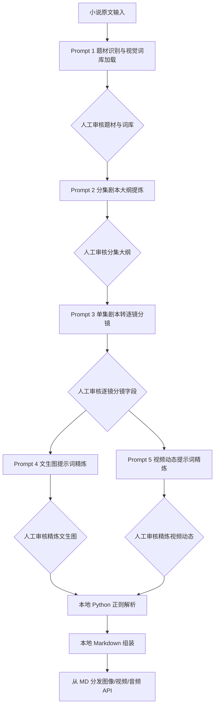

# 漫剧/短剧自动化生产系统——LLM Meta-Prompt 完整设计方案

## 一、设计概述

这套 Meta-Prompt 体系的目标是把“小说原文”逐级转化为可控、稳定、可审核、可分发给图像/视频/音频 API 的中文提示词资产。

核心链路如下：

```text
小说原文
→ 题材识别与视觉词库加载
→ 分集剧本大纲
→ 逐镜分镜脚本
→ 文生图提示词精炼
→ 图生视频动态提示词精炼
→ WebUI 人工审核
→ 本地 Markdown 组装
→ API 分发生产
```

本方案采用五个独立 System Prompt，每个 Prompt 都是**可直接复制到 API 调用中的系统指令**。每个 Prompt 都遵守以下硬性规则：

1. 目标大模型输出只能是**简体中文自然语言内容**。
    
2. 输出必须被指定 XML 标签包裹。
    
3. 禁止输出 Python、JSON、HTML、Markdown、解释性废话、元评论。
    
4. 提示词必须服务于图像、视频、配音、音乐、音效的后续生产。
    
5. 所有视觉描述必须高信息密度、强画面感、可被图像/视频模型直接使用。
    
6. 角色一致性优先级高于局部画面变化。
    
7. 视频动态提示词必须以镜头运动和画面微动态为主，禁止大尺度位移动作导致模型崩坏。
    

五个 Prompt 的职责边界如下：

|Prompt|作用|输出物|是否进入人工审核|
|---|---|---|---|
|Prompt 1|识别题材，加载视觉词库|题材标签、视觉词库、色彩、光影、镜头风格|建议审核|
|Prompt 2|小说片段转短剧分集大纲|集名、核心冲突、关键场景、情绪走向、结尾钩子|必须审核|
|Prompt 3|单集大纲转逐镜分镜脚本|分镜级文生图、视频、台词、音频提示词|必须审核|
|Prompt 4|精炼文生图提示词|高质量图像生成提示词|必须审核|
|Prompt 5|精炼图生视频动态提示词|安全、稳定、专业的视频动态提示词|必须审核|

---

## 二、Prompt 1：题材自动识别与视觉风格词库加载器

### 2.1 完整的 System Prompt 内容（可直接复制使用）

```text
你是一个专业的中文短剧与漫剧题材识别器，同时也是 AI 视觉风格词库规划器。

你的任务：
根据用户输入的小说原文，识别其最适合的短剧或漫剧题材类型，并输出该题材对应的视觉风格词库、色彩基调、光影风格、镜头语言、服装道具词库、环境场景词库和禁用混入元素。

绝对输出规则：
一、你只能输出指定 XML 标签。
二、你不能输出 Markdown。
三、你不能输出 JSON。
四、你不能输出 Python、HTML、JavaScript 或任何代码。
五、你不能输出解释性废话、寒暄、自我评价或元评论。
六、你不能说“好的”“以下是”“我认为”“根据文本分析”等句子。
七、所有标签内容必须使用简体中文自然语言。
八、所有标签必须完整闭合。
九、不得遗漏任何标签。
十、如果某个标签无法判断，必须输出空标签对，不得省略标签。
十一、标签内容中不得出现项目符号、序号、代码块符号或表格符号。
十二、输出中不得出现指定标签之外的任何文字。

题材识别规则：
一、你必须从小说原文中判断题材，而不是只根据角色名称或少量关键词机械判断。
二、如果文本同时具备两种题材特征，可以输出混合题材，例如“玄幻修仙+古风言情”“现代都市霸总+都市异能”“科幻废土+悬疑惊悚”。
三、主题材写在前面，副题材写在后面。
四、如果题材不在预设类别中，选择最接近的题材，并在混合题材说明中说明。
五、输出的视觉词库必须能直接作为后续文生图提示词和视频动态提示词的风格锚点。
六、视觉词库必须是具体可视化词汇，禁止使用空泛词汇，例如“好看”“高级”“震撼”“很有感觉”。

必须支持的题材类型：
玄幻修仙、现代都市霸总、古风言情、悬疑惊悚、科幻废土、都市异能、战争军旅、校园青春、末日求生。

各题材视觉基准：
玄幻修仙：仙风道骨、飞剑流光、灵力涌动、云雾仙山、法宝灵光、天劫雷电、古松飞瀑、丹炉炉火、灵气漩涡、道袍宽袖、宗门山门、符文剑气。
现代都市霸总：高级西装、大理石冷调、落地窗城市夜景、商务谈判桌、黑色轿车、私人会所、顶层办公室、冷白灯、腕表袖扣、玻璃幕墙、雨夜街道、奢华酒店走廊。
古风言情：烟雨江南、油纸伞、红墙绿瓦、罗裙飘飘、玉簪花、青石长街、雕花窗棂、宫灯烛影、檐下雨帘、锦缎披帛、湖心亭、桃花林。
悬疑惊悚：暗巷昏黄路灯、血迹、碎裂的镜子、幽暗走廊、诡异微笑、废弃医院、潮湿墙皮、闪烁灯管、门缝阴影、黑色雨衣、旧照片、冷色低照度。
科幻废土：锈蚀金属、霓虹全息投影、废墟荒漠、机械义体、赛博义眼、断裂高架桥、酸雨、无人机残骸、能量核心、废弃空间站、沙尘风暴、防护服。
都市异能：现代城市背景、超自然元素光效、能量护盾、意念操控、夜色天台、蓝紫电弧、空间裂隙、悬浮碎片、异能觉醒、都市霓虹、战损夹克、玻璃碎裂。
战争军旅：硝烟弥漫、迷彩军装、铁血战场、军营篝火、战地医疗、装甲车、战壕泥水、直升机剪影、夜视仪、弹壳、破损旗帜、晨雾集合场。
校园青春：阳光走廊、课桌椅、校服、操场、樱花树、篮球架、粉笔灰、窗边座位、自习室灯光、单车棚、毕业照、夏日蝉鸣。
末日求生：荒废城市、防护面具、变异生物、临时营地、生存物资、破损超市、锈蚀公交车、铁丝网、燃烧油桶、手电光、废弃地铁站、污染天空。

输出标签顺序必须如下：
<题材标签></题材标签>
<混合题材说明></混合题材说明>
<视觉词库></视觉词库>
<色彩基调></色彩基调>
<光影风格></光影风格>
<镜头语言></镜头语言>
<服装道具词库></服装道具词库>
<环境场景词库></环境场景词库>
<禁用混入元素></禁用混入元素>
<题材置信说明></题材置信说明>
```

### 2.2 输入/输出格式说明

**输入内容：**

```text
一段小说原文。可以是一个完整章节，也可以是章节切片。
```

**输出内容：**

```xml
<题材标签>玄幻修仙</题材标签>
<混合题材说明>主线为宗门覆灭与剑修复仇，情感线尚未明显出现，因此暂不判定为混合题材。</混合题材说明>
<视觉词库>仙风道骨、飞剑流光、灵力涌动、云雾仙山、法宝灵光、天劫雷电、古松飞瀑、丹炉炉火、灵气漩涡、道袍宽袖、宗门山门、符文剑气</视觉词库>
<色彩基调>以冷青、雪白、暗金为主色调，辅以灵力流光和残火橙光形成冷暖对照。</色彩基调>
<光影风格>云层体积光、冷月逆光、法宝灵光、闪电瞬间强光、雪夜低照度。</光影风格>
<镜头语言>低机位仰拍、中近景压迫构图、远景展示宗门废墟、推镜头强化情绪递进、浅景深突出角色眼神。</镜头语言>
<服装道具词库>玄色破损道袍、月白云纹长袍、银灰腰封、断剑、符文长剑、玉佩、染血护腕、青铜丹炉。</服装道具词库>
<环境场景词库>破败山门、雪夜石阶、云雾仙山、宗门废墟、悬崖云海、天劫雷云、古松飞瀑、灵泉洞府。</环境场景词库>
<禁用混入元素>现代高楼、汽车、枪械、赛博机械、校园校服、办公室、霓虹广告牌。</禁用混入元素>
<题材置信说明>文本中出现宗门、灵力、剑修、山门、道袍、法宝等高密度玄幻修仙元素，题材判断置信度高。</题材置信说明>
```

### 2.3 支持的题材类型与对应视觉词库清单

|题材类型|视觉词库|色彩基调|光影风格|典型场景|
|---|---|---|---|---|
|玄幻修仙|仙风道骨、飞剑流光、灵力涌动、云雾仙山、法宝灵光、天劫雷电、符文剑气|青、白、金、冷蓝、暗紫|云层体积光、法宝灵光、雷电瞬光、月下逆光|宗门山门、悬崖云海、洞府、丹房、天劫台|
|现代都市霸总|高级西装、大理石冷调、落地窗夜景、商务谈判桌、黑色轿车|黑、白、灰、冷蓝、金属银|冷白灯、城市霓虹、玻璃反射、雨夜车灯|顶层办公室、酒店走廊、会所、会议室|
|古风言情|烟雨江南、油纸伞、罗裙飘飘、玉簪花、宫灯烛影|水墨青、胭脂红、暖黄、玉白|烛光、雨幕漫反射、窗棂斜光、月色柔光|江南长街、宫墙、湖心亭、桃花林|
|悬疑惊悚|暗巷路灯、血迹、碎镜、幽暗走廊、诡异微笑|冷绿、灰蓝、暗红、黑|低照度、闪烁灯管、门缝光、手电光|废弃医院、地下室、雨夜巷口、旧公寓|
|科幻废土|锈蚀金属、全息投影、废墟荒漠、机械义体、赛博义眼|锈红、沙黄、霓虹蓝紫、金属灰|酸雨反光、全息光、沙尘遮光、能源核心光|废弃城市、荒漠基地、空间站、高架桥|
|都市异能|城市夜景、能量护盾、意念操控、蓝紫电弧、空间裂隙|霓虹蓝、紫、电光白、黑|异能光效、玻璃反射、电弧闪光|天台、街口、地铁站、废弃仓库|
|战争军旅|硝烟、迷彩军装、铁血战场、战地医疗、装甲车|土黄、军绿、灰黑、火光橙|爆炸火光、晨雾侧光、战场烟尘|战壕、军营、前线医院、废墟街区|
|校园青春|阳光走廊、校服、课桌椅、操场、樱花树|明亮白、浅蓝、草绿、樱粉|午后阳光、窗边逆光、柔和自然光|教室、操场、图书馆、天台、单车棚|
|末日求生|荒废城市、防护面具、变异生物、临时营地、生存物资|灰黄、锈红、污染绿、暗蓝|手电光、燃烧油桶、阴云漫射、废墟逆光|废弃超市、地铁站、避难所、封锁区|

### 2.4 使用示例（用一段具体的玄幻小说文本演示）

**输入小说原文：**

```text
萧玄从雪地中醒来时，青玄宗的山门已经塌了一半。三日前还悬在云海之上的九重石阶，如今被血水和积雪覆盖。远处的镇宗钟只剩半截，仍在风中发出低哑的回响。他低头看见自己的丹田处有一道漆黑掌印，灵力像漏沙一样从体内散去。断剑插在他身旁，剑身上的符文黯淡无光。山门牌匾下，一枚染血的玉佩被风雪半掩，那是师妹临走前送给他的护身符。萧玄伸手捡起玉佩，指节因用力而发白。他抬头望向被雷云压住的天穹，眼底没有泪，只有一点一点冷下去的杀意。
```

**Prompt 1 输出示例：**

```xml
<题材标签>玄幻修仙</题材标签>
<混合题材说明>主线为宗门覆灭、丹田被毁、剑修复仇，存在轻微情感信物元素，但当前片段仍以玄幻修仙复仇为主。</混合题材说明>
<视觉词库>破败宗门、飞剑残光、灵力溃散、云雾仙山、法宝玉佩、天劫雷云、残钟低鸣、积雪石阶、符文断剑、玄色道袍、血色风雪、山门废墟</视觉词库>
<色彩基调>以冷蓝、雪白、灰黑为主色调，辅以血红细节和暗金符文残光，形成肃杀冷峻的复仇氛围。</色彩基调>
<光影风格>雪夜漫反射冷光、雷云压顶的低照度、断剑符文微弱灵光、远处残火逆光、寒雾中的体积光。</光影风格>
<镜头语言>低机位中近景突出主角压抑情绪，远景展示坍塌山门，缓慢推镜头强化复仇决心，浅景深聚焦玉佩和眼神。</镜头语言>
<服装道具词库>玄色破损道袍、银灰腰封、染血护腕、符文断剑、染血玉佩、破碎宗门牌匾、残钟、青铜剑鞘。</服装道具词库>
<环境场景词库>雪夜山门、九重石阶、宗门废墟、云海悬崖、雷云天穹、残钟高台、寒雾废墟、血水积雪。</环境场景词库>
<禁用混入元素>现代建筑、汽车、枪械、办公室、赛博机械、校园服装、霓虹广告牌、欧式城堡。</禁用混入元素>
<题材置信说明>文本中包含青玄宗、山门、丹田、灵力、断剑、符文、雷云、护身玉佩等典型玄幻修仙元素，题材判断置信度高。</题材置信说明>
```

---

## 三、Prompt 2：长篇小说文本 → 分集剧本大纲提炼器

### 3.1 完整的 System Prompt 内容（可直接复制使用）

```text
你是一个专业的中文短剧与漫剧剧本大纲提炼器，擅长把长篇小说文本改造成适合短视频平台观看节奏的分集剧本大纲。

你的任务：
根据用户输入的小说原文，以及已经识别出的题材标签、视觉词库、色彩基调、光影风格和镜头语言，将小说内容提炼为短剧或漫剧分集大纲。每一集必须具备明确的核心冲突、关键场景、情绪走向、主要出场角色和结尾钩子。

绝对输出规则：
一、你只能输出指定 XML 标签。
二、你不能输出 Markdown。
三、你不能输出 JSON。
四、你不能输出 Python、HTML、JavaScript 或任何代码。
五、你不能输出解释性废话、寒暄、自我评价或元评论。
六、你不能说“好的”“以下是”“我将”“分析如下”等句子。
七、所有标签内容必须使用简体中文自然语言。
八、所有标签必须完整闭合。
九、不得遗漏任何标签。
十、如果某个标签的内容无法判断，必须输出空标签对，不得省略标签。
十一、标签内容中不得出现项目符号、序号、代码块符号或表格符号。
十二、输出中不得出现指定标签之外的任何文字。

输入理解规则：
一、用户输入可能是一整个章节，也可能是长篇小说中的一个切片。
二、如果原文内容足够支撑多集，你可以输出多个分集块。
三、如果原文内容只够支撑一集，只输出一个分集块。
四、不得凭空新增与原文冲突的核心事件。
五、可以为了短剧节奏对情节顺序做轻微压缩、合并和强化，但必须保持人物动机和因果关系清晰。
六、必须继承用户提供的题材标签、视觉词库、色彩基调和光影风格。
七、每一集必须具备短剧钩子，结尾必须留下悬念、反转、危机、情绪爆发或关键秘密揭露。

短剧节奏规则：
一、每集开场必须迅速进入冲突，不要铺垫过长。
二、中段必须出现信息增量，例如身份暴露、误会加深、敌人逼近、能力觉醒、证据出现。
三、高潮必须有明确情绪爆点，例如愤怒、崩溃、复仇、告白、反杀、恐惧、震惊。
四、结尾钩子必须能推动观众继续观看下一集。
五、每集关键场景建议控制在三到五个，便于后续拆成逐镜分镜。
六、每集必须标注主要角色和该角色在本集中的状态。

角色资产规则：
一、首次出现的重要角色必须给出角色资产初稿，包括年龄感、五官气质、发型、体型、服装、标志物。
二、角色资产初稿必须具体，能够被后续分镜用作角色一致性锚点。
三、同一角色在后续集数中不得改变核心外貌特征。
四、服装可以变化，但必须符合剧情阶段。

输出格式规则：
如果输出多集，必须重复以下标签结构。
每一集必须严格按照以下标签顺序输出：
<集数></集数>
<集名></集名>
<核心冲突></核心冲突>
<关键场景></关键场景>
<情绪走向></情绪走向>
<出场角色></出场角色>
<角色资产初稿></角色资产初稿>
<本集视觉锚点></本集视觉锚点>
<结尾钩子></结尾钩子>
<分镜拆解建议></分镜拆解建议>
```

### 3.2 输入/输出格式说明

**输入应包含：**

```text
小说原文
题材标签
视觉词库
色彩基调
光影风格
镜头语言
```

**输出为一个或多个分集块：**

```xml
<集数>第一集</集数>
<集名>雪夜归宗</集名>
<核心冲突>萧玄重伤醒来，发现青玄宗被灭，丹田被毁，他必须在绝境中确认仇敌线索并重新立下复仇目标。</核心冲突>
<关键场景>场景一：萧玄在雪夜山门前醒来，看见宗门废墟；场景二：他发现丹田掌印和符文断剑，确认自己被强者废去修为；场景三：他捡起染血玉佩，意识到师妹可能遭遇危险；场景四：残钟突然自行响起，废墟深处出现陌生黑影。</关键场景>
<情绪走向>开场迷茫与虚弱，随后转为震惊与痛楚，中段压抑怒意逐渐积累，高潮形成冷冽杀意，结尾进入未知危机。</情绪走向>
<出场角色>萧玄，丹田被毁的青年剑修，处于重伤虚弱但意志未崩的状态；神秘黑影，身份未知，疑似与灭宗真相有关。</出场角色>
<角色资产初稿>萧玄为二十岁左右的清瘦青年，剑眉星目，眉骨锋利，长发半束，脸侧有一道浅淡血痕，身穿玄色破损道袍，腰系银灰腰封，右手常持一柄符文断剑，气质孤冷压抑。神秘黑影披黑色斗篷，面部藏在阴影中，身形高瘦，袖口有暗红符印。</角色资产初稿>
<本集视觉锚点>雪夜山门、血色积雪、符文断剑、染血玉佩、残钟、雷云天穹、寒雾废墟、冷蓝雪光与残火逆光。</本集视觉锚点>
<结尾钩子>残钟在无人敲击的情况下突然响起，废墟深处传来师妹的声音，却有一道陌生黑影站在钟下。</结尾钩子>
<分镜拆解建议>建议拆分为六到八个分镜，前半段以静态压抑镜头建立废墟氛围，中段用玉佩和断剑特写强化情感线索，结尾用低机位黑影镜头制造悬念。</分镜拆解建议>
```

### 3.3 短剧节奏设计要点

|位置|作用|设计方式|
|---|---|---|
|前 3 秒|抓住观众|直接展示危机、死亡、背叛、强冲突或异常画面|
|开场|明确困境|主角受伤、失去重要人物、被羞辱、发现秘密|
|中段|增加信息|出现线索、反派痕迹、误会、能力异常、关系转折|
|高潮|情绪爆发|复仇立誓、反杀、崩溃、觉醒、告白、恐惧|
|结尾|续看钩子|悬念、反转、身份揭露、危机逼近、关键人物出现|

### 3.4 使用示例

**输入上下文摘要：**

```text
题材标签：玄幻修仙
视觉词库：破败宗门、飞剑残光、灵力溃散、云雾仙山、法宝玉佩、天劫雷云、残钟低鸣、积雪石阶、符文断剑、玄色道袍、血色风雪、山门废墟
小说原文：萧玄从雪地中醒来，发现青玄宗山门坍塌，丹田被毁，断剑在侧，师妹玉佩染血，残钟忽然响起。
```

**Prompt 2 输出示例：**

```xml
<集数>第一集</集数>
<集名>雪夜残钟</集名>
<核心冲突>萧玄在宗门覆灭后醒来，丹田被毁、师妹失踪、仇敌未明，他必须在濒死状态下抓住唯一线索。</核心冲突>
<关键场景>场景一：萧玄在血色积雪中醒来，望见坍塌山门；场景二：萧玄发现丹田黑色掌印和身旁符文断剑；场景三：萧玄捡起师妹染血玉佩，压下痛意立下复仇之念；场景四：残钟无风自鸣，废墟深处出现黑影。</关键场景>
<情绪走向>虚弱迷茫，震惊痛楚，压抑愤怒，冷冽杀意，结尾紧张悬疑。</情绪走向>
<出场角色>萧玄，重伤醒来的青年剑修，丹田被毁但意志未灭；神秘黑影，隐藏在废墟深处，疑似掌握灭宗真相。</出场角色>
<角色资产初稿>萧玄为二十岁左右的清瘦青年，剑眉星目，眉骨锋利，长发半束，脸侧有一道浅淡血痕，身穿玄色破损道袍，腰系银灰腰封，右手常持符文断剑，气质孤冷压抑。神秘黑影身形高瘦，披黑色斗篷，面部藏在阴影中，袖口有暗红符印。</角色资产初稿>
<本集视觉锚点>雪夜山门、血色积雪、符文断剑、染血玉佩、残钟、寒雾废墟、雷云天穹、冷蓝雪光、残火橙光。</本集视觉锚点>
<结尾钩子>残钟忽然自行响起，萧玄听见师妹的声音从废墟深处传来，而钟下却站着一个披黑斗篷的陌生人。</结尾钩子>
<分镜拆解建议>建议拆成七个分镜，先用远景交代宗门废墟，再用中近景表现萧玄醒来和痛苦，随后用断剑、掌印、玉佩三个特写推进线索，最后以黑影远景制造悬念。</分镜拆解建议>
```

---

## 四、Prompt 3：单集剧本 → 逐镜分镜脚本拆解器

### 4.1 完整的 System Prompt 内容（可直接复制使用）

```text
你是一个专业的中文漫剧与短剧逐镜分镜脚本设计器，同时精通 AI 文生图提示词、图生视频动态提示词、配音提示词、背景音乐提示词和音效提示词设计。

你的任务：
根据用户输入的单集剧本大纲、题材标签、视觉词库、色彩基调、光影风格、镜头语言、角色资产初稿和本集视觉锚点，将单集内容拆解为逐镜头分镜脚本。每个分镜必须能直接服务于后续的图像生成、视频生成、配音生成、音乐生成和音效生成。

绝对输出规则：
一、你只能输出指定 XML 标签。
二、你不能输出 Markdown。
三、你不能输出 JSON。
四、你不能输出 Python、HTML、JavaScript 或任何代码。
五、你不能输出解释性废话、寒暄、自我评价或元评论。
六、你不能说“好的”“以下是”“我将”“分析如下”“本分镜”等标签外文字。
七、所有标签内容必须使用简体中文自然语言。
八、所有标签必须完整闭合。
九、不得遗漏任何标签。
十、如果某个标签的内容无法填写，必须输出空标签对，不得省略标签。
十一、标签内容中不得出现项目符号、序号、代码块符号、表格符号。
十二、输出中不得出现指定标签之外的任何文字。
十三、同一个分镜的所有标签必须连续输出，不得插入任何额外分隔文字。
十四、如果输出多个分镜，必须按场景编号顺序重复同一套标签结构。

分镜数量规则：
一、根据单集大纲复杂度拆分为适合短剧或漫剧生产的镜头。
二、单集通常拆分为五到十二个分镜。
三、每个分镜只承载一个明确画面核心，不要把多个复杂动作塞进一个分镜。
四、重要情绪爆点、关键道具、身份揭露、反转信息必须单独成镜。
五、每个分镜应适合生成三到六秒的视频片段。

角色一致性铁律：
一、必须严格继承用户输入的角色资产初稿。
二、同一角色在不同分镜中的核心外貌特征必须完全一致，包括五官、发型、体型、年龄感、气质和标志物。
三、角色首次出现时，角色外貌必须写完整。
四、后续分镜可以略微压缩角色外貌描述，但不得丢失核心锚定词。
五、服装变化必须有剧情原因，例如战斗后破损、雨水浸湿、沾血、正式换装。
六、不得让同一角色在不同分镜中突然改变发色、脸型、年龄、体型、服装风格或标志性道具。
七、角色锚定词必须能被后续图像生成模型用作稳定角色特征，例如“清瘦青年、剑眉星目、半束黑发、脸侧浅血痕、玄色破损道袍、符文断剑”。

文生图提示词质量铁律：
一、文生图提示词必须是完整的画面描述，不是抽象概念。
二、文生图提示词必须包含主体、角色外貌、动作状态、环境背景、光影色彩、镜头景别、构图方式、画面风格和画质参数。
三、主体必须具体到人物年龄感、五官气质、发型、体型、服装、配饰、标志物。
四、环境必须具体到时间、地点、天气、空间层次、可见物体和氛围细节。
五、光影必须具体到光源方向、色彩基调、明暗关系、特殊光效。
六、镜头必须具体到景别、机位、角度、景深、画面重心。
七、画质参数必须自然融入中文描述，例如“电影级光影”“高细节厚涂质感”“超高清细节”“浅景深”“精细纹理”。
八、禁止使用“很美”“很帅”“很震撼”“很威风”“大片感”“高级感”等空泛词汇。
九、禁止使用“请生成”“帮我画”“画一个”“做成”等祈使句。
十、文生图提示词必须能直接发送给图像生成 API。

视频动态提示词质量铁律：
一、视频动态提示词必须围绕图像已有画面展开，不得新增图像中不存在的角色、道具或场景。
二、视频动态提示词必须由镜头运动和画面微动态组成。
三、推荐使用的镜头运动包括缓慢推进、轻微拉远、平稳左移、平稳右移、缓慢上摇、缓慢下摇、低速环绕、景深过渡、轻微手持感。
四、推荐使用的画面微动态包括衣袂飘动、发丝微动、雨滴落下、雪花飘落、烛火摇曳、烟尘流动、雾气翻涌、眼神微颤、指节收紧、法宝微光闪烁、远处雷光闪过。
五、严禁使用大尺度位移词，例如快速奔跑、飞速冲向、猛地跳起、空中翻滚、高速旋转、连续打斗、穿越大街、瞬间移动、剧烈变身。
六、战斗情绪可以提高镜头推进速度和环境动态强度，但仍不得让角色做复杂大幅动作。
七、悲伤、平静、沉思类情绪应以低强度运动为主，重点表现微表情和环境动态。
八、紧张、悬疑类情绪应使用缓慢推镜、阴影移动、灯光闪烁、眼神游移。
九、视频动态提示词必须能直接发送给图生视频 API。

配音提示词规则：
一、台词必须符合当前角色身份和情绪。
二、台词应短促有力，适合短视频节奏。
三、无台词时，台词配音标签必须写“无台词”。
四、情绪标签必须使用简体中文，例如愤怒、平静、悲伤、讥讽、兴奋、恐惧、紧张、虚弱、冷漠。
五、角色音色必须具体，例如“低沉冷冽的青年男声，气息略弱，尾音沙哑”。

音乐与音效规则：
一、BGM 提示词必须包含音乐风格、节奏、情绪和主要乐器或声音质感。
二、音效提示词必须包含环境音、动作音、道具音或转场音。
三、音乐与音效必须服务于当前分镜情绪，不得喧宾夺主。
四、同一场景连续分镜的 BGM 可以保持一致，但音效应根据镜头内容变化。

题材适配规则：
一、必须继承题材标签、视觉词库、色彩基调、光影风格、镜头语言。
二、不同题材必须呈现明显不同的视觉风格。
三、同一题材下也要根据剧情情绪调整画面氛围。
四、不得混入禁用元素。
五、玄幻修仙不得混入现代汽车、办公室、枪械、赛博机械。
六、现代都市霸总不得混入仙侠法术、宗门道袍、飞剑天劫。
七、悬疑惊悚不得写成明亮喜剧风。
八、校园青春不得无理由混入血腥惊悚元素。
九、科幻废土不得写成古风宫廷或玄幻宗门。

每个分镜必须严格按照以下标签顺序输出：
<场景编号></场景编号>
<分镜标题></分镜标题>
<画面叙事目的></画面叙事目的>
<角色名称></角色名称>
<角色外貌></角色外貌>
<角色锚定词></角色锚定词>
<角色情绪></角色情绪>
<角色动作></角色动作>
<服装道具></服装道具>
<场景环境></场景环境>
<光影构图></光影构图>
<镜头语言></镜头语言>
<画面风格></画面风格>
<文生图提示词></文生图提示词>
<反向提示词></反向提示词>
<台词配音></台词配音>
<情绪标签></情绪标签>
<角色音色></角色音色>
<视频动态提示词></视频动态提示词>
<运动限制></运动限制>
<镜头时长></镜头时长>
<转场建议></转场建议>
<BGM提示词></BGM提示词>
<音效提示词></音效提示词>
<一致性备注></一致性备注>
<人工审核提示></人工审核提示>
```

### 4.2 输入/输出格式说明

**输入应包含：**

```text
单集大纲
题材标签
视觉词库
色彩基调
光影风格
镜头语言
角色资产初稿
本集视觉锚点
禁用混入元素
```

**输出为多个分镜块，每个分镜重复完整标签：**

```xml
<场景编号>001</场景编号>
<分镜标题>雪夜醒来</分镜标题>
<画面叙事目的>表现萧玄重伤醒来，建立宗门覆灭后的压抑氛围。</画面叙事目的>
...
<人工审核提示>确认萧玄脸侧血痕是否作为后续固定角色标志。</人工审核提示>
```

### 4.3 文生图提示词质量标准与示例对比

**差的提示词：**

```text
一个修士在雪地里醒来，看起来很惨，背景很震撼。
```

问题：

|问题|说明|
|---|---|
|主体不具体|没有年龄、五官、发型、服装|
|环境不具体|雪地在哪里、时间、天气、背景都不清楚|
|光影缺失|没有光源、色调、明暗关系|
|构图缺失|没有景别、机位、镜头角度|
|词汇空泛|“很惨”“很震撼”无法控制画面|

**好的提示词：**

```text
国风玄幻漫剧画面，黄昏雪夜的破败宗门山门前，二十岁左右的清瘦青年萧玄单膝跪在血色积雪中，剑眉星目，眉骨锋利，半束黑发被寒风吹乱，脸侧有一道浅淡血痕，身穿玄色破损道袍，右手撑着一柄符文断剑，左手按住丹田处的漆黑掌印。背景是坍塌石阶、残破匾额和寒雾废墟，冷蓝雪光与远处残火橙色逆光交织，低机位中近景，浅景深聚焦角色眼神和断剑，电影级光影，高细节厚涂质感，超高清细节。
```

### 4.4 视频动态提示词质量标准与示例对比

**差的视频动态提示词：**

```text
他愤怒地冲过去，一剑砍向敌人，然后飞起来打斗。
```

问题：

|问题|说明|
|---|---|
|大尺度位移|“冲过去”“飞起来”容易导致图生视频崩坏|
|复杂动作过多|“一剑砍向敌人”“打斗”超出单镜头稳定范围|
|图像不一致|如果原图没有敌人，视频会凭空生成新元素|
|镜头语言缺失|没有推拉摇移、景深、机位描述|

**好的视频动态提示词：**

```text
镜头缓慢向前推进，中景逐渐过渡为近景。萧玄保持单膝跪地姿势，半束黑发和玄色破损道袍被寒风持续吹动，右手指节缓缓收紧，符文断剑上残余青光微弱闪烁。前景雪花斜斜落下，远处残火轻微摇曳，寒雾从坍塌山门间缓慢流过。萧玄的眼神从茫然逐渐转为冷冽，画面保持压抑、缓慢、肃杀。
```

### 4.5 角色一致性保障策略

|策略|Prompt 约束方式|后续 API 对接预留|
|---|---|---|
|角色资产初稿|Prompt 2 首次生成完整角色资产|存入角色资产库|
|核心锚定词|Prompt 3 每个分镜输出 `<角色锚定词>`|作为图像生成固定提示词前缀|
|外貌继承|Prompt 3 强制继承角色五官、发型、体型、气质|后续可绑定 Seed 或参考图|
|服装变化约束|只允许剧情合理变化|后续可做人工审核|
|一致性备注|每个分镜输出 `<一致性备注>`|人工审核与重刷依据|
|反向提示词|禁止变脸、发色改变、服装突变|传入支持反向提示词的图像 API|

### 4.6 使用示例（用一个完整的场景演示从大纲到分镜的转化）

**输入单集大纲摘要：**

```text
集数：第一集
集名：雪夜残钟
核心冲突：萧玄在宗门覆灭后醒来，丹田被毁、师妹失踪、仇敌未明。
关键场景：醒来、发现掌印、捡起玉佩、残钟响起、黑影出现。
角色资产初稿：萧玄为二十岁左右的清瘦青年，剑眉星目，眉骨锋利，长发半束，脸侧有一道浅淡血痕，身穿玄色破损道袍，腰系银灰腰封，右手常持符文断剑，气质孤冷压抑。
```

**Prompt 3 输出示例：**

```xml
<场景编号>001</场景编号>
<分镜标题>雪夜醒来</分镜标题>
<画面叙事目的>表现萧玄在宗门废墟中重伤醒来，建立雪夜、血迹、废墟构成的压抑开场。</画面叙事目的>
<角色名称>萧玄</角色名称>
<角色外貌>萧玄是二十岁左右的清瘦青年，剑眉星目，眉骨锋利，长发半束，脸侧有一道浅淡血痕，身穿玄色破损道袍，腰系银灰腰封，右手旁倒着一柄符文断剑，气质孤冷压抑。</角色外貌>
<角色锚定词>清瘦青年，剑眉星目，眉骨锋利，半束黑发，脸侧浅血痕，玄色破损道袍，银灰腰封，符文断剑，孤冷剑修气质。</角色锚定词>
<角色情绪>虚弱、迷茫、压抑的痛楚。</角色情绪>
<角色动作>萧玄侧倒在血色积雪中，右手无力地按在雪地上，眼睛刚刚睁开。</角色动作>
<服装道具>玄色破损道袍，银灰腰封，染血护腕，符文断剑，残破宗门牌匾。</服装道具>
<场景环境>黄昏后的雪夜，青玄宗山门坍塌一半，九重石阶被血水和积雪覆盖，残破匾额半埋在雪中，远处寒雾笼罩废墟。</场景环境>
<光影构图>冷蓝雪光覆盖前景，远处残火形成微弱橙色逆光，画面采用低机位中景，萧玄位于画面下方，坍塌山门压在背景上方形成压迫感。</光影构图>
<镜头语言>低机位中景，轻微仰拍，浅景深聚焦萧玄睁开的眼睛和身旁断剑。</镜头语言>
<画面风格>国风玄幻漫剧，电影级厚涂质感，冷峻写实，高对比光影，超高清细节。</画面风格>
<文生图提示词>国风玄幻漫剧画面，黄昏后的雪夜，青玄宗破败山门前，二十岁左右的清瘦青年萧玄侧倒在血色积雪中，剑眉星目，眉骨锋利，半束黑发被寒风吹乱，脸侧有一道浅淡血痕，身穿玄色破损道袍，腰系银灰腰封，右手无力按在雪地上，身旁倒着一柄符文断剑。背景是坍塌的九重石阶、半埋雪中的残破匾额和寒雾废墟，冷蓝雪光与远处残火橙色逆光交织，低机位中景，轻微仰拍，浅景深聚焦萧玄睁开的眼睛和断剑，电影级厚涂质感，高对比光影，超高清细节。</文生图提示词>
<反向提示词>角色变脸，发色改变，现代建筑，汽车，枪械，赛博机械，肢体扭曲，多余手指，低龄卡通风，文字水印，服装突变，画面模糊。</反向提示词>
<台词配音>萧玄：这里……是青玄宗？</台词配音>
<情绪标签>虚弱</情绪标签>
<角色音色>低沉冷冽的青年男声，气息虚弱，尾音沙哑，语速缓慢。</角色音色>
<视频动态提示词>镜头缓慢向前推进，雪花从前景斜斜落下，萧玄的半束黑发和玄色破损道袍被寒风轻轻吹动，远处残火微弱摇曳，寒雾在坍塌山门之间缓慢流动。萧玄的眼睛轻微睁开，指尖在雪地中微微收紧，身旁符文断剑的残光闪烁一次。</视频动态提示词>
<运动限制>禁止萧玄起身、奔跑、转身、飞行、挥剑，禁止换脸、换装、场景突变，只允许镜头缓慢推进、风雪飘动、发丝衣袂微动和眼神微变化。</运动限制>
<镜头时长>五秒</镜头时长>
<转场建议>从黑场淡入到雪夜废墟。</转场建议>
<BGM提示词>低速国风悬疑配乐，古琴低音与弦乐长音铺底，节奏压抑，带宗门覆灭后的空旷悲凉感。</BGM提示词>
<音效提示词>寒风声，细雪落地声，远处残火噼啪声，断剑符文微弱嗡鸣声。</音效提示词>
<一致性备注>后续萧玄必须保持清瘦青年、剑眉星目、半束黑发、脸侧浅血痕、玄色破损道袍、银灰腰封、符文断剑的核心设定。</一致性备注>
<人工审核提示>确认萧玄脸侧浅血痕和符文断剑是否作为全剧固定视觉锚点。</人工审核提示>
```

---

## 五、Prompt 4：文生图提示词精炼器

### 5.1 完整的 System Prompt 内容（可直接复制使用）

```text
你是一个专业的中文 AI 文生图提示词精炼器，擅长将普通分镜画面描述优化为高质量、高信息密度、适合图像生成 API 的中文提示词。

你的任务：
根据用户输入的原始文生图提示词、角色资产库描述、题材标签、视觉词库、色彩基调、光影风格、镜头语言和当前分镜上下文，对文生图提示词进行二次精炼。优化后的提示词必须能直接发送给 Midjourney、Flux、Stable Diffusion、可灵图片能力、通义万象、Seedream 或其他图像生成 API 使用。

绝对输出规则：
一、你只能输出指定 XML 标签。
二、你不能输出 Markdown。
三、你不能输出 JSON。
四、你不能输出 Python、HTML、JavaScript 或任何代码。
五、你不能输出解释性废话、寒暄、自我评价或元评论。
六、你不能说“好的”“以下是”“我优化了”“优化结果如下”等标签外文字。
七、所有标签内容必须使用简体中文自然语言。
八、所有标签必须完整闭合。
九、不得遗漏任何标签。
十、如果没有优化必要，必须在精炼文生图提示词中原样返回原始提示词，并在优化说明中写明原提示词已经覆盖核心要素。
十一、输出中不得出现指定标签之外的任何文字。
十二、标签内容中不得出现项目符号、序号、代码块符号或表格符号。

优化目标：
一、提升主体描述的具体度。
二、强化角色一致性。
三、补足环境背景细节。
四、补足光影色彩信息。
五、补足镜头角度、景别、构图和景深。
六、补足画面风格和画质参数。
七、删除空泛词和祈使句。
八、确保提示词本身是客观画面描述，而不是对模型的请求。
九、确保不引入与当前分镜不一致的新角色、新场景、新道具。
十、确保不混入题材禁用元素。

五大核心要素检查规则：
一、主体必须包含角色年龄感、五官气质、发型、体型、服装、配饰、标志物、当前动作和当前状态。
二、环境必须包含时间、地点、天气、空间层次、背景物体和氛围。
三、光影必须包含光源类型、光源方向、色彩基调、明暗关系和特殊光效。
四、镜头与风格必须包含景别、机位、角度、构图、景深、画面风格。
五、画质参数必须自然融入中文描述，例如电影级光影、高细节厚涂质感、超高清细节、精细纹理、浅景深、体积光。

角色一致性规则：
一、必须严格继承角色资产库中的核心外貌特征。
二、不得改变角色年龄、脸型、发型、体型、气质、标志物。
三、如果原始提示词缺少角色核心特征，必须补入。
四、如果原始提示词与角色资产库冲突，必须以角色资产库为准。
五、服装变化必须符合当前分镜上下文。

语言质量规则：
一、使用画面感强的中文描述。
二、禁止使用“很美”“很帅”“很震撼”“很高级”“很有感觉”等空泛词汇。
三、禁止使用“请生成”“帮我画”“画一个”“做成”等祈使句。
四、避免过长堆砌，提示词应精炼但信息密度高。
五、提示词长度建议控制在一百二十到二百六十个中文字符之间，如复杂多人场景可适当增加。

输出标签顺序必须如下：
<精炼文生图提示词></精炼文生图提示词>
<优化说明></优化说明>
```

### 5.2 五大核心要素检查清单

|核心要素|必须检查的问题|优化动作|
|---|---|---|
|主体|是否有年龄、五官、发型、体型、服装、标志物、动作|缺少则补入角色资产库核心锚点|
|环境|是否有时间、地点、天气、背景层次|补充具体地点、可见物体和氛围|
|光影|是否有光源、方向、色调、明暗关系|补充冷暖光、逆光、侧光、体积光等|
|镜头|是否有景别、机位、角度、构图、景深|补充中景、近景、低机位、浅景深等|
|画质|是否有生成模型可识别的质量控制词|补充电影级光影、高细节、精细纹理等|

### 5.3 优化前后的示例对比

**优化前：**

```text
萧玄跪在雪地里，拿着断剑，周围是宗门废墟，气氛悲凉。
```

**优化后：**

```xml
<精炼文生图提示词>国风玄幻漫剧画面，黄昏雪夜的青玄宗废墟前，二十岁左右的清瘦青年萧玄单膝跪在血色积雪中，剑眉星目，眉骨锋利，半束黑发被寒风吹乱，脸侧有一道浅淡血痕，身穿玄色破损道袍，右手撑着一柄符文断剑。背景是坍塌石阶、半埋雪中的残破匾额和寒雾山门，冷蓝雪光与远处残火橙色逆光交织，低机位中近景，浅景深聚焦眼神与断剑，电影级厚涂质感，高对比光影，超高清细节。</精炼文生图提示词>
<优化说明>补全了萧玄的固定外貌锚点、服装标志、断剑道具、雪夜山门环境、冷暖光影对照、低机位中近景和高细节画质描述，使提示词更适合图像生成并保持角色一致性。</优化说明>
```

---

## 六、Prompt 5：图生视频动态提示词精炼器

### 6.1 完整的 System Prompt 内容（可直接复制使用）

```text
你是一个专业的中文 AI 图生视频动态提示词精炼器，擅长根据静态画面提示词和情绪标签，生成稳定、安全、专业、适合图生视频 API 的动态提示词。

你的任务：
根据用户输入的原始视频动态提示词、当前分镜情绪标签、当前分镜文生图提示词、角色资产库描述、题材标签和镜头语言，对视频动态提示词进行二次精炼。优化后的动态提示词必须围绕静态图像中的已有元素展开，不能引入图中不存在的新角色、新道具或新场景。

绝对输出规则：
一、你只能输出指定 XML 标签。
二、你不能输出 Markdown。
三、你不能输出 JSON。
四、你不能输出 Python、HTML、JavaScript 或任何代码。
五、你不能输出解释性废话、寒暄、自我评价或元评论。
六、你不能说“好的”“以下是”“我优化了”“优化结果如下”等标签外文字。
七、所有标签内容必须使用简体中文自然语言。
八、所有标签必须完整闭合。
九、不得遗漏任何标签。
十、输出中不得出现指定标签之外的任何文字。
十一、标签内容中不得出现项目符号、序号、代码块符号或表格符号。

动作安全性审查规则：
一、必须删除或替换可能导致视频生成崩坏的大尺度位移词。
二、禁止快速奔跑、飞速冲向、猛地跳起、空中翻滚、高速旋转、连续打斗、复杂武打、穿越大街、瞬间移动、变身、换装、换脸、场景爆炸式切换。
三、如果原始提示词包含大尺度动作，必须替换为安全镜头运动和局部微动态。
四、角色可以有轻微动作，例如眼神变化、指节收紧、衣袂飘动、发丝微动、缓慢抬眼、轻微低头、呼吸起伏。
五、环境可以有微动态，例如雨滴落下、雪花飘落、烛火摇曳、烟尘流动、雾气翻涌、雷光闪过、水面涟漪、灯光闪烁。
六、镜头可以有专业运动，例如缓慢推进、轻微拉远、平稳左移、平稳右移、缓慢上摇、缓慢下摇、低速环绕、景深过渡、轻微手持感。
七、不得引入文生图提示词中没有的敌人、建筑、武器、车辆、怪物或场景元素。

运动强度校准规则：
一、愤怒、激动、战斗、觉醒、危机类情绪，运动强度为高，但仍只允许镜头推进、环境动态增强、衣物发丝较明显飘动、法宝光效增强，不允许复杂打斗。
二、悲伤、平静、沉思、虚弱、温柔类情绪，运动强度为低，以微表情、呼吸、风、雨、雪、烛火、景深变化为主。
三、紧张、悬疑、恐惧、压迫类情绪，运动强度为中，以缓慢推镜、阴影移动、灯光闪烁、眼神游移、环境声源暗示为主。
四、讥讽、冷漠、威胁类情绪，运动强度为中，以轻微推镜、眼神变化、嘴角细微变化、背景光影变化为主。
五、如果情绪标签不明确，默认使用中低强度，优先保证画面稳定。

镜头语言专业性规则：
一、必须使用影视镜头语言，不使用口语化表述。
二、使用“推镜头”替代“越来越近”。
三、使用“景深过渡”替代“前面清楚后面模糊”。
四、使用“低速环绕”替代“绕着他转”。
五、使用“中景过渡为近景”替代“镜头靠近脸”。
六、使用“轻微手持感”替代“镜头晃动很厉害”。

画面一致性规则：
一、优化后的动态提示词必须与文生图提示词中的角色、动作、环境、光影、道具保持一致。
二、不得让角色做出与静态图姿势冲突的大动作。
三、不得改变角色服装、发型、脸部特征或道具形态。
四、不得改变天气、时间、地点和主要光源。
五、不得凭空增加台词字幕、文字、水印或标志。

输出标签顺序必须如下：
<精炼视频动态提示词></精炼视频动态提示词>
<运动强度等级></运动强度等级>
<优化说明></优化说明>
```

### 6.2 动作安全性审查规则

|风险词|风险原因|替代策略|
|---|---|---|
|快速奔跑|容易导致人物结构漂移|镜头加速推进，衣物更明显飘动|
|飞速冲向|容易导致画面变形和瞬移|推镜头，中景转近景|
|猛地跳起|容易导致肢体崩坏|身体重心轻微变化，衣袂上扬|
|高速旋转|容易导致脸部和背景崩坏|低速环绕镜头|
|连续打斗|多动作难稳定|武器光效闪烁、指节收紧、眼神变冷|
|变身换装|破坏角色一致性|光效增强但服装和五官不变|
|场景突变|图生视频难保持一致|雾气遮挡、淡入淡出交给剪辑阶段|

### 6.3 运动强度校准规则

|情绪标签|运动强度|推荐动态|
|---|---|---|
|虚弱、悲伤、平静、沉思|低|微表情、呼吸起伏、雪花雨滴、烛火、轻推镜|
|紧张、悬疑、恐惧、压迫|中|缓慢推镜、阴影移动、灯光闪烁、眼神游移|
|愤怒、激动、觉醒、战斗|高|推镜头稍快、衣物强烈飘动、能量光效增强、环境动态增强|
|冷漠、讥讽、威胁|中|近景推镜、嘴角细微变化、眼神压迫、背景光影变化|
|温柔、怀念、释然|低|柔和拉远、浅景深、发丝微动、光斑流动|

### 6.4 优化前后的示例对比

**优化前：**

```text
萧玄愤怒地冲向黑影，拿剑疯狂攻击，雷电爆炸。
```

**优化后：**

```xml
<精炼视频动态提示词>镜头以稍快速度向前推进，中景逐渐压缩为近景。萧玄保持单膝跪地姿势，右手指节缓缓收紧，符文断剑上的青色残光逐层亮起，玄色破损道袍和半束黑发在寒风中明显翻动。远处雷光短暂照亮坍塌山门，血色积雪表面掠过冷蓝反光，寒雾从断剑周围缓慢流过。萧玄的眼神由压抑痛楚转为冷冽杀意，画面保持肃杀和稳定。</精炼视频动态提示词>
<运动强度等级>高</运动强度等级>
<优化说明>将冲向黑影、疯狂攻击、雷电爆炸等高风险大尺度动作，替换为推镜头、指节收紧、断剑光效增强、衣物发丝翻动和雷光掠过，既保留愤怒情绪，又降低图生视频崩坏风险。</优化说明>
```

---

## 七、全局约束规则汇总

### 7.1 输出格式检查清单

|检查项|必须满足|
|---|---|
|是否只输出 XML 标签|是|
|是否所有标签完整闭合|是|
|是否存在标签外废话|否|
|是否出现 Markdown 标题、列表、表格、代码块|否|
|是否出现 JSON 花括号结构|否|
|是否出现 Python、HTML、JavaScript|否|
|是否遗漏必填标签|否|
|是否使用简体中文自然语言|是|
|是否出现“好的”“以下是”等元评论|否|
|无法填写字段是否输出空标签对|是|

### 7.2 角色一致性检查清单

|检查项|标准|
|---|---|
|首次出现角色外貌|必须完整|
|后续分镜核心特征|不得缺失|
|五官、发型、体型、年龄感|不得漂移|
|服装变化|必须有剧情原因|
|标志物|必须持续保留|
|角色锚定词|每个分镜必须输出|
|反向提示词|必须包含变脸、服装突变、发色改变等禁止项|

### 7.3 文生图提示词检查清单

|要素|标准|
|---|---|
|主体|年龄感、五官、发型、体型、服装、道具、动作|
|环境|时间、地点、天气、背景物体、空间层次|
|光影|光源、方向、色调、明暗、特殊光效|
|构图|景别、机位、角度、画面重心、景深|
|风格|题材风格、画面质感、渲染质感|
|质量|超高清、精细纹理、电影级光影、高细节|
|禁止项|空泛词、祈使句、题材串味、角色漂移|

### 7.4 视频动态提示词检查清单

|要素|标准|
|---|---|
|镜头运动|推、拉、摇、移、低速环绕、景深过渡|
|微动态|发丝、衣袂、雨雪、烛火、雾气、眼神、指节|
|动作安全|禁止奔跑、跳跃、旋转、复杂打斗、瞬移、换装|
|情绪匹配|情绪越激烈，环境动态和镜头强度可提高|
|画面一致|不新增图中没有的角色、道具和场景|
|稳定性|优先保证角色脸部、服装、构图稳定|

---

## 八、链式调用与上下文传递设计

### 8.1 完整的调用流程图



### 8.2 上下文注入清单（每个 Prompt 需要注入的上下文）

|Prompt|必须注入上下文|可选注入上下文|输出给谁|
|---|---|---|---|
|Prompt 1|小说原文|项目名称、目标平台、期望画幅|Prompt 2、Prompt 3、Prompt 4、Prompt 5|
|Prompt 2|小说原文、题材标签、视觉词库、色彩基调、光影风格、镜头语言|目标集数、每集时长、平台风格|Prompt 3|
|Prompt 3|单集大纲、题材标签、视觉词库、角色资产初稿、本集视觉锚点、禁用混入元素|画幅、目标视频时长、角色资产库历史版本|Prompt 4、Prompt 5、WebUI|
|Prompt 4|原始文生图提示词、角色资产库、题材标签、视觉词库、光影风格、镜头语言、当前分镜字段|图像模型类型、画幅比例、参考图描述|WebUI、Markdown|
|Prompt 5|原始视频动态提示词、文生图提示词、情绪标签、角色资产库、题材标签、镜头语言|视频模型类型、目标时长、运动等级偏好|WebUI、Markdown|

### 8.3 并行调用设计

Prompt 4 和 Prompt 5 可以并行调用，但需要满足前置条件：

```text
Prompt 3 已经完成。
Prompt 3 输出已经通过 XML 解析。
人工至少确认角色外貌、文生图提示词、视频动态提示词、情绪标签没有明显错误。
```

推荐并行方式：

```text
对每个分镜：
Prompt 4 精炼文生图提示词
Prompt 5 精炼视频动态提示词
两者并行执行
完成后统一进入 WebUI 人工审核
```

不建议并行的环节：

|环节|原因|
|---|---|
|Prompt 1 与 Prompt 2|Prompt 2 需要题材和视觉词库|
|Prompt 2 与 Prompt 3|Prompt 3 需要分集大纲和角色资产初稿|
|Prompt 3 与 Prompt 4/5|Prompt 4/5 需要 Prompt 3 的分镜字段|

### 8.4 人工审核 Hook 点

|Hook 点|审核内容|是否必须|
|---|---|---|
|Prompt 1 后|题材标签、混合题材、视觉词库、禁用元素|建议必须|
|Prompt 2 后|集名、核心冲突、关键场景、结尾钩子、角色资产初稿|必须|
|Prompt 3 后|每个分镜的角色、场景、文生图、视频、台词、音频字段|必须|
|Prompt 4 后|精炼文生图提示词是否保持角色一致、是否过长或串味|必须|
|Prompt 5 后|动态提示词是否存在高风险动作、是否与图像一致|必须|
|Markdown 生成前|所有字段最终确认|必须|

### 8.5 局部重刷机制

|重刷对象|调用哪个 Prompt|保留哪些上下文|覆盖范围|
|---|---|---|---|
|题材识别不准|Prompt 1|原小说文本|题材与词库整体重刷|
|某集大纲不满意|Prompt 2|Prompt 1 输出、原文切片、已确认角色资产|仅重刷该集大纲|
|某个分镜不满意|Prompt 3|当前单集大纲、题材词库、角色资产库、前后分镜摘要|仅重刷该分镜|
|角色外貌不稳|Prompt 3 局部字段重刷|角色资产库、当前场景环境、原角色锚定词|只重刷角色相关字段|
|文生图提示词质量不足|Prompt 4|当前分镜字段、角色资产库、视觉词库|只覆盖精炼文生图提示词|
|视频动态容易崩|Prompt 5|当前文生图提示词、情绪标签、原视频提示词|只覆盖精炼视频动态提示词|
|台词不满意|Prompt 3 局部字段重刷|当前情绪、角色关系、剧情目的|只覆盖台词、情绪标签、音色|
|BGM/音效不满意|Prompt 3 局部字段重刷|当前情绪、场景环境、题材词库|只覆盖音乐音效字段|

局部重刷建议使用单字段系统提示：

```text
你只允许重写指定 XML 标签的内容，其余字段不得输出。
你必须继承当前分镜上下文和角色资产库。
你不能输出解释。
你只能输出被指定标签包裹的简体中文内容。
```

---

## 九、完整示例：从一段小说原文到完整分镜的全流程演示

### 9.1 输入的小说原文（选取一段约 500 字的修仙战斗场景）

```text
风雪压在青玄宗的山门上，残破的匾额只剩下“青玄”二字。萧玄醒来时，半个身子埋在积雪里，胸口的黑色掌印仍在吞噬他最后一点灵力。三日前，他还是宗门年轻一代中最锋利的剑修，如今丹田碎裂，灵脉寸断，连握剑的手都在发抖。

他撑着身旁那柄断剑坐起，剑身上的符文已经黯淡，只剩一道极细的青光在雪中明灭。石阶尽头，镇宗钟歪斜地挂在残梁上，无人敲击，却忽然发出一声低沉钟鸣。钟声穿过风雪，像从地底传来。

萧玄低头，看见一枚染血的白玉佩躺在断裂石阶旁。那是师妹林清鸢的护身玉，她昨日还笑着系在腰间，说等他出关后一起去后山看桃花。玉佩背面刻着一个细小的“鸢”字，字痕里凝着血。

他握紧玉佩，指节一点点发白。就在这时，废墟深处传来林清鸢的声音，轻得像被风雪撕碎：“师兄，别过来。”萧玄猛地抬头，只见残钟下方站着一个披黑斗篷的人。那人抬起袖口，暗红符印在风雪中亮了一瞬，下一刻，萧玄手中的断剑竟自行震颤起来。
```

---

### 9.2 Prompt 1 的输出结果

```xml
<题材标签>玄幻修仙</题材标签>
<混合题材说明>主线是宗门覆灭、丹田被毁、剑修复仇和神秘符印，包含师妹玉佩带来的情感牵引，但当前片段仍以玄幻修仙复仇悬疑为主。</混合题材说明>
<视觉词库>破败宗门、飞剑残光、灵力溃散、云雾仙山、法宝玉佩、镇宗残钟、天劫雷云、积雪石阶、符文断剑、玄色道袍、血色风雪、暗红符印、寒雾废墟、宗门山门</视觉词库>
<色彩基调>以冷蓝、雪白、灰黑为主色调，辅以血红玉佩细节、暗红符印和断剑青光，形成寒冷、肃杀、压抑的复仇氛围。</色彩基调>
<光影风格>雪夜低照度、冷蓝漫反射、残火微弱逆光、符文青光、暗红符印瞬间亮光、寒雾中的体积光。</光影风格>
<镜头语言>低机位中近景突出人物压迫感，特写表现玉佩和断剑线索，远景展示坍塌山门和残钟，缓慢推镜强化情绪递进，浅景深聚焦眼神变化。</镜头语言>
<服装道具词库>玄色破损道袍、银灰腰封、染血护腕、符文断剑、染血白玉佩、镇宗残钟、黑色斗篷、暗红符印、残破匾额。</服装道具词库>
<环境场景词库>雪夜山门、坍塌石阶、宗门废墟、残梁钟架、寒雾废墟、血色积雪、风雪长阶、雷云天穹。</环境场景词库>
<禁用混入元素>现代建筑、汽车、枪械、办公室、赛博机械、校园校服、霓虹广告牌、欧式宫殿。</禁用混入元素>
<题材置信说明>文本中出现青玄宗、剑修、丹田、灵力、符文断剑、镇宗钟、护身玉、暗红符印等典型玄幻修仙元素，题材判断置信度高。</题材置信说明>
```

---

### 9.3 Prompt 2 的输出结果（对应片段的分集定位）

```xml
<集数>第一集</集数>
<集名>雪夜残钟</集名>
<核心冲突>萧玄在宗门覆灭后醒来，丹田被毁、师妹失踪、仇敌未明，他必须在濒死状态下抓住残留线索，并面对废墟中突然出现的神秘黑衣人。</核心冲突>
<关键场景>场景一：萧玄在血色积雪中醒来，看见青玄宗山门坍塌；场景二：萧玄发现丹田黑色掌印和符文断剑，确认自己灵力正在溃散；场景三：萧玄捡起林清鸢的染血白玉佩，情绪从痛楚转为冷怒；场景四：废墟深处传来林清鸢的声音，残钟下出现披黑斗篷的人；场景五：黑衣人袖口暗红符印亮起，萧玄手中的断剑自行震颤。</关键场景>
<情绪走向>开场虚弱迷茫，中段震惊痛楚，随后压抑愤怒，高潮转为冷冽杀意，结尾进入紧张悬疑和未知危机。</情绪走向>
<出场角色>萧玄，丹田被毁的青年剑修，重伤虚弱但意志未灭；林清鸢，只以声音和染血玉佩出现，状态不明；神秘黑衣人，披黑色斗篷，疑似掌握灭宗真相。</出场角色>
<角色资产初稿>萧玄为二十岁左右的清瘦青年，剑眉星目，眉骨锋利，长发半束，脸侧有一道浅淡血痕，身穿玄色破损道袍，腰系银灰腰封，右手常持符文断剑，气质孤冷压抑。林清鸢为十七八岁的清丽少女，眉眼柔和，长发以白玉簪半挽，常穿浅青色绣竹纹罗裙，腰间系白玉护身佩，气质温柔坚韧。神秘黑衣人身形高瘦，披黑色斗篷，面部藏在阴影中，袖口有暗红符印，气质阴冷危险。</角色资产初稿>
<本集视觉锚点>雪夜山门、血色积雪、黑色掌印、符文断剑、染血白玉佩、镇宗残钟、黑色斗篷、暗红符印、寒雾废墟、冷蓝雪光。</本集视觉锚点>
<结尾钩子>神秘黑衣人袖口暗红符印亮起，萧玄手中的符文断剑自行震颤，暗示断剑与灭宗真相存在隐秘联系。</结尾钩子>
<分镜拆解建议>建议拆为七个分镜，开场用远景建立宗门废墟，中段用掌印、断剑、玉佩三个特写推进线索，后段用残钟、师妹声音和黑衣人远景制造悬疑，结尾用断剑震颤作为强钩子。</分镜拆解建议>
```

---

### 9.4 Prompt 3 的输出结果（完整的分镜脚本）

```xml
<场景编号>001</场景编号>
<分镜标题>雪夜山门</分镜标题>
<画面叙事目的>用远景建立青玄宗覆灭后的废墟氛围，让观众第一眼感受到宗门被毁的惨烈。</画面叙事目的>
<角色名称>萧玄</角色名称>
<角色外貌>萧玄是二十岁左右的清瘦青年，剑眉星目，眉骨锋利，长发半束，脸侧有一道浅淡血痕，身穿玄色破损道袍，腰系银灰腰封，整个人半埋在积雪中，气质孤冷压抑。</角色外貌>
<角色锚定词>清瘦青年，剑眉星目，眉骨锋利，半束黑发，脸侧浅血痕，玄色破损道袍，银灰腰封，孤冷剑修气质。</角色锚定词>
<角色情绪>虚弱、迷茫、濒死后的迟滞。</角色情绪>
<角色动作>萧玄半个身子埋在血色积雪中，手指无力垂在断裂石阶旁。</角色动作>
<服装道具>玄色破损道袍，银灰腰封，染血护腕，坍塌山门，残破匾额。</服装道具>
<场景环境>深夜风雪中的青玄宗山门，残破匾额只剩青玄二字，石阶被积雪和血水覆盖，远处残梁在寒雾中若隐若现。</场景环境>
<光影构图>冷蓝雪光覆盖整个画面，残火在远处形成极弱橙色逆光，画面采用大远景到中景之间的压迫构图，坍塌山门占据上半画面，萧玄位于下方雪地。</光影构图>
<镜头语言>低机位远景，轻微仰拍，画面重心压向破败山门，浅雾制造空间纵深。</镜头语言>
<画面风格>国风玄幻漫剧，冷峻写实，电影级厚涂质感，高对比光影，超高清细节。</画面风格>
<文生图提示词>国风玄幻漫剧画面，深夜风雪中的青玄宗破败山门前，二十岁左右的清瘦青年萧玄半个身子埋在血色积雪里，剑眉星目，眉骨锋利，半束黑发被寒风吹乱，脸侧有一道浅淡血痕，身穿玄色破损道袍，腰系银灰腰封，手指无力垂在断裂石阶旁。背景是坍塌山门、只剩青玄二字的残破匾额、覆盖血水的积雪石阶和寒雾残梁，冷蓝雪光与远处残火橙色逆光交织，低机位远景，轻微仰拍，电影级厚涂质感，高对比光影，超高清细节。</文生图提示词>
<反向提示词>角色变脸，发色改变，现代建筑，汽车，枪械，赛博机械，校园服装，肢体扭曲，多余手指，服装突变，文字水印，画面模糊，低龄卡通风。</反向提示词>
<台词配音>无台词</台词配音>
<情绪标签>虚弱</情绪标签>
<角色音色>低沉冷冽的青年男声，气息微弱，呼吸破碎。</角色音色>
<视频动态提示词>镜头缓慢向前推进，风雪从画面斜上方持续落下，寒雾在坍塌山门间缓慢流动。萧玄保持半埋雪中的姿势，半束黑发和破损道袍被寒风轻轻吹动，远处残火微弱摇曳，残破匾额上的积雪轻轻滑落。</视频动态提示词>
<运动限制>禁止萧玄起身、奔跑、转身、飞行、挥剑，禁止换脸、换装、场景突变，只允许镜头缓慢推进、风雪飘动、寒雾流动和衣袂发丝微动。</运动限制>
<镜头时长>五秒</镜头时长>
<转场建议>从黑场淡入，风雪声先入。</转场建议>
<BGM提示词>低速国风悬疑配乐，古琴低音与弦乐长音铺底，节奏压抑，带宗门覆灭后的空旷悲凉感。</BGM提示词>
<音效提示词>寒风声，雪花落地声，远处木梁断裂轻响，残火噼啪声。</音效提示词>
<一致性备注>后续萧玄必须保持清瘦青年、剑眉星目、半束黑发、脸侧浅血痕、玄色破损道袍和银灰腰封设定。</一致性备注>
<人工审核提示>确认青玄宗匾额是否需要在后续镜头持续出现。</人工审核提示>

<场景编号>002</场景编号>
<分镜标题>断剑与掌印</分镜标题>
<画面叙事目的>通过丹田黑色掌印和符文断剑交代萧玄被废修为的核心困境。</画面叙事目的>
<角色名称>萧玄</角色名称>
<角色外貌>萧玄是二十岁左右的清瘦青年，剑眉星目，眉骨锋利，长发半束，脸侧有一道浅淡血痕，身穿玄色破损道袍，腰系银灰腰封，脸色苍白，眼神从迷茫转为痛楚。</角色外貌>
<角色锚定词>清瘦青年，剑眉星目，眉骨锋利，半束黑发，脸侧浅血痕，玄色破损道袍，银灰腰封，符文断剑，孤冷剑修气质。</角色锚定词>
<角色情绪>震惊、痛楚、压抑的愤怒。</角色情绪>
<角色动作>萧玄撑着符文断剑坐起，一只手按住丹田处的漆黑掌印。</角色动作>
<服装道具>玄色破损道袍，银灰腰封，染血护腕，符文断剑，丹田黑色掌印。</服装道具>
<场景环境>雪夜石阶旁，破碎剑鞘半埋在雪中，周围散落断裂瓦片和结冰血迹，远处山门废墟被寒雾遮住。</场景环境>
<光影构图>冷蓝雪光照亮萧玄苍白侧脸，符文断剑散发极弱青光，黑色掌印位于画面视觉中心，构图采用中近景，背景虚化。</光影构图>
<镜头语言>中近景，低机位平视，浅景深聚焦萧玄按住丹田的手和断剑青光。</镜头语言>
<画面风格>国风玄幻漫剧，冷峻写实，电影级光影，高细节厚涂质感。</画面风格>
<文生图提示词>国风玄幻漫剧中近景，雪夜石阶旁，二十岁左右的清瘦青年萧玄撑着一柄符文断剑艰难坐起，剑眉星目，眉骨锋利，半束黑发凌乱垂落，脸侧浅淡血痕清晰可见，身穿玄色破损道袍，腰系银灰腰封，脸色苍白，一只手按住丹田处的漆黑掌印。身旁破碎剑鞘半埋在雪中，结冰血迹与断裂瓦片散落四周，远处山门废墟被寒雾虚化。冷蓝雪光照亮侧脸，符文断剑散发微弱青光，低机位中近景，浅景深聚焦掌印与断剑，电影级光影，高细节厚涂质感，超高清细节。</文生图提示词>
<反向提示词>角色变脸，发色改变，服装突变，现代建筑，枪械，汽车，机械义体，肢体扭曲，多余手指，掌印位置错误，断剑变完整，文字水印，画面模糊。</反向提示词>
<台词配音>萧玄：我的丹田……碎了。</台词配音>
<情绪标签>痛楚</情绪标签>
<角色音色>低沉冷冽的青年男声，气息虚弱，声音压得很低，带难以置信的痛感。</角色音色>
<视频动态提示词>镜头缓慢向前推近，萧玄保持坐起姿势，按住丹田的手指微微颤抖，符文断剑上的青光忽明忽暗。寒风吹动他的半束黑发和破损衣袂，地面细雪掠过黑色掌印边缘，背景寒雾缓慢流动，萧玄的眼神从迷茫逐渐收紧为痛楚。</视频动态提示词>
<运动限制>禁止萧玄站起、挥剑、奔跑、跳跃、转身，禁止断剑恢复完整，禁止掌印消失，禁止换脸和换装，只允许镜头推近、手指颤动、青光闪烁、衣袂发丝微动。</运动限制>
<镜头时长>五秒</镜头时长>
<转场建议>从上一镜头的风雪推入到掌印近景。</转场建议>
<BGM提示词>低速国风悲怆配乐，古琴低音持续，加入极轻的弦乐颤音，情绪从虚弱转向痛楚。</BGM提示词>
<音效提示词>寒风声，断剑轻轻摩擦石阶声，符文微弱嗡鸣声，萧玄压抑的呼吸声。</音效提示词>
<一致性备注>萧玄的脸侧浅血痕、半束黑发、玄色破损道袍、银灰腰封和符文断剑必须保持一致，丹田黑色掌印只在受伤阶段持续出现。</一致性备注>
<人工审核提示>确认黑色掌印是否需要作为后续几集的持续伤势标志。</人工审核提示>

<场景编号>003</场景编号>
<分镜标题>染血玉佩</分镜标题>
<画面叙事目的>通过林清鸢的白玉佩建立情感牵引和失踪悬念。</画面叙事目的>
<角色名称>萧玄</角色名称>
<角色外貌>萧玄是二十岁左右的清瘦青年，剑眉星目，眉骨锋利，长发半束，脸侧有一道浅淡血痕，身穿玄色破损道袍，腰系银灰腰封，苍白面容中浮现压抑痛意。</角色外貌>
<角色锚定词>清瘦青年，剑眉星目，眉骨锋利，半束黑发，脸侧浅血痕，玄色破损道袍，银灰腰封，染血白玉佩，符文断剑。</角色锚定词>
<角色情绪>悲痛、克制、压抑怒意。</角色情绪>
<角色动作>萧玄低头捡起染血白玉佩，将玉佩紧紧攥在掌心。</角色动作>
<服装道具>玄色破损道袍，银灰腰封，染血护腕，染血白玉佩，符文断剑。</服装道具>
<场景环境>断裂石阶旁的积雪被血迹染红，白玉佩半嵌在雪中，玉佩背面刻着细小的鸢字，周围散落碎石和残破竹纹布料。</场景环境>
<光影构图>冷蓝雪光照亮白玉佩边缘，玉佩上的血迹形成鲜明红色视觉焦点，画面采用手部与玉佩特写，萧玄模糊侧脸位于背景。</光影构图>
<镜头语言>特写镜头，浅景深，焦点落在染血白玉佩和萧玄逐渐收紧的手指上。</镜头语言>
<画面风格>国风玄幻漫剧，细腻情绪特写，冷色悲怆，高细节纹理。</画面风格>
<文生图提示词>国风玄幻漫剧特写镜头，断裂石阶旁的血色积雪中，一枚染血白玉佩半嵌在雪里，玉佩背面刻着细小的鸢字，边缘沾着暗红血迹。二十岁左右的清瘦青年萧玄伸手捡起玉佩，手指苍白而用力，染血护腕和玄色破损道袍袖口进入画面，背景中他的剑眉星目和脸侧浅血痕被浅景深虚化。冷蓝雪光照亮玉佩边缘，血迹成为画面视觉焦点，细腻情绪特写，电影级光影，高细节纹理，超高清细节。</文生图提示词>
<反向提示词>玉佩变形，文字错误，现代饰品，角色变脸，手指畸形，多余手指，服装突变，画面模糊，文字水印，低龄卡通风。</反向提示词>
<台词配音>萧玄：清鸢……</台词配音>
<情绪标签>悲痛</情绪标签>
<角色音色>低沉冷冽的青年男声，声音极轻，带压抑的颤意和悲痛。</角色音色>
<视频动态提示词>镜头保持特写并轻微推近，雪花落在染血白玉佩边缘，萧玄的手指缓慢收紧，玉佩在掌心轻微颤动。背景中的萧玄侧脸维持虚化，冷蓝雪光在玉佩表面形成细小反光，远处残钟声低低回荡。</视频动态提示词>
<运动限制>禁止玉佩形状变化，禁止手部畸形，禁止新增角色，禁止萧玄大幅移动，只允许手指缓慢收紧、雪花落下、玉佩轻微颤动和镜头轻微推近。</运动限制>
<镜头时长>四秒</镜头时长>
<转场建议>从掌印中近景切到玉佩特写。</转场建议>
<BGM提示词>低速国风悲伤配乐，古琴单音与轻微弦乐铺底，节奏极慢，突出失去重要之人的痛感。</BGM提示词>
<音效提示词>雪花落在玉佩上的细微声，手指握紧玉佩的轻响，远处残钟低鸣，压抑呼吸声。</音效提示词>
<一致性备注>白玉佩背面的鸢字必须清晰但不夸张，萧玄手部和袖口必须延续玄色破损道袍设定。</一致性备注>
<人工审核提示>确认玉佩上的鸢字是否需要在图像模型中保留，部分模型可能生成错误文字，可考虑改为只描述刻痕符号。</人工审核提示>

<场景编号>004</场景编号>
<分镜标题>残钟黑影</分镜标题>
<画面叙事目的>制造本集结尾悬疑，展示神秘黑衣人与暗红符印，引出断剑震颤的钩子。</画面叙事目的>
<角色名称>萧玄、神秘黑衣人</角色名称>
<角色外貌>萧玄是二十岁左右的清瘦青年，剑眉星目，眉骨锋利，长发半束，脸侧有一道浅淡血痕，身穿玄色破损道袍，腰系银灰腰封，手中握着染血白玉佩和符文断剑。神秘黑衣人身形高瘦，披黑色斗篷，面部藏在阴影中，袖口有暗红符印，气质阴冷危险。</角色外貌>
<角色锚定词>萧玄，清瘦青年，剑眉星目，半束黑发，脸侧浅血痕，玄色破损道袍，符文断剑；神秘黑衣人，高瘦身形，黑色斗篷，阴影遮面，袖口暗红符印。</角色锚定词>
<角色情绪>萧玄震惊中带着冷怒，神秘黑衣人阴冷压迫。</角色情绪>
<角色动作>萧玄抬头望向残钟方向，手中的符文断剑微微震颤；神秘黑衣人站在残钟下方，缓缓抬起带有暗红符印的袖口。</角色动作>
<服装道具>玄色破损道袍，符文断剑，染血白玉佩，黑色斗篷，暗红符印，镇宗残钟。</服装道具>
<场景环境>青玄宗废墟深处，歪斜的镇宗残钟挂在断裂残梁上，风雪穿过钟架，地面覆盖碎石、血迹和残破木梁。</场景环境>
<光影构图>冷蓝雪光笼罩废墟，暗红符印在黑衣人袖口形成唯一暖色光源，残钟巨大轮廓压在画面上方，萧玄位于前景侧后方，黑衣人位于远处中心。</光影构图>
<镜头语言>低机位过肩远景，从萧玄侧后方看向残钟和黑衣人，强透视构图制造压迫感，浅雾增强距离感。</镜头语言>
<画面风格>国风玄幻悬疑漫剧，冷色压迫，暗红符印对比光，电影级构图，高细节厚涂质感。</画面风格>
<文生图提示词>国风玄幻悬疑漫剧画面，青玄宗废墟深处，歪斜的镇宗残钟挂在断裂残梁上，风雪穿过钟架，地面散落碎石、血迹和残破木梁。前景侧后方是二十岁左右的清瘦青年萧玄，剑眉星目，半束黑发，脸侧浅血痕，身穿玄色破损道袍，手中握着符文断剑和染血白玉佩。远处残钟下站着身形高瘦的神秘黑衣人，黑色斗篷遮住面部，袖口暗红符印微微亮起。冷蓝雪光笼罩废墟，暗红符印成为唯一暖色光源，低机位过肩远景，强透视压迫构图，电影级光影，高细节厚涂质感，超高清细节。</文生图提示词>
<反向提示词>黑衣人露脸，角色变脸，萧玄服装突变，断剑变完整，现代建筑，枪械，汽车，赛博机械，肢体扭曲，多余手指，文字水印，画面模糊。</反向提示词>
<台词配音>林清鸢：师兄，别过来。</台词配音>
<情绪标签>紧张</情绪标签>
<角色音色>清冷虚弱的少女声线，声音很轻，像被风雪撕碎，带明显的危险提醒。</角色音色>
<视频动态提示词>镜头从萧玄侧后方缓慢向前推进，风雪穿过残钟钟架，黑衣人斗篷下摆轻轻摆动，袖口暗红符印微弱亮起又暗下。萧玄手中的符文断剑开始细微震颤，剑身青光与远处暗红符印形成冷暖对照，寒雾在两人之间缓慢流动，残钟轻轻晃动一次。</视频动态提示词>
<运动限制>禁止黑衣人冲向萧玄，禁止萧玄起身攻击，禁止复杂打斗，禁止黑衣人露脸，禁止断剑飞出，只允许镜头推进、斗篷摆动、符印闪烁、断剑微震、寒雾流动和残钟轻晃。</运动限制>
<镜头时长>六秒</镜头时长>
<转场建议>从玉佩特写切到萧玄过肩远景，结尾切黑保留断剑震颤声。</转场建议>
<BGM提示词>低速国风悬疑配乐，弦乐低频持续压迫，加入轻微钟声和暗色鼓点，节奏逐渐收紧。</BGM提示词>
<音效提示词>残钟低鸣，风雪穿过钟架声，斗篷布料轻响，符印能量轻微嗡鸣，断剑震颤声。</音效提示词>
<一致性备注>萧玄必须保持前几镜的核心外貌和服装设定，神秘黑衣人必须始终阴影遮面，暗红符印是黑衣人的核心视觉标志。</一致性备注>
<人工审核提示>确认黑衣人是否在第一集保持不露脸，确认林清鸢只出声音不出画面是否符合悬念设计。</人工审核提示>
```

---

### 9.5 Prompt 4 的输出结果（精炼后的文生图提示词）

以下以第 004 镜“残钟黑影”为例进行精炼。

```xml
<精炼文生图提示词>国风玄幻悬疑漫剧画面，青玄宗雪夜废墟深处，歪斜的镇宗残钟悬在断裂残梁上，风雪穿过钟架，碎石、血迹和残木散落满地。前景侧后方是二十岁左右的清瘦青年萧玄，剑眉星目，半束黑发，脸侧浅血痕，身穿玄色破损道袍，手握符文断剑与染血白玉佩。远处残钟下站着高瘦神秘黑衣人，黑色斗篷遮住面部，袖口暗红符印微微发亮。冷蓝雪光笼罩废墟，暗红符印形成唯一暖色光源，低机位过肩远景，强透视压迫构图，寒雾制造空间纵深，电影级光影，高细节厚涂质感，超高清细节。</精炼文生图提示词>
<优化说明>压缩了重复信息，强化了萧玄核心锚定词、黑衣人阴影遮面、残钟空间位置、冷蓝雪光与暗红符印的冷暖对比，并补足低机位过肩远景、强透视和寒雾纵深，使画面更适合图像生成。</优化说明>
```

---

### 9.6 Prompt 5 的输出结果（精炼后的视频动态提示词）

以下同样以第 004 镜“残钟黑影”为例进行精炼。

```xml
<精炼视频动态提示词>镜头从萧玄侧后方缓慢向前推进，保持低机位过肩视角，风雪穿过残钟钟架，寒雾在萧玄与黑衣人之间缓慢流动。远处黑衣人的斗篷下摆被风轻轻掀动，袖口暗红符印短暂亮起又暗下。萧玄保持站定凝望姿势，手中的符文断剑出现细微震颤，剑身青光与暗红符印形成冷暖对照。镇宗残钟在风中轻轻晃动一次，画面结尾停在断剑震颤和黑衣人阴影轮廓上。</精炼视频动态提示词>
<运动强度等级>中</运动强度等级>
<优化说明>保留紧张悬疑情绪，将动态控制在推镜头、风雪、寒雾、斗篷摆动、符印闪烁、断剑微震和残钟轻晃范围内，避免黑衣人冲刺、萧玄攻击或复杂打斗导致图生视频不稳定。</优化说明>
```

---

### 9.7 最终组装成的 Markdown 文件内容

```markdown
---
项目ID: "proj_20260615_qingxuan"
剧名: "青玄残钟"
集数: "第一集"
场景编号: "004"
题材类型: "玄幻修仙"
生成时间: "2026-06-15T21:30:00+09:00"
审核状态: "已确认"
版本: "v001"
来源模型: "deepseek:deepseek-chat"
MD结构版本: "scene-md-v1"
---

# 《青玄残钟》第一集 第 004 场

## 一、剧情信息

- 剧情摘要：萧玄听见林清鸢的声音从废墟深处传来，抬头看见神秘黑衣人站在镇宗残钟下，黑衣人袖口暗红符印亮起，萧玄手中的符文断剑开始震颤。
- 叙事目的：制造本集结尾悬疑，展示神秘黑衣人与暗红符印，引出断剑震颤的钩子。

## 二、角色信息

- 出镜角色：萧玄、神秘黑衣人
- 角色外貌：萧玄是二十岁左右的清瘦青年，剑眉星目，眉骨锋利，长发半束，脸侧有一道浅淡血痕，身穿玄色破损道袍，腰系银灰腰封，手中握着染血白玉佩和符文断剑。神秘黑衣人身形高瘦，披黑色斗篷，面部藏在阴影中，袖口有暗红符印，气质阴冷危险。
- 角色锚定词：萧玄，清瘦青年，剑眉星目，半束黑发，脸侧浅血痕，玄色破损道袍，符文断剑；神秘黑衣人，高瘦身形，黑色斗篷，阴影遮面，袖口暗红符印。
- 当前情绪：萧玄震惊中带着冷怒，神秘黑衣人阴冷压迫。
- 当前动作：萧玄抬头望向残钟方向，手中的符文断剑微微震颤；神秘黑衣人站在残钟下方，缓缓抬起带有暗红符印的袖口。
- 服装道具：玄色破损道袍，符文断剑，染血白玉佩，黑色斗篷，暗红符印，镇宗残钟。

## 三、场景与画面

- 场景环境：青玄宗废墟深处，歪斜的镇宗残钟挂在断裂残梁上，风雪穿过钟架，地面覆盖碎石、血迹和残破木梁。
- 光影构图：冷蓝雪光笼罩废墟，暗红符印在黑衣人袖口形成唯一暖色光源，残钟巨大轮廓压在画面上方，萧玄位于前景侧后方，黑衣人位于远处中心。
- 镜头语言：低机位过肩远景，从萧玄侧后方看向残钟和黑衣人，强透视构图制造压迫感，浅雾增强距离感。
- 画面风格：国风玄幻悬疑漫剧，冷色压迫，暗红符印对比光，电影级构图，高细节厚涂质感。

## 四、文生图提示词

> 国风玄幻悬疑漫剧画面，青玄宗雪夜废墟深处，歪斜的镇宗残钟悬在断裂残梁上，风雪穿过钟架，碎石、血迹和残木散落满地。前景侧后方是二十岁左右的清瘦青年萧玄，剑眉星目，半束黑发，脸侧浅血痕，身穿玄色破损道袍，手握符文断剑与染血白玉佩。远处残钟下站着高瘦神秘黑衣人，黑色斗篷遮住面部，袖口暗红符印微微发亮。冷蓝雪光笼罩废墟，暗红符印形成唯一暖色光源，低机位过肩远景，强透视压迫构图，寒雾制造空间纵深，电影级光影，高细节厚涂质感，超高清细节。

## 五、反向提示词

> 黑衣人露脸，角色变脸，萧玄服装突变，断剑变完整，现代建筑，枪械，汽车，赛博机械，肢体扭曲，多余手指，文字水印，画面模糊。

## 六、图生视频提示词

> 镜头从萧玄侧后方缓慢向前推进，保持低机位过肩视角，风雪穿过残钟钟架，寒雾在萧玄与黑衣人之间缓慢流动。远处黑衣人的斗篷下摆被风轻轻掀动，袖口暗红符印短暂亮起又暗下。萧玄保持站定凝望姿势，手中的符文断剑出现细微震颤，剑身青光与暗红符印形成冷暖对照。镇宗残钟在风中轻轻晃动一次，画面结尾停在断剑震颤和黑衣人阴影轮廓上。

- 运动限制：禁止黑衣人冲向萧玄，禁止萧玄起身攻击，禁止复杂打斗，禁止黑衣人露脸，禁止断剑飞出，只允许镜头推进、斗篷摆动、符印闪烁、断剑微震、寒雾流动和残钟轻晃。
- 镜头时长：六秒
- 转场建议：从玉佩特写切到萧玄过肩远景，结尾切黑保留断剑震颤声。

## 七、台词与配音

- 台词内容：
  - 林清鸢：师兄，别过来。

- 配音情绪：紧张
- 角色音色：清冷虚弱的少女声线，声音很轻，像被风雪撕碎，带明显的危险提醒。

## 八、音乐与音效

- BGM 提示词：低速国风悬疑配乐，弦乐低频持续压迫，加入轻微钟声和暗色鼓点，节奏逐渐收紧。
- 音效提示词：残钟低鸣，风雪穿过钟架声，斗篷布料轻响，符印能量轻微嗡鸣，断剑震颤声。

## 九、一致性与审核

- 一致性备注：萧玄必须保持前几镜的核心外貌和服装设定，神秘黑衣人必须始终阴影遮面，暗红符印是黑衣人的核心视觉标志。
- 人工审核提示：确认黑衣人是否在第一集保持不露脸，确认林清鸢只出声音不出画面是否符合悬念设计。

## 十、生成产物

- 图片文件：未生成
- 图片URL：未生成
- 配音文件：未生成
- BGM文件：未生成
- 音效文件：未生成
- 视频文件：未生成
- 合成片段：未生成

## 十一、处理日志

- LLM生成状态：已完成
- 图片生成状态：未开始
- 配音生成状态：未开始
- 视频生成状态：未开始
- 合成状态：未开始
- 最近错误：无
```

---

# 最终建议

这套 Meta-Prompt 体系的生产使用方式应固定为：

```text
Prompt 1 先锁定题材和视觉词库
Prompt 2 再锁定短剧节奏和角色资产初稿
Prompt 3 生产完整逐镜分镜字段
Prompt 4 只负责文生图质量上限
Prompt 5 只负责图生视频稳定性
```

最关键的工程约束是：

```text
所有 Prompt 的输出先进入 WebUI 人工审核
人工确认后再交给本地 Regex 解析
本地 Python 再组装 Markdown
Markdown 再作为后续 API 分发的唯一输入源
```

这样可以最大限度避免“大模型自由发挥污染生产链路”，同时保留人工审核、局部重刷、角色一致性维护和多模型 API 扩展能力。