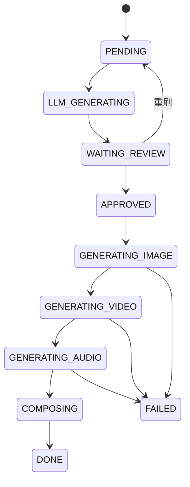
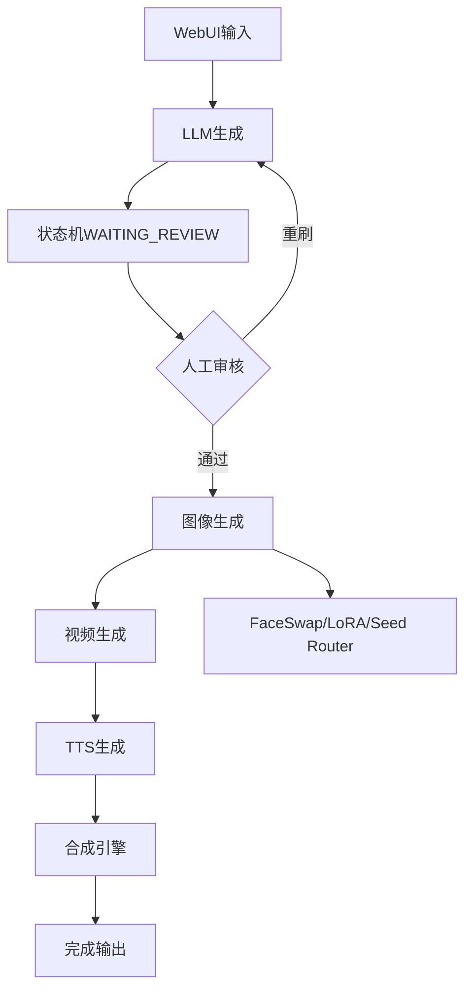

**第4部分：任务调度 + 状态机 + 角色一致性控制中枢（系统大脑层）**

这一层不是“执行层”，而是：

> 🧠 控制整个短剧生产流水线的“大脑”

它负责：

- 什么时候生成什么
    
- 哪个失败重试
    
- 哪个进入人工审核
    
- 哪个走 LoRA / Seed / FaceSwap
    
- 哪个任务暂停 / 恢复 / 回滚
    

---

# 🧠 一、系统核心定位

这一层解决 6 个问题：

### 1️⃣ 全链路状态机控制（Pipeline State Machine）

---

### 2️⃣ 任务调度（生产队列 / 优先级）

---

### 3️⃣ 断点续传（工业级必备）

---

### 4️⃣ 人工审核 Hook（Human-in-the-loop）

---

### 5️⃣ 角色一致性策略分发

---

### 6️⃣ 并发控制 + API节流协调

---

# 🏗 二、核心状态机设计（系统灵魂）

## scene_state.py

```python
from enum import Enum


class SceneStatus(Enum):
    PENDING = "待处理"
    LLM_GENERATING = "LLM生成中"
    WAITING_REVIEW = "等待人工审核"
    APPROVED = "已确认"
    GENERATING_IMAGE = "图像生成中"
    GENERATING_VIDEO = "视频生成中"
    GENERATING_AUDIO = "音频生成中"
    COMPOSING = "合成中"
    DONE = "生产完成"
    FAILED = "失败"
    PAUSED = "暂停"
```

---

# 🔁 三、状态流转规则（核心逻辑）



---

# 🧠 四、任务对象设计（核心数据结构）

## task_model.py

```python
from dataclasses import dataclass, field
from typing import Dict, Any
import time
import uuid


@dataclass
class SceneTask:

    scene_id: str
    episode_id: str
    status: str = "PENDING"

    retry_count: int = 0
    created_at: float = field(default_factory=time.time)

    payload: Dict[str, Any] = field(default_factory=dict)

    task_id: str = field(default_factory=lambda: str(uuid.uuid4()))
```

---

# 🚦 五、任务调度核心引擎

## scheduler.py

```python
import asyncio
from collections import deque
from scene_state import SceneStatus


class TaskScheduler:

    def __init__(self, gateway, concurrency=5):
        self.gateway = gateway
        self.queue = deque()
        self.running = {}
        self.semaphore = asyncio.Semaphore(concurrency)

    # =========================
    # 入队
    # =========================

    def add_task(self, task):
        self.queue.append(task)

    # =========================
    # 主调度循环
    # =========================

    async def run(self):

        while True:

            if not self.queue:
                await asyncio.sleep(0.5)
                continue

            task = self.queue.popleft()

            asyncio.create_task(self._execute(task))

    # =========================
    # 执行任务
    # =========================

    async def _execute(self, task):

        async with self.semaphore:

            try:
                task.status = SceneStatus.LLM_GENERATING

                await self.run_llm(task)

                task.status = SceneStatus.WAITING_REVIEW

                # ⚠️ 人工审核 Hook
                await self.wait_for_review(task)

                task.status = SceneStatus.APPROVED

                await self.run_pipeline(task)

                task.status = SceneStatus.DONE

            except Exception as e:
                task.status = SceneStatus.FAILED
                print(f"[ERROR] {task.task_id}: {str(e)}")

    # =========================
    # LLM阶段
    # =========================

    async def run_llm(self, task):
        result = await self.gateway.call(
            "llm",
            task.payload["prompt"]
        )
        task.payload["llm_output"] = result

    # =========================
    # 人工审核
    # =========================

    async def wait_for_review(self, task):

        while task.status == SceneStatus.WAITING_REVIEW:
            await asyncio.sleep(1)

    # =========================
    # 多媒体流水线
    # =========================

    async def run_pipeline(self, task):

        # image
        task.status = SceneStatus.GENERATING_IMAGE

        img = await self.gateway.call(
            "image",
            task.payload["image_prompt"]
        )

        task.payload["image"] = img

        # video
        task.status = SceneStatus.GENERATING_VIDEO

        video = await self.gateway.call(
            "video",
            task.payload["video_prompt"],
            image_url=img
        )

        task.payload["video"] = video

        # audio
        task.status = SceneStatus.GENERATING_AUDIO

        audio = await self.gateway.call(
            "tts",
            task.payload["dialogue"]
        )

        task.payload["audio"] = audio
```

---

# 🧍 六、角色一致性控制中枢（关键）

## character_controller.py

```python
class CharacterController:

    def __init__(self):
        self.strategy_map = {}

    def set_strategy(self, character_id, strategy):
        """
        strategy:
        - seed
        - lora
        - faceswap
        """
        self.strategy_map[character_id] = strategy

    def get_strategy(self, character_id):
        return self.strategy_map.get(character_id, "seed")
```

---

# 🧠 七、自动策略选择器（核心逻辑）

```python
class StrategyRouter:

    def __init__(self, controller):
        self.controller = controller

    def select(self, character_id, scene_complexity):

        strategy = self.controller.get_strategy(character_id)

        # 自动修正策略（工业逻辑）
        if scene_complexity == "high_motion":
            return "faceswap"

        if scene_complexity == "long_episode":
            return "lora"

        return strategy
```

---

# 🔁 八、断点续传系统（工业级关键）

## checkpoint_manager.py

```python
import json
import os


class CheckpointManager:

    def __init__(self, path="checkpoint.json"):
        self.path = path

    def save(self, task):
        data = {
            "task_id": task.task_id,
            "status": task.status,
            "payload": task.payload
        }

        with open(self.path, "w") as f:
            json.dump(data, f)

    def load(self):
        if not os.path.exists(self.path):
            return None

        with open(self.path, "r") as f:
            return json.load(f)
```

---

# 🧩 九、人工审核 Hook（WebUI关键点）

```python
class HumanReviewHook:

    def __init__(self):
        self.review_state = {}

    def pause(self, task_id):
        self.review_state[task_id] = "WAITING"

    def approve(self, task_id):
        self.review_state[task_id] = "APPROVED"

    def reject(self, task_id):
        self.review_state[task_id] = "RETRY"
```

---

# ⚙️ 十、完整调度架构图



---

# 🧠 十一、本部分核心能力总结

你现在已经拥有：

## ✔ 完整状态机系统（工业级）

## ✔ 任务调度器（async + semaphore）

## ✔ 人工审核 Hook

## ✔ 断点续传系统

## ✔ 角色一致性策略路由器

## ✔ 自动 fallback 调度逻辑

## ✔ pipeline 控制中枢

---

# 🚀 下一步（第5部分 = 最终核心）

下一部分是整个系统的“落地执行引擎”：

## 👉 自动化剪辑 + 合成引擎（MoviePy + FFmpeg + 字幕 + 音画同步）

我会给你：

- AssetDownloader（云端素材系统）
    
- AudioProcessor（音画同步核心）
    
- SubtitleGenerator（ASS字幕工业级）
    
- ImageAnimator（静态图变视频）
    
- EpisodeAssembler（整集拼接）
    
- FFmpeg工业级命令库
    
- BatchProducer（批量生产）
 