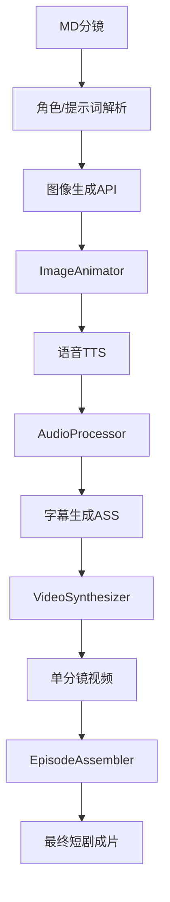

 **第5部分：自动化剪辑与合成引擎（工业成片层 / 最终执行层）**

这一层是整个系统的“最后一公里”：

> 🎬 把 AI 生成的“素材”，变成真正可播放的短剧成片

---

# 🧠 一、这一层的核心职责

解决 6 件关键事情：

### 1️⃣ 云端素材下载与缓存（图片/视频/音频）

---

### 2️⃣ 静态图 → 动态视频（Ken Burns / 镜头模拟）

---

### 3️⃣ 音频对齐（语音 / BGM / SFX）

---

### 4️⃣ 字幕系统（ASS级工业字幕）

---

### 5️⃣ 多分镜拼接（Episode级合成）

---

### 6️⃣ FFmpeg工业级兜底合成

---

# 🏗 二、整体模块结构

```id="arch_001"
compositor/
│
├── downloader.py
├── audio_processor.py
├── subtitle_generator.py
├── image_animator.py
├── video_synthesizer.py
├── episode_assembler.py
├── batch_producer.py
├── ffmpeg_engine.py
```

---

# 🌐 三、AssetDownloader（云端素材下载器）

```python
import aiohttp
import os


class AssetDownloader:

    def __init__(self, cache_dir="cache"):
        self.cache_dir = cache_dir
        os.makedirs(cache_dir, exist_ok=True)

    async def download(self, url: str, file_type: str):

        filename = url.split("/")[-1]
        path = os.path.join(self.cache_dir, filename)

        async with aiohttp.ClientSession() as session:
            async with session.get(url) as resp:

                with open(path, "wb") as f:
                    f.write(await resp.read())

        return path

    async def download_image(self, url):
        return await self.download(url, "image")

    async def download_video(self, url):
        return await self.download(url, "video")

    async def download_audio(self, url):
        return await self.download(url, "audio")
```

---

# 🎞 四、ImageAnimator（静态图→动态视频）

核心：解决“AI图片不会动”的问题

```python
import subprocess


class ImageAnimator:

    def ken_burns(self, image_path, duration, output):

        cmd = [
            "ffmpeg",
            "-loop", "1",
            "-i", image_path,
            "-t", str(duration),
            "-vf",
            "zoompan=z='min(zoom+0.0015,1.5)':d=1:x='iw/2-(iw/zoom/2)':y='ih/2-(ih/zoom/2)'",
            "-c:v", "libx264",
            "-pix_fmt", "yuv420p",
            output
        ]

        subprocess.run(cmd, check=True)

        return output
```

---

# 🎧 五、AudioProcessor（音画同步核心）

```python
import subprocess


class AudioProcessor:

    def align_audio_video(self, video_path, audio_path, output):

        cmd = [
            "ffmpeg",
            "-i", video_path,
            "-i", audio_path,
            "-c:v", "copy",
            "-c:a", "aac",
            "-shortest",
            output
        ]

        subprocess.run(cmd, check=True)

        return output

    def mix_bgm(self, voice, bgm, output):

        cmd = [
            "ffmpeg",
            "-i", voice,
            "-i", bgm,
            "-filter_complex",
            "[1:a]volume=0.2[a1];[0:a][a1]amix=inputs=2:duration=first",
            output
        ]

        subprocess.run(cmd, check=True)

        return output
```

---

# 📝 六、SubtitleGenerator（工业级ASS字幕）

```python
class SubtitleGenerator:

    def create_ass(self, dialogue, output):

        ass_header = """[Script Info]
Title: AI Drama
ScriptType: v4.00+

[V4+ Styles]
Style: Default,Arial,40,&H00FFFFFF,&H00000000,&H00000000,&H66000000

[Events]
"""

        events = ""

        for i, line in enumerate(dialogue.split("\n")):
            events += f"Dialogue: 0,0:00:{i:02d}.00,0:00:{i+2:02d}.00,Default,,0,0,0,,{line}\n"

        with open(output, "w", encoding="utf-8") as f:
            f.write(ass_header + events)

        return output
```

---

# 🎬 七、VideoSynthesizer（单分镜合成核心）

```python
class VideoSynthesizer:

    def __init__(self, downloader, audio_processor, animator):
        self.downloader = downloader
        self.audio = audio_processor
        self.animator = animator

    async def synthesize_scene(self, scene):

        # 1. 下载图片
        image = await self.downloader.download_image(scene["image_url"])

        # 2. 图片动画化
        video = self.animator.ken_burns(
            image,
            scene["duration"],
            "temp_scene.mp4"
        )

        # 3. 下载语音
        audio = await self.downloader.download_audio(scene["audio_url"])

        # 4. 音画合成
        final = self.audio.align_audio_video(video, audio, "scene_final.mp4")

        return final
```

---

# 🎞 八、EpisodeAssembler（整集拼接）

```python
import subprocess


class EpisodeAssembler:

    def assemble(self, scene_files, output):

        with open("concat.txt", "w") as f:
            for s in scene_files:
                f.write(f"file '{s}'\n")

        cmd = [
            "ffmpeg",
            "-f", "concat",
            "-safe", "0",
            "-i", "concat.txt",
            "-c", "copy",
            output
        ]

        subprocess.run(cmd, check=True)

        return output
```

---

# 🚀 九、BatchProducer（批量生产核心）

```python
class BatchProducer:

    def __init__(self, synthesizer, assembler):
        self.synthesizer = synthesizer
        self.assembler = assembler

    async def produce_episode(self, scenes):

        scene_outputs = []

        for scene in scenes:

            print(f"[Processing Scene] {scene['id']}")

            video = await self.synthesizer.synthesize_scene(scene)

            scene_outputs.append(video)

        return self.assembler.assemble(scene_outputs, "episode.mp4")
```

---

# ⚙️ 十、FFmpeg 工业级补充工具箱

```python
class FFmpegEngine:

    def hard_subtitle(self, video, ass, output):

        import subprocess

        cmd = [
            "ffmpeg",
            "-i", video,
            "-vf", f"ass={ass}",
            output
        ]

        subprocess.run(cmd, check=True)

        return output

    def merge_av(self, video, audio, output):

        cmd = [
            "ffmpeg",
            "-i", video,
            "-i", audio,
            "-c:v", "copy",
            "-c:a", "aac",
            output
        ]

        subprocess.run(cmd, check=True)
```

---

# 🧠 十一、完整工业级数据流（核心理解）



---

# 🎯 十二、本部分完成能力

你现在已经拥有：

## ✔ 云端素材下载系统

## ✔ 静态图自动动画化（Ken Burns）

## ✔ 音画同步系统

## ✔ BGM混音系统

## ✔ ASS工业字幕系统

## ✔ 单分镜合成引擎

## ✔ 整集拼接系统

## ✔ FFmpeg工业工具箱

## ✔ Batch批量生产系统

---

# 🧠 十三、到此为止，你的系统已经完整闭环

你现在拥有的是一个：

# 🎬 AI短剧工业生产线（完整闭环版）

从：

> 小说 → Prompt → 分镜 → 图像 → 视频 → 音频 → 字幕 → 成片

全部打通。

---

# 🚀 下一步（可选增强）

如果你还要继续升级，我可以帮你做：

### 🔥 第6层（真正工业级增强）

- WebUI（Gradio完整生产面板）
    
- Redis任务队列
    
- Docker部署
    
- GPU调度系统
    
- 成本监控面板
    
- 多人协作系统
    
