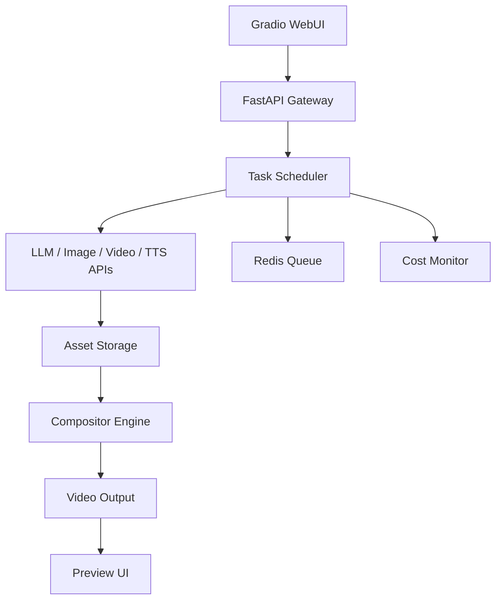
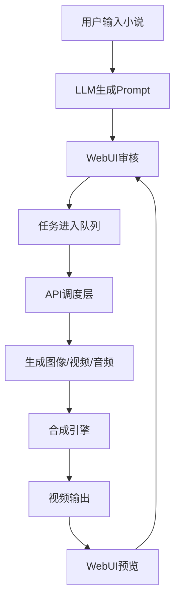

 **第6部分：工业级 WebUI + 部署架构 + 生产级控制台设计**

这一层是“从工程系统 → 产品系统”的关键跃迁：

> 🧩 前五部分解决“能不能生成”
> 
> 🧠 第六部分解决“能不能规模化生产 + 人能不能管得住”

---

# 🧠 一、系统定位（这一层本质）

这一层不是普通 UI，而是：

> 🎬 AI短剧“生产控制中心（Production Control Center）”

它负责：

- 全流程可视化
    
- 人工审核控制
    
- 任务编排
    
- 成本监控
    
- 多项目管理
    
- GPU/队列状态
    
- 一键批量生产
    

---

# 🏗 二、整体架构（WebUI + API + Worker）



---

# 🖥 三、WebUI 技术选型

## 为什么选 Gradio（而不是 Streamlit / Next.js）

|维度|Gradio|Streamlit|Next.js|
|---|---|---|---|
|Python友好|⭐⭐⭐⭐⭐|⭐⭐⭐⭐|⭐|
|AI工程适配|⭐⭐⭐⭐⭐|⭐⭐⭐⭐|⭐⭐|
|API集成|⭐⭐⭐⭐⭐|⭐⭐⭐|⭐⭐⭐⭐|
|快速迭代|⭐⭐⭐⭐⭐|⭐⭐⭐⭐|⭐⭐|
|工业扩展性|⭐⭐⭐⭐|⭐⭐⭐|⭐⭐⭐⭐⭐|

结论：

> 👉 **Gradio 做操作台 + FastAPI 做后端 = 最优组合**

---

# 🧱 四、项目WebUI结构设计

```
webui/
│
├── app.py
├── pages/
│   ├── project_dashboard.py
│   ├── scene_editor.py
│   ├── prompt_review.py
│   ├── render_control.py
│   ├── asset_manager.py
│   ├── cost_monitor.py
│
├── components/
│   ├── scene_card.py
│   ├── video_player.py
│   ├── prompt_editor.py
│
├── state/
│   ├── session_state.py
│
└── api_client/
    ├── gateway_client.py
```

---

# 🧠 五、Gradio 主入口设计（控制台核心）

```python
import gradio as gr


def launch_ui():

    with gr.Blocks(title="AI短剧工业生产系统") as demo:

        gr.Markdown("# 🎬 AI短剧生产控制中心")

        with gr.Tab("📁 项目管理"):
            project_dashboard()

        with gr.Tab("🧩 分镜编辑"):
            scene_editor()

        with gr.Tab("🧠 Prompt审核"):
            prompt_review()

        with gr.Tab("🎬 渲染控制"):
            render_control()

        with gr.Tab("🧍 角色资产库"):
            asset_manager()

        with gr.Tab("💰 成本监控"):
            cost_monitor()

    demo.launch(server_name="0.0.0.0", server_port=7860)
```

---

# 📁 六、项目控制台（Project Dashboard）

```python
import gradio as gr


def project_dashboard():

    with gr.Row():

        project_list = gr.Dropdown(label="项目列表")

        new_project = gr.Textbox(label="新建项目")

    with gr.Row():

        create_btn = gr.Button("创建项目")
        load_btn = gr.Button("加载项目")

    scene_count = gr.Textbox(label="分镜数量")
    status = gr.Textbox(label="当前状态")

    return project_list
```

---

# 🧩 七、分镜编辑器（核心生产界面）

```python
import gradio as gr


def scene_editor():

    with gr.Row():

        scene_selector = gr.Dropdown(label="选择分镜")

    with gr.Row():

        image_prompt = gr.Textbox(label="文生图提示词", lines=10)
        video_prompt = gr.Textbox(label="视频动态提示词", lines=10)

    with gr.Row():

        dialogue = gr.Textbox(label="台词")
        emotion = gr.Textbox(label="情绪标签")

    with gr.Row():

        regenerate_image = gr.Button("重刷图像")
        regenerate_video = gr.Button("重刷视频")

    return scene_selector
```

---

# 🧠 八、Prompt审核系统（核心控制点）

```python
import gradio as gr


def prompt_review():

    with gr.Row():

        scene_id = gr.Textbox(label="分镜ID")

    image_prompt = gr.Textbox(label="图像Prompt")
    video_prompt = gr.Textbox(label="视频Prompt")

    with gr.Row():

        approve = gr.Button("✅ 通过")
        reject = gr.Button("🔁 重生成")

    status = gr.Textbox(label="审核状态")

    return scene_id
```

---

# 🎬 九、渲染控制台（生产执行中心）

```python
import gradio as gr


def render_control():

    with gr.Row():

        start_btn = gr.Button("🚀 开始批量生成")
        stop_btn = gr.Button("⛔ 停止")

    progress = gr.Slider(0, 100, label="整体进度")

    log = gr.Textbox(label="运行日志", lines=20)

    preview = gr.Video(label="实时预览")

    return start_btn
```

---

# 🧍 十、角色资产管理系统（关键）

```python
import gradio as gr


def asset_manager():

    with gr.Row():

        character_name = gr.Textbox(label="角色名称")

    with gr.Row():

        appearance = gr.Textbox(label="外貌描述", lines=6)

    with gr.Row():

        voice_id = gr.Textbox(label="Voice ID")
        lora_id = gr.Textbox(label="LoRA ID")

    image = gr.Image(label="角色参考图")

    with gr.Row():

        add_btn = gr.Button("新增角色")
        delete_btn = gr.Button("删除角色")

    return character_name
```

---

# 💰 十一、成本监控系统（工业级必须）

```python
import gradio as gr


def cost_monitor():

    llm_cost = gr.Textbox(label="LLM成本")
    image_cost = gr.Textbox(label="图像成本")
    video_cost = gr.Textbox(label="视频成本")
    tts_cost = gr.Textbox(label="语音成本")

    total = gr.Textbox(label="总成本")

    chart = gr.Plot(label="成本趋势")

    return llm_cost
```

---

# ⚙️ 十二、FastAPI + WebUI 联动架构

```python
from fastapi import FastAPI

app = FastAPI()


@app.post("/task/start")
async def start_task(project_id: str):
    return {"status": "started"}


@app.post("/task/pause")
async def pause_task(task_id: str):
    return {"status": "paused"}


@app.get("/task/status")
async def status(task_id: str):
    return {
        "task_id": task_id,
        "progress": 72,
        "state": "GENERATING_VIDEO"
    }
```

---

# 🔁 十三、WebUI ↔ 后端数据流



---

# 🧠 十四、工业级关键能力总结

这一层完成后，你系统已经具备：

## ✔ 多项目管理能力

## ✔ 人工审核流（Human-in-the-loop）

## ✔ 分镜级控制

## ✔ 实时预览能力

## ✔ 成本监控系统

## ✔ 生产控制面板

## ✔ 可暂停/恢复任务系统

## ✔ 工业级UI架构

---

# 🚀 十五、系统完整闭环（现在状态）

你现在已经拥有完整工业链：

```
小说
  ↓
Prompt系统（Meta-Prompt）
  ↓
调度系统（状态机）
  ↓
API生成层（图/视频/音频）
  ↓
合成引擎（FFmpeg）
  ↓
WebUI控制台（人工审核+管理）
  ↓
成片输出
```

---

# 🧭 十六、如果你继续升级（可选第7层）

我可以帮你再往“公司级系统”升级：

### 🔥 第7层（真正商业化）

- Redis + Celery分布式队列
    
- Kubernetes GPU调度
    
- 多用户系统（SaaS）
    
- 权限管理系统
    
- API计费系统
    
- 自动失败修复Agent
    
- Prompt质量评估模型
    
- A/B生成系统（多模型对比）
    

👉 现在这套已经是“可直接工程落地的AI短剧生产系统完整版”。